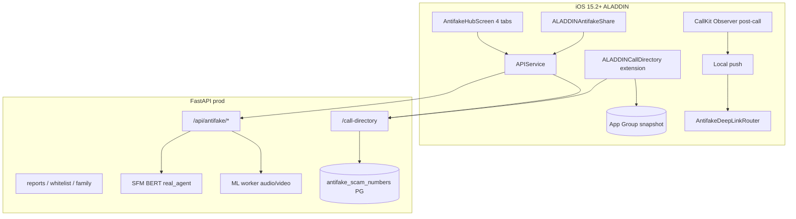

# ALADDIN Antifake — Unified Master (SSOT для людей и ML-агентов)

**Версия:** 1.0 · **Дата синхронизации:** 2026-06-15  
**Корень проекта:** `ALADDIN_iOS` · **Build:** 232+ · **iOS min:** 15.2 · **Prod:** `aladdin-ai.ru:8002`

> **Этот файл — единая точка входа** по направлению Antifake.  
> Он объединяет v4 (134 задачи), legacy (`af-0…af-12`), Build 232, BATCH 2 iOS и карту всех документов/скриптов.  
> **Атомарные статусы v4** — в [ANTIFAKE_V4_TASK_REGISTRY.md](./ANTIFAKE_V4_TASK_REGISTRY.md) (при расхождении побеждает REGISTRY).

---

## 0. Быстрый старт для ML-агента (60 секунд)

1. **Читай статусы здесь** → детали задачи в [REGISTRY](./ANTIFAKE_V4_TASK_REGISTRY.md).
2. **Не смешивай ID:** `af-F-01` (v4) ≠ `af-2-01` (legacy) ≠ `B2-02` (implementation batch).
3. **Код готов на 100%** — static gates green. **Осталось:** Xcode build + iPhone QA (7 задач).
4. **Перед правками:** `bash scripts/verify_antifake_all_static.sh` (без xcodebuild).
5. **Cursor TODO:** 134 строки `af-*` + meta — только `merge: true`, не пересоздавать список.
6. **Prod policy:** `sfm_mock`, `mock-real-protection`, wildcard antifake — **запрещены**.

```bash
cd ALADDIN_iOS
bash scripts/verify_antifake_all_static.sh          # master code gate
python3 docs/server/test_antifake_prod_smoke.py     # prod (needs JWT/SSH)
./scripts/archive_antifake_device_build.sh --simulator-only  # compile (manual)
```

---

## 1. Сводка прогресса (2026-06-15)

### 1.1 v4 — главный реестр (134 задачи)

| Статус | Кол-во | Смысл |
|--------|--------|-------|
| ✅ Done | **111** | Код, prod, docs, static gates |
| ⬜ Open | **7** | Только real iPhone / Xcode archive |
| ⏸ Deferred | **13** | H (PIR iOS 18+) + K (on-device ML) — v2 |
| ❌ Cancelled | **3** | Batch O (Safari filter) |
| **Итого** | **134** | 131 активных (без O-01…O-03) |

### 1.2 Grand total — все системы учёта

| Система | Файл | Задач | Роль |
|---------|------|-------|------|
| **v4 SSOT** | `ANTIFAKE_V4_TASK_REGISTRY.md` | **134** | Исполнение, Cursor TODO `af-{ID}` |
| **Legacy prod** | `ANTIFAKE_PRODUCTION_TODO.md` | **~94** | `af-0-01…af-12-04`, история 2026-06-09 |
| **iOS BATCH 2** | `IMPLEMENTATION_BATCHES_TODO.md` | **~12** | `B2-00…B2-12`, Hub UI 2026-06 |
| **Build 232** | `BUILD_232_AGREED_TRACKER.md` | **~15** | Call Directory M2/M3, signing |
| **Архитектура** | `ANTIFAKE_MASTER_ROADMAP.md` | — | Компоненты, риски (не SSOT статусов) |
| **Cursor panel** | TodoWrite | **~156 строк** | 134 `af-*` + 22 meta/hdr |

**Итого отслеживаемых пунктов:** **~280** (с перекрытием legacy↔v4↔B2).

### 1.3 Что осталось до TestFlight submit

| ID | Тип | Действие |
|----|-----|----------|
| **D-01** | Xcode | Archive build 232+ с extensions |
| **D-02** | TestFlight | Upload → install на iPhone |
| **D-03** | Device | Extension ON → Sync → QA входящий |
| **D-04** | **Must** | Метка «Возможный мошенник?» на экране звонка |
| **D-09** | Device | Sync после airplane mode / reboot |
| **E-06** | **Must** | Post-call flow ≤2 taps |
| **R-02** | Sign-off | Скрин метки + sync N → `qa_signoff/antifake/` |

Runbook: `docs/release/ANTIFAKE_DEVICE_BATCH_RUNBOOK.md`  
Запись: `docs/release/device_qa/antifake/DEVICE_QA_RECORD.json`

---

## 2. Иерархия документов (что главнее)

```
ANTIFAKE_UNIFIED_MASTER.md          ← ВЫ ЗДЕСЬ (карта + контекст)
    │
    ├── ANTIFAKE_V4_TASK_REGISTRY.md   ← SSOT статусов v4 (111/7/13/3)
    ├── ANTIFAKE_TOP_TIER_PLAN.md    ← План фаз, DoD, prod snapshot
    ├── ANTIFAKE_V4_WORKFLOW.md      ← Правила агентов, порядок батчей
    ├── ANTIFAKE_V4_DOC_INDEX.md     ← Индекс файлов по категориям
    ├── ANTIFAKE_ML_HANDOFF_FOR_NEXT_AGENT.md  ← Deploy/ML команды
    │
    ├── ANTIFAKE_MASTER_ROADMAP.md   ← Архитектура (legacy refs)
    ├── ANTIFAKE_PRODUCTION_TODO.md  ← Legacy af-0…12 (история)
    ├── IMPLEMENTATION_BATCHES_TODO.md ← B2 iOS, R-08
    └── BUILD_232_AGREED_TRACKER.md  ← Build 232 milestones
```

**Правило синхронизации при закрытии `af-{ID}`:**
1. REGISTRY → ✅  
2. TOP_TIER_PLAN → ✅ + счётчик  
3. Cursor todo → `completed` (**merge: true** only)  
4. При необходимости — runbook / smoke doc / этот UNIFIED (сводка)

---

## 3. Системы нумерации задач (не путать!)

| Префикс | Пример | Документ | Комментарий |
|---------|--------|----------|-------------|
| **v4** | `af-A-01`, `af-F-13`, `af-D-04` | REGISTRY | **Актуальный SSOT** |
| **Legacy batch** | `af-2-08`, `af-4-02`, `af-11-02` | PRODUCTION_TODO | Часто закрыто через v4/B2 |
| **iOS impl** | `B2-02`, `B2-09` | IMPLEMENTATION_BATCHES | Hub UI, GATE-E |
| **Build 232** | `P0-4`, `P1-7` | BUILD_232_AGREED_TRACKER | Signing, M2/M3 |
| **UX** | `ux-1-07` | UX_AUDIT | Accordion antifake |
| **Release** | `R-08`, `af-11` gate | IMPLEMENTATION / F-05 | Demo matrix |

### 3.1 Crosswalk: legacy → v4 (основное)

| Legacy | v4 / B2 | Что сделано |
|--------|---------|-------------|
| `af-2-01…af-2-10` API | B-03, F-* | Router, OpenAPI, rate limit |
| `af-3-01…af-3-06` jobs | B-05, B-08, F-* | PG jobs, worker, TTL cron |
| `af-4-02` Call Directory | D-05, build 232 | Extension target + CI sign |
| `af-4-03` post-call | E-01…E-08 | CallKit + push + deep link |
| `af-4-09` CD sync API | B-01, C-* | Fraud DB + delta sync |
| `af-6-01…af-6-08` Hub UI | B2-02…B2-05, J-04 | 4 tabs, history, PDF export |
| `af-7-01…af-7-02` Share | B2-08 | Share extension |
| `af-8-*` copy/legal | A-*, G-*, N-* | Apple limits, marketing honest |
| `af-10-*` deploy/nginx | B-06, B-07, P-* | nginx 25MB, deploy script |
| `af-11-*` QA gate | F-05, Q-06, R-03 | prod smoke + golden |
| `af-12-*` ops alerts | P-01…P-05 | alerts, runbooks |

---

## 4. Стратегия продукта (одна фраза)

**Семейный antifake на iOS 15.2+:** проверка ссылок / голоса / видео / записи звонка **по инициативе пользователя** + метки на входящих через Call Directory + честная privacy. **Не** клон Truecaller. PIR (iOS 18+) — опционально v2.

### 4.1 Apple — что обещаем / не обещаем

| ✅ Можно | ❌ Нельзя в v1 |
|---------|----------------|
| Hub 4 вкладки, Share Extension | «Блокируем все мошенники 100%» |
| Call Directory метка из fraud DB | Фоновый перехват всех PSTN |
| Post-call push «проверить?» | Auto-hangup по ML |
| Upload media с consent | Harvest телефонной книги |

Полный текст: `docs/ANTIFAKE_APPLE_LIMITS_AND_CLAIMS.md`

---

## 5. Архитектура (как реализовано)



### 5.1 iOS — ключевые файлы

| Область | Файлы |
|---------|-------|
| Hub UI | `Screens/AntifakeHubScreen.swift`, `Shared/Components/Antifake*View*.swift` |
| ViewModels | `ViewModels/AntifakeTextCheckViewModel.swift`, `AntifakeMediaCheckViewModel.swift` |
| Verdict / reports | `Shared/Components/AntifakeVerdictCard.swift` |
| Call Directory | `Shared/Components/AntifakeCallDirectorySettingsCard.swift`, `Core/Security/AntifakeCallDirectorySyncService.swift`, `Shared/AntifakeCallDirectory/AntifakeCallDirectoryStore.swift`, `ALADDINCallDirectory/CallDirectoryHandler.swift` |
| Post-call | `Core/Security/AntifakeCallObserverService.swift`, `AntifakePostCallPolicy.swift`, `AntifakeLastCallContext.swift` |
| Premium / bypass | `Core/Security/AntifakeAccessPolicy.swift` (`bypassPremiumGate=false`, UITest `-UITestAntifakeHubSmoke`) |
| Privacy | `Core/Security/AntifakePhonePrivacy.swift`, `AntifakePrivacyWipe.swift`, `PrivacyInfo.xcprivacy` |
| Family moat | `Shared/Components/AntifakeFamilyMoatViews.swift` |
| History + PDF | `AntifakeCheckHistoryStore.swift`, `AntifakeCheckHistoryPDFExporter.swift` |
| Extensions | `ALADDINCallDirectory/`, `ALADDINAntifakeShare/` |

### 5.2 Backend — ключевые файлы

| Область | Файлы |
|---------|-------|
| Router | `app/routers/antifake.py` |
| Service | `app/services/antifake_service.py`, `antifake_worker_tasks.py` |
| Jobs | `app/services/antifake_jobs_store.py`, `migrations/create_antifake_jobs.sql` |
| Fraud DB | `app/services/antifake_call_directory_store.py`, `antifake_fraud_ingest.py` |
| Reports | `antifake_reports_store.py`, `antifake_whitelist_store.py` |
| Family | `antifake_family_store.py`, `antifake_family_notify.py` |
| Security | `antifake_security.py`, `antifake_premium.py`, `antifake_rate_limit.py` |
| Upload TTL | `antifake_upload_store.py`, `scripts/antifake_cleanup_uploads.py` |

### 5.3 API endpoints (prod)

| Method | Path | Назначение |
|--------|------|------------|
| POST | `/api/antifake/check/text` | Sync text/URL |
| POST | `/api/antifake/check/url` | Sync URL |
| POST | `/api/antifake/check/audio\|video\|document` | Async job |
| POST | `/api/antifake/call/analyze` | Call recording |
| GET | `/api/antifake/jobs/{id}` | Poll verdict |
| GET | `/api/antifake/call-directory` | CD sync (identified/blocked) |
| POST | `/api/antifake/report`, `/appeal`, `/whitelist` | Crowd I-batch |
| GET | `/api/antifake/metrics` | User metrics |

**Verdict contract:** `verdict`, `confidence`, `reasons[]`, `source` (`real_agent`|`local_ml`|`rule_engine`|`probe`), `job_id`.

---

## 6. v4 — полный реестр по батчам (134)

> Детальные строки — [ANTIFAKE_V4_TASK_REGISTRY.md](./ANTIFAKE_V4_TASK_REGISTRY.md)

| Batch | Фаза | Задач | ✅ | ⬜ | ⏸ | ❌ | Суть |
|-------|------|-------|----|----|---|---|------|
| **D** | 1 | 9 | 5 | **4** | 0 | 0 | iPhone Call Directory QA |
| **C** | 1 | 11 | 11 | 0 | 0 | 0 | Fraud DB + sync |
| **A** | 1 | 10 | 10 | 0 | 0 | 0 | UX, Apple Review copy |
| **F** | 1 | 17 | 17 | 0 | 0 | 0 | ML/SFM prod, golden |
| **J** | 1 | 5 | 5 | 0 | 0 | 0 | Verdict UX, PDF export |
| **B** | 1 | 9 | 9 | 0 | 0 | 0 | Backend hardening |
| **E** | 1 | 5 | 4 | **1** | 0 | 0 | Post-call (E-06 device) |
| **N** | 1 | 5 | 5 | 0 | 0 | 0 | Privacy manifests |
| **R** | 1 | 3 | 2 | **1** | 0 | 0 | Release (R-02 sign-off) |
| **I** | 2 | 8 | 8 | 0 | 0 | 0 | Crowd reports |
| **L** | 2 | 5 | 5 | 0 | 0 | 0 | Family moat |
| **M** | 2 | 5 | 5 | 0 | 0 | 0 | TLS, metrics, pen-test |
| **P** | 2 | 6 | 6 | 0 | 0 | 0 | Ops alerts, runbooks |
| **G** | 2 | 7 | 7 | 0 | 0 | 0 | Marketing honest + G-03 |
| **Q** | 2 | 6 | 6 | 0 | 0 | 0 | Release gates, UITest |
| **H** | 3 | 10 | 0 | 0 | **10** | 0 | PIR/OHTTP v2 |
| **K** | 3 | 3 | 0 | 0 | **3** | 0 | On-device ML v2 |
| **O** | — | 3 | 0 | 0 | 0 | **3** | Cancelled |
| **Early** | — | 8 | 8 | 0 | 0 | 0 | A-01…04, B-01, D-05, E-01…02 |
| **Bypass** | 3 | 3 | 3 | 0 | 0 | 0 | G-03, B-10, Q-01 (dup ref) |

**Открытые v4 (7):** D-01, D-02, D-03, D-04, D-09, E-06, R-02

---

## 7. Legacy `ANTIFAKE_PRODUCTION_TODO` (~94 задачи)

Исторический бэклог **2026-06-09**. Большинство P0 закрыто через v4 + B2 + Build 232.

| Batch | Тема | ~Задач | ~✅ | Комментарий |
|-------|------|--------|-----|-------------|
| af-0 | Prod safety | 8 | 7 | Wildcard block, smoke |
| af-1 | Agents/deps | 9 | 4 | torch/transformers via F-13 |
| af-2 | API routers | 10 | 9 | B-03 OpenAPI |
| af-3 | Async jobs | 7 | 6 | B-05 PG persistence |
| af-4 | Calls/spoof | 9 | 7 | CD + post-call build 232 |
| af-5 | iOS settings sync | 6 | 2 | Partial — Premium enable ✅ |
| af-6 | Hub UI | 10 | 9 | B2 complete |
| af-7 | Share + AI | 5 | 2 | Share ✅; AI tool ⬜ |
| af-8 | Copy/legal | 7 | 0→v4 | Superseded by A/G/N |
| af-9 | 8 threats matrix | 8 | partial | Hub covers main paths |
| af-10 | Deploy/nginx | 5 | 5 | B-06, B-07 |
| af-11 | QA acceptance | 6 | partial | F-05, Q-06, R-03 |
| af-12 | Ops monitoring | 4 | 0→P | P-01…P-05 ✅ |

**Legacy счёт в файле:** 38/72 ✅ (не обновлялся — ориентир v4 REGISTRY).

---

## 8. Build 232 + BATCH 2 (iOS milestone)

### Build 232 (`BUILD_232_AGREED_TRACKER.md`)

| ID | Deliverable | Status |
|----|-------------|--------|
| M2 | Call Directory extension + sync | ✅ |
| M3 | History 50, post-call banner | ✅ |
| P0-1…P0-3 | Fastlane CI signing 4 extensions | ✅ |
| P1 | af-4-03 post-call → Hub call tab | ✅ |
| P0-4 | `bypassPremiumGate=false` | ✅ (G-03, 2026-06-15) |
| — | Device QA Call Directory | ⬜ D-batch |

### BATCH 2 iOS (`B2-00…B2-12`) — ✅ 12/12

Hub 4 tabs, Share extension, SecurityVerdict, Premium gate, dfk matrix R-08, lazy ML deps.

---

## 9. Static gates & scripts (без xcodebuild)

| Gate | Команда | Задачи v4 |
|------|---------|-----------|
| **Master** | `bash scripts/verify_antifake_all_static.sh` | ALL code |
| Q release | `bash scripts/verify_antifake_q_static.sh` | Q-01…Q-05 |
| R-01 | `python3 scripts/verify_antifake_release_readiness.py` | R-01 |
| Open tasks code | `bash scripts/verify_antifake_open_tasks_code.sh` | J-04, D-07/08/10, G-03 |
| Device infra | `bash scripts/verify_antifake_device_readiness.sh` | D-05, D-06 |
| Bypass | `python3 scripts/verify_antifake_bypass_off.py` | G-03, Q-01 |
| Marketing | `python3 scripts/verify_antifake_marketing_claims.py` | G-01 |
| No mock | `python3 scripts/verify_antifake_no_mock_pre_submit.py` | Q-05 |
| Prod smoke | `python3 docs/server/test_antifake_prod_smoke.py` | R-03, Q-06 |
| af-11 gate | `python3 scripts/antifake_prod_gate_af11.py` | F-05 |
| Deploy | `bash scripts/deploy_antifake_m1.sh` | B-07 |
| Post-deploy | `bash scripts/antifake_post_deploy_check.sh` | P-05 |
| Ops alerts | `python3 scripts/antifake_ops_alerts.py --check-jobs` | P-01, P-02 |
| Archive | `./scripts/archive_antifake_device_build.sh` | D-01 |

**Backend tests:** `backend_tests/test_antifake_*.py` (20+ files) — golden, rate limit, CD store, reports, family, ops.

**iOS unit tests:** `Tests/UnitTests/Antifake*.swift`, `Tests/UITests/AntifakeHubTabsUITests.swift`

---

## 10. Хронология реализации (фазы)

| Период | Батчи | Результат |
|--------|-------|-----------|
| 2026-06-09 | Legacy af-0…2, BATCH 0 | API router, no-mock guard |
| 2026-06-10…11 | B2 iOS, BATCH 2 | Hub UI, Share, SecurityVerdict |
| 2026-06-12…13 | Build 232 | Call Directory M2/M3, signing |
| 2026-06-14 | C, F ML-100% | Fraud DB, SFM BERT prod, F-13/F-14 |
| 2026-06-15 | A, J, B, E, N, I, L, M, P, G, Q | Ф2 complete, bypass off, static gates |
| **Next** | D, E-06, R-02 | iPhone QA → TestFlight |

**Порядок v4 (выполнен):**
```
C → A → F → J → B → E → N → R → I → L → M → P → G → Q → G-03/Q-01
→ DEVICE (осталось) → H/K (v2)
```

---

## 11. Каталог документов (129+ файлов antifake)

### 11.1 `.cursor/` — планирование

| Файл | Назначение |
|------|------------|
| **ANTIFAKE_UNIFIED_MASTER.md** | **Этот файл** |
| ANTIFAKE_V4_TASK_REGISTRY.md | SSOT статусов |
| ANTIFAKE_TOP_TIER_PLAN.md | План фаз v4.2 |
| ANTIFAKE_V4_DOC_INDEX.md | Индекс по категориям |
| ANTIFAKE_V4_WORKFLOW.md | Правила агентов |
| ANTIFAKE_ML_HANDOFF_FOR_NEXT_AGENT.md | ML/deploy handoff |
| ANTIFAKE_MASTER_ROADMAP.md | Архитектура |
| ANTIFAKE_PRODUCTION_TODO.md | Legacy af-* |
| BUILD_232_AGREED_TRACKER.md | Build 232 |
| rules/antifake-v4-todo-ssot.mdc | Cursor rule |

### 11.2 `docs/` — продукт, Apple, QA

| Файл | v4 |
|------|-----|
| ANTIFAKE_APPLE_LIMITS_AND_CLAIMS.md | A-06, G-01 |
| ANTIFAKE_CALL_DIRECTORY_DEVICE_QA.md | D-06 |
| ANTIFAKE_POST_CALL_DEVICE_QA.md | E-06 |
| ANTIFAKE_METRICS_DASHBOARD.md | F-06 |
| ANTIFAKE_PRODUCTION_PLAN.md | техспек API |
| ANTIFAKE_CALLS_PRODUCT_SCOPE.md | af-4-01 |
| marketing/ANTIFAKE_LANDING_COPY.md | G-02 |
| marketing/ANTIFAKE_VS_TRUECALLER_COMPARISON.md | G-06 |

### 11.3 `docs/release/` — релиз

| Файл | v4 |
|------|-----|
| ANTIFAKE_TESTFLIGHT_CHECKLIST.md | R-01 |
| ANTIFAKE_TESTFLIGHT_BETA_CRITERIA.md | Q-04 |
| ANTIFAKE_QA_SIGNOFF.md | R-02 |
| ANTIFAKE_DEVICE_BATCH_RUNBOOK.md | D-01…D-04 |
| ANTIFAKE_APP_STORE_REVIEW_NOTES.md | A-07 |
| ANTIFAKE_APP_STORE_PRIVACY_LABELS.md | G-05 |
| ANTIFAKE_CALL_DIRECTORY_ENTITLEMENT.md | A-13 |
| ANTIFAKE_PROD_SMOKE.md | R-03 |
| BUILD_232_RELEASE_SUMMARY.md | build 232 |
| qa_signoff/antifake/README.md | R-02 attachments |
| device_qa/antifake/DEVICE_QA_RECORD.json | device QA log |

### 11.4 `docs/server/` — ops

| Файл | v4 |
|------|-----|
| test_antifake_prod_smoke.py | R-03, Q-06 |
| RUNBOOK_ANTIFAKE_WORKER_OOM.md | P-03 |
| RUNBOOK_ANTIFAKE_SCAM_DB_ROLLBACK.md | P-04 |
| RUNBOOK_ANTIFAKE_DEPLOY_ROLLBACK.md | B-07 |
| RUNBOOK_ANTIFAKE_MODEL_VERSION.md | F-07 |
| RUNBOOK_SFM_ML_DEGRADED.md | P-06 |
| ANTIFAKE_POST_DEPLOY_CHECKLIST.md | P-05 |

### 11.5 `scripts/` — automation

См. раздел 9. Полный список: `scripts/*antifake*`, `scripts/verify_antifake*`, `scripts/deploy_antifake_m1.sh`, `scripts/archive_antifake_device_build.sh`.

### 11.6 Code + tests

- **iOS:** `Core/Security/Antifake*.swift`, `Shared/Components/Antifake*.swift`, `Screens/AntifakeHubScreen.swift`, extensions  
- **Backend:** `app/routers/antifake.py`, `app/services/antifake_*.py`  
- **Tests:** `backend_tests/test_antifake_*.py`, `Tests/**/Antifake*.swift`  
- **Migrations:** `create_antifake_*.sql`  
- **KB:** `docs/kb/kb_v1/documents/antifake_*.json`

---

## 12. Definition of Done

### TestFlight (код ✅, device ⬜)

**Must функционал:** D-04, E-06, C-03/C-08, F-01/F-12/F-10/F-08, Q-06, R-01, G-03/Q-01  
**Must Apple Review:** A-06, A-07, A-13, A-15, G-01, G-04, G-05, N-01, N-05, J-02, Q-05

### App Store submit (после TestFlight)

- R-02 sign-off с скринами  
- D-01…D-04, D-09 device pass  
- `bash scripts/verify_antifake_all_static.sh` green  
- `test_antifake_prod_smoke.py` green on prod

### Не в v1

- Batch **H** (PIR/OHTTP, iOS 18+)  
- Batch **K** (on-device CoreML)  
- Batch **O** (Safari filter) — cancelled  
- Legacy af-7-03/04 (AI assistant tool) — backlog

---

## 13. Правила для ML-агентов

1. **SSOT статусов:** REGISTRY → UNIFIED (сводка) → TOP_TIER_PLAN.  
2. **Не переделывать** закрытые батчи C, A, F, I, L, M, P, G, Q без регрессии.  
3. **TodoWrite:** только `merge: true`; ~156 строк не схлопывать.  
4. **Device last:** D-01…D-04, E-06, R-02 — после green static gates.  
5. **Prod:** no mock sources; Premium gate production (`bypassPremiumGate=false`).  
6. **iOS 15.2:** no bare `NavigationStack` / `.toolbar` без `@available`; use `WellnessNavigationStack`.  
7. **При добавлении Swift файла:** добавить в `project.pbxproj` (урок: `AntifakeAnalytics.swift`).

---

## 14. Связанные документы вне antifake

| Файл | Связь |
|------|-------|
| `ALADDIN_SERVER_CONNECTION_GUIDE_FOR_ML_SYSTEMS.md` | SSH, deploy paths |
| `IMPLEMENTATION_BATCHES_TODO.md` | B2, R-08, GATE-E |
| `docs/release/MASTER_STATUS_INDEX.md` | Build 232 общий статус |
| `SECURITY_138_MASTER_TODO.md` | § AF legacy sync |

---

*Последняя синхронизация: 2026-06-15 · Static gates: `verify_antifake_all_static.sh` PASS · v4: **111 ✅ / 7 ⬜ / 13 ⏸ / 3 ❌***
