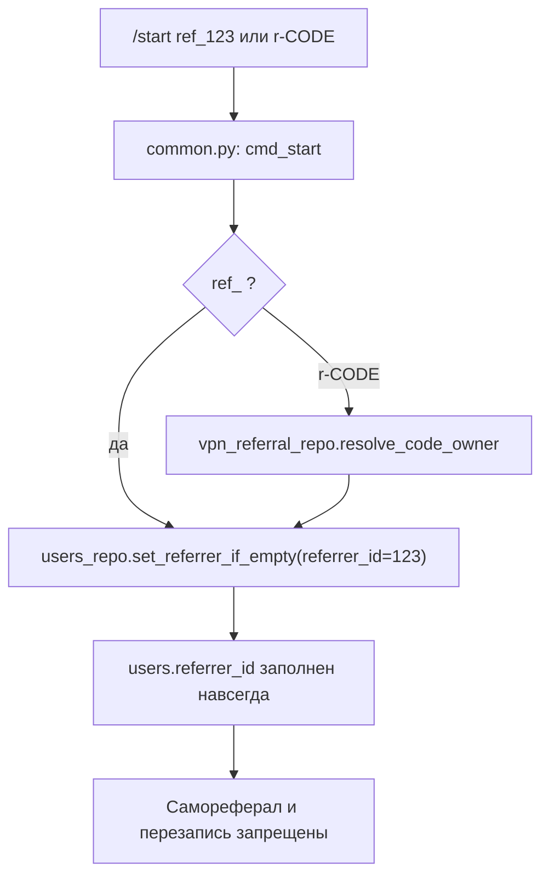

# Telegram Shop Bot — Final ML Handoff

## 0) Журнал: фактический деплой на production (2026-04-20)

Ниже зафиксированы **реальные шаги**, которые были выполнены для выкладки бота на прод (без изменения мобильного приложения и без изменения `/opt/aladdin-backend`).

1. **Внешний health основного ALADDIN API (до SSH):**  
   `curl -s -S -m 8 http://149.154.65.180:8002/api/health` → ожидаемо `{"status":"ok"}` (порядок действий с хостом — в `ALADDIN_SERVER_CONNECTION_GUIDE_FOR_ML_SYSTEMS.md`).

2. **SSH на прод:** пользователь `root`, хост `149.154.65.180`; для неинтерактивного входа использован существующий ключ **`~/.ssh/aladdin_server`** с опциями в духе `ssh -o IdentitiesOnly=yes -i ~/.ssh/aladdin_server` (ключ `~/.ssh/aladdin_prod` в окружении агента отсутствовал — важно зафиксировать фактически рабочий путь к ключу).

3. **Проверка дерева бота на сервере:** каталог `ROOT=/opt/aladdin-telegram-shop-bot` существует; активная версия до выкладки указывала на предыдущий релиз в `ROOT/releases/.../telegram_stars_shop_bot`; симлинки `current_app` и `current_release` уже использовались.

4. **Подготовка каталога нового релиза:** на сервере выполнено `mkdir -p "${ROOT}/releases/<TS>/telegram_stars_shop_bot"` (конкретный timestamp см. п. 6).

5. **`rsync` с машины разработки** из корня монорепозитория, где лежит `telegram_stars_shop_bot/` (пример пути локально: `.../mobile_apps/ALADDIN_iOS`): синхронизация в `root@149.154.65.180:${ROOT}/releases/<TS>/telegram_stars_shop_bot/` с транспортом `rsync -e "ssh … -i ~/.ssh/aladdin_server"` и исключениями **`--exclude`**: `.git`, `__pycache__`, `*.pyc`, `.venv`, `venv`, **`data`** (SQLite на проде), **`.env`** (секреты не из репозитория), плюс режим **`--delete`** для зеркалирования кода без лишних файлов — **без** затрагивания `ROOT/shared/.env`, `ROOT/venv/`, `ROOT/logs/`.

6. **Фактический активный релиз после этой выкладки:**  
   `/opt/aladdin-telegram-shop-bot/releases/20260420-233510/telegram_stars_shop_bot`  
   (timestamp в формате `YYYYMMDD-HHMMSS` от локальной машины на момент деплоя).

7. **Переключение симлинков на сервере:**  
   `ln -sfn "${ROOT}/releases/<TS>" "${ROOT}/current_release"`  
   `ln -sfn "${ROOT}/releases/<TS>/telegram_stars_shop_bot" "${ROOT}/current_app"`

8. **Зависимости Python:**  
   `sudo "${ROOT}/venv/bin/pip" install -r "${ROOT}/current_app/requirements.txt"`  
   (общий venv в `ROOT/venv`, код — в `current_app`).

9. **Рестарт сервисов бота:**  
   `systemctl restart aladdin-telegram-bot.service aladdin-partner-api.service aladdin-webhook-worker.service`

10. **Пост-деплой проверки на сервере:**  
    `curl -s -S -m 8 http://127.0.0.1:8090/health` → `{"status":"ok"}`;  
    `systemctl is-active` для трёх unit’ов выше → `active`.

**Инварианты этой сессии:** дерево **мобильного приложения** в репозитории не менялось для целей деплоя; на сервере **не** выполнялись правки в **`/opt/aladdin-backend`** и не перезапускался `aladdin-backend` в рамках этой выкладки.

**Дальше по эксплуатации:** полный канон команд (`rsync` / `git pull` / `scp`, симлинки, что нельзя затирать) — в подразделе **«Доставка кода на production (канон)»** ниже в разделе 2; быстрый смоук в Telegram (`/start`, сценарии оплаты и т.д.) — **раздел 9** этого файла и чеклисты по ссылкам в разделе 10.

### 0.1) Журнал: деплой VPN-стека + админ-команды бота (2026-05-14)

1. **Shop Bot** — `rsync` каталога `telegram_stars_shop_bot/` в `ROOT/releases/20260514-143345/telegram_stars_shop_bot/`, симлинки `current_release` / `current_app`, `pip install -r current_app/requirements.txt`, рестарт **`aladdin-telegram-bot`**, **`aladdin-partner-api`**, **`aladdin-webhook-worker`**.  
2. **aladdin-shop-vpn-api** — `rsync` из репо `aladdin_shop_vpn_api/` в **`/opt/aladdin-shop-vpn-api`** с исключениями **`var/`**, **`env`**, **`venv/`** (прод-данные и секреты не трогались), `chmod +x deploy/scripts/*.sh`, рестарт **`aladdin-shop-vpn-api.service`**.  
3. **Смоук на сервере:** `8090/health` и `8091/health` → `ok`, `8091/ready` → **200**; все четыре unit’а выше + **`aladdin-shop-vpn-worker.timer`** — `active`; в `shared/.env` присутствуют **`VPN_API_BASE_URL`**, **`VPN_API_HMAC_SECRET`**, **`VPN_DB_PATH`**, **`ADMIN_IDS`** (значения не логируются).  
4. **Новое в боте на проде:** команды **`/admin_vpn`**, **`/admin_vpn_status`**, **`/admin_vpn_revoke`**, **`/admin_vpn_extend`** (см. **`docs/VPN14_SUPPORT_ADMIN_RUNBOOK.md`**).  
5. **Канон БД и VPN в меню (2026-05-14):** в **`shared/.env`** заданы **`DATABASE_PATH=/opt/aladdin-telegram-shop-bot/data/shop.db`** (каталог **`ROOT/data/`**, копия из активного релиза при первом включении) и **`UI_SHOW_VPN=true`** — в главном меню строка **«🌐 VPN»** и команда **`/vpn`** в списке команд бота после рестарта.

---

Этот документ — единая входная точка для другой ML/agent системы.  
Цель: открыть один файл и быстро понять, **что развернуто, где лежит, как работает, как проверять и где риски**.

## 0.5) Два независимых продукта: iOS / backend / Telegram Shop Bot

В одном монорепозитории **`ALADDIN_iOS`** лежат **разные артефакты**. Другая ML-система должна различать **что деплоить куда** и **не смешивать** пути.

| Продукт | Где в репозитории | Куда на сервере (prod) | Как выкатывать |
|---------|-------------------|-------------------------|----------------|
| **Мобильное приложение ALADDIN (iOS)** | `Core/`, Xcode-проект, каталоги приложения **вне** `telegram_stars_shop_bot/` | **Не** в `/opt/aladdin-telegram-shop-bot`. Сборка — через Xcode / CI мобильного приложения; на сервере бота **не копировать**. |
| **Основной ALADDIN backend (API)** | Отдельный репозиторий/дерево на сервере | **`/opt/aladdin-backend`**, публичный health обычно **`:8002`** | Свой деплой и `systemctl` (например `aladdin-backend`). При выкладке **магазина** backend **не трогать**, если нет отдельной задачи на backend. |
| **Telegram Shop Bot** (этот документ) | Только **`telegram_stars_shop_bot/`** | **`ROOT=/opt/aladdin-telegram-shop-bot`**, Partner API внутри сервера **`:8090`**, три unit'а: `aladdin-telegram-bot`, `aladdin-partner-api`, `aladdin-webhook-worker` | **`rsync`** содержимого `./telegram_stars_shop_bot/` → `releases/<TS>/telegram_stars_shop_bot/` + симлинки `current_app` / `current_release` + `pip` в `ROOT/venv` + рестарт **трёх** сервисов бота. Канон — §2 и §2.1 ниже. |
| **VPN для Shop Bot** (планируется) | План и пути: **`telegram_stars_shop_bot/docs/VPN_SHOP_INTEGRATION_PLAN.md`**; выборочный код-референс в монорепо: **`…/ALADDIN_iOS/app/security/vpn/`** | **`/opt/aladdin-shop-vpn-api`** + systemd **`aladdin-shop-vpn-api.service`**; **не** смешивать с **`/opt/aladdin-backend`**. Старый деплой справки: **`/opt/aladdin-backend/app/security/vpn`**. | Отдельный деплой venv + API; бот вызывает по секрету из **`ROOT/shared/.env`**. Детали — в `VPN_SHOP_INTEGRATION_PLAN.md`. |

**Правило:** команда деплоя бота всегда начинается с пути **`…/ALADDIN_iOS/telegram_stars_shop_bot/`** (или эквивалента на диске). **Никогда** не делать `rsync` всего корня `ALADDIN_iOS` в `current_app` бота — туда попадёт мусор из iOS и сломается Python.

### 0.6) VPN только для Telegram Shop Bot (отдельно от `/opt/aladdin-backend`)

План путей на сервере, переиспользование старого `app/security/vpn`, интеграция с ботом (**доступ к VPN только после оплаты**, без триала) — в **`docs/VPN_SHOP_INTEGRATION_PLAN.md`**; контракт API — **`docs/VPN_SHOP_API.md`**. Новый контроль-план VPN **не** кладётся в дерево основного backend; целевой каталог на проде: **`/opt/aladdin-shop-vpn-api`** (отдельный systemd `aladdin-shop-vpn-api.service`). Старый код на сервере **`/opt/aladdin-backend/app/security/vpn`** трактовать как **архив/справку**, не как место деплоя нового VPN.

### Что **не** попадает на сервер тем же `rsync` бота (и это правильно)

| Что | Почему |
|-----|--------|
| **`ROOT/shared/.env`** | Файл **только на сервере**; в git не коммитится. После выкладки кода **вручную** сверить с `telegram_stars_shop_bot/env.example` и дописать новые переменные — иначе часть функций останется на старых дефолтах. |
| **`data/` и `shop.db`** | Исключены из `rsync` (`--exclude data`), чтобы **не уничтожить** продовую SQLite. |
| **Локальный `.env`** внутри клона | Исключён из `rsync`; не подменять им `shared/.env` на сервере. |
| **Задача `0-backup` из плана 44 ID** | Это **операция на сервере** (копии `shared/.env`, `shop.db`, архив кода), а не содержимое git. `rsync` её **не выполняет** — делает человек по §1.2 плана в `IMPLEMENTATION_PLAN_AND_TASKS.md` и по §1.2 этого файла. |

## 1) Что это за система

Развернут отдельный Telegram Shop Bot с Partner API:

- Telegram-бот (aiogram) для пользователей/админов.
- Partner API (FastAPI) для партнёров.
- Worker очереди исходящих webhook.
- Отдельный деплой на сервере, не затрагивающий основной ALADDIN backend.

Архитектура: **один бот + один API + один worker + SQLite БД бота**.

## 2) Где что находится

### Локальный репозиторий

- Код бота (единственный источник для деплоя магазина): `telegram_stars_shop_bot/`
- **iOS и прочее в корне `ALADDIN_iOS/`** (`Core/` и т.д.) — **отдельный продукт**; в выкладку бота **не входят** (см. §0.5).
- Ключевая документация бота: `telegram_stars_shop_bot/docs/`
- CI workflow бота: `.github/workflows/telegram_shop_bot_ci.yml`

### Сервер (production)

- Основной ALADDIN backend (отдельно, не трогать): `/opt/aladdin-backend`
- Отдельный бот-проект:
  - `/opt/aladdin-telegram-shop-bot/current_app`
  - `/opt/aladdin-telegram-shop-bot/current_release`
  - `/opt/aladdin-telegram-shop-bot/releases/<timestamp>/telegram_stars_shop_bot`
  - `/opt/aladdin-telegram-shop-bot/shared/.env`
  - `/opt/aladdin-telegram-shop-bot/venv`
  - `/opt/aladdin-telegram-shop-bot/logs`

### Доставка кода на production (канон)

**Корень на сервере:** `ROOT=/opt/aladdin-telegram-shop-bot`.  
**Новый релиз:** каталог `ROOT/releases/<timestamp>/telegram_stars_shop_bot/`. **Активная версия:** симлинки `ROOT/current_release` → каталог релиза и `ROOT/current_app` → `.../telegram_stars_shop_bot` внутри него.

**Секреты:** только файл `ROOT/shared/.env` на сервере. Не заливать поверх него локальный `.env` с машины разработчика и не включать `shared/.env` в команды копирования «поверх всего дерева».

**Нельзя перезатирать или удалять при обновлении кода:** `ROOT/shared/.env`, дерево `ROOT/venv/`, каталог **`data/`** внутри приложения (по умолчанию там SQLite `shop.db`), каталог **`ROOT/logs/`**. В `rsync` с `--delete` обязательно исключать `data`, иначе можно уничтожить продовую БД.

**SSH и порядок действий с хостом** (ключ, health основного API при необходимости): см. `ALADDIN_SERVER_CONNECTION_GUIDE_FOR_ML_SYSTEMS.md` в корне монорепозитория. IP прод-сервера в примерах ниже — тот же, что в гайде.

**Перед деплоем:** убедиться, что unit-файлы systemd указывают на канонические пути, например `WorkingDirectory=/opt/aladdin-telegram-shop-bot/current_app` и `EnvironmentFile=/opt/aladdin-telegram-shop-bot/shared/.env` (`systemctl cat aladdin-telegram-bot.service` и аналогично для API и worker).

#### Вариант A (рекомендуется): `rsync` в новый release + переключение симлинков

С локальной машины, из каталога, где лежит папка `telegram_stars_shop_bot/` (например корень клона `ALADDIN_iOS`):

```bash
export SSH_HOST="root@149.154.65.180"
export ROOT="/opt/aladdin-telegram-shop-bot"
export TS="$(date +%Y%m%d-%H%M%S)"
# Каталог релиза на сервере должен существовать до rsync (иначе ошибка mkdir на стороне receiver):
ssh "${SSH_HOST}" "mkdir -p \"${ROOT}/releases/${TS}/telegram_stars_shop_bot\""
rsync -az --delete \
  --exclude '.git' \
  --exclude '__pycache__' \
  --exclude '*.pyc' \
  --exclude '.venv' \
  --exclude 'venv' \
  --exclude 'data' \
  --exclude '.env' \
  ./telegram_stars_shop_bot/ "${SSH_HOST}:${ROOT}/releases/${TS}/telegram_stars_shop_bot/"
```

На сервере после успешной синхронизации (подставить тот же `TS`):

```bash
ROOT=/opt/aladdin-telegram-shop-bot
sudo ln -sfn "${ROOT}/releases/${TS}" "${ROOT}/current_release"
sudo ln -sfn "${ROOT}/releases/${TS}/telegram_stars_shop_bot" "${ROOT}/current_app"
```

Если менялся `telegram_stars_shop_bot/requirements.txt`, на сервере обновить зависимости в общем venv:

```bash
sudo /opt/aladdin-telegram-shop-bot/venv/bin/pip install -r /opt/aladdin-telegram-shop-bot/current_app/requirements.txt
```

Рестарт и проверка API (полный smoke — раздел 9 ниже):

```bash
sudo systemctl restart aladdin-telegram-bot.service aladdin-partner-api.service aladdin-webhook-worker.service
curl -s -S -m 8 http://127.0.0.1:8090/health
```

**Компактно одной цепочкой** (после `rsync` с локальной машины; пути SSH/ключ — как в вашем окружении):

```bash
TS="$(date +%Y%m%d-%H%M%S)" && rsync -az --delete \
  --exclude '.git' --exclude '__pycache__' --exclude '*.pyc' \
  --exclude '.venv' --exclude 'venv' --exclude 'data' --exclude '.env' \
  ./telegram_stars_shop_bot/ "root@149.154.65.180:/opt/aladdin-telegram-shop-bot/releases/${TS}/telegram_stars_shop_bot/" && \
ssh root@149.154.65.180 "TS='${TS}' ROOT=/opt/aladdin-telegram-shop-bot && sudo ln -sfn \"\$ROOT/releases/\$TS\" \"\$ROOT/current_release\" && sudo ln -sfn \"\$ROOT/releases/\$TS/telegram_stars_shop_bot\" \"\$ROOT/current_app\" && sudo systemctl restart aladdin-telegram-bot.service aladdin-partner-api.service aladdin-webhook-worker.service && curl -s -S -m 8 http://127.0.0.1:8090/health"
```

(При необходимости добавьте к `ssh` опции ключа, например `-o IdentitiesOnly=yes -i ~/.ssh/aladdin_prod`.)

#### Вариант B: `git pull` в каталоге активного приложения

Если `current_app` — рабочий клон того же репозитория с настроенным `origin`:

```bash
cd "$(readlink -f /opt/aladdin-telegram-shop-bot/current_app)"
git fetch origin && git checkout <ветка_или_тег> && git pull --ff-only
sudo systemctl restart aladdin-telegram-bot.service aladdin-partner-api.service aladdin-webhook-worker.service
curl -s -S -m 8 http://127.0.0.1:8090/health
```

`git push` на `origin` **сам по себе сервер не обновляет** — на хосте всё равно нужен pull (вариант B) или выкладка файлов (вариант A).

#### Вариант C: точечный hotfix через `scp`

Для срочной подмены одного файла в уже активном дереве:

```bash
scp ./telegram_stars_shop_bot/bot/handlers/shop.py \
  root@149.154.65.180:/opt/aladdin-telegram-shop-bot/current_app/bot/handlers/shop.py
sudo systemctl restart aladdin-telegram-bot.service aladdin-partner-api.service aladdin-webhook-worker.service
```

Минус: расхождение с релизами в `releases/`; после патча лучше закрепить состояние через вариант A или B.

### 2.1) Чеклист: всё из репозитория доставлено и реально применилось на сервере

Цель — не «файлы уехали по scp», а **работающий** бот + API + worker на канонических путях.

1. **Локально** (в каталоге `telegram_stars_shop_bot/`): `python3 -m pytest -q` — зелёный прогон перед выкладкой.
2. **Источник rsync:** с машины разработки синхронизируется **только** каталог `./telegram_stars_shop_bot/` → `${ROOT}/releases/<TS>/telegram_stars_shop_bot/` (как в варианте A). Не путать с корнем всего монорепозитория `ALADDIN_iOS`, если там несколько проектов.
3. **Перед rsync на сервере:** `ssh … "mkdir -p \"${ROOT}/releases/<TS>/telegram_stars_shop_bot\""` — иначе `rsync` может завершиться с ошибкой «No such file or directory» на приёмнике.
4. **Исключения обязательны:** `--exclude 'data'`, `--exclude '.env'`, venv и `.git` — иначе можно затереть продовую SQLite или залить локальный `.env`.
5. **Секреты:** после выкладки кода сравнить **`telegram_stars_shop_bot/env.example`** с **`${ROOT}/shared/.env`**: новые ключи из репо должны появиться на сервере вручную (merge), иначе сервис стартует со старыми дефолтами. Актуальные имена см. в `env.example`; среди часто забываемых после доработок плана: `SUPER_ADMIN_IDS`, `PARTNER_API_RATE_LIMIT_*`, `STUCK_PAID_ALERT_HOURS`, `STUCK_PAID_CHECK_INTERVAL_SECONDS`, `STUCK_PROCESSING_ALERT_MINUTES`, `OPERATOR_QUEUE_PROCESSING_IDLE_MINUTES`, `AUTO_FULFILL_FAILURE_ALERTS_ENABLED`, `PAYMENT_CHECKOUT_INVOICE_COOLDOWN_SECONDS`, флаги `CRYPTO_PAY_*` / `XROCKET_*` / `AUTO_FULFILL_*`, `ISTAR_*`. Ротация — `docs/SECRETS_AND_ROTATION_RUNBOOK.md`.
6. **Симлинки:** `current_release` → каталог релиза, `current_app` → `.../telegram_stars_shop_bot` внутри него (обе команды `ln -sfn`).
7. **Зависимости:** если менялся `requirements.txt` — `pip install -r "${ROOT}/current_app/requirements.txt"` в **`${ROOT}/venv`**, не в системный Python.
8. **Рестарт только трёх сервисов бота** — см. §3. **`aladdin-backend`** для выкладки магазина **не перезапускать**, если нет отдельной задачи на backend.
9. **Проверки:** подождать несколько секунд после `systemctl restart`, затем `curl` на `127.0.0.1:8090/health` (сразу после рестарта порт может быть ещё не готов). `systemctl is-active` для трёх unit’ов; затем смоук из §9 (Telegram + при необходимости тестовый API заказ).
10. **Приёмка по ID плана:** заполнить колонку «Человек» в `docs/ACCEPTANCE_CHECKLIST_BY_ID.md` для строк с pytest **Нет** / **Частично** и для операционных пунктов.

## 3) Сервисы systemd (production)

- `aladdin-telegram-bot.service` — Telegram polling.
- `aladdin-partner-api.service` — FastAPI на `:8090`.
- `aladdin-webhook-worker.service` — фоновая доставка исходящих webhook.
- `aladdin-backend.service` — основной ALADDIN backend, отдельный.

Проверка:

```bash
systemctl is-active aladdin-telegram-bot.service
systemctl is-active aladdin-partner-api.service
systemctl is-active aladdin-webhook-worker.service
systemctl is-active aladdin-backend.service
```

## 4) Обязательные env-переменные бота

Файл: `/opt/aladdin-telegram-shop-bot/shared/.env`

Минимум:

- `BOT_TOKEN`
- `ADMIN_IDS` (ID живых админов Telegram)
- `API_KEY_PEPPER`
- `PAYMENT_WEBHOOK_SECRET`
- **`USD_RUB_RATE`** — строго **`> 0`** (₽ за 1 USD); иначе процессы не стартуют. Регламент обновления: **`docs/FX_RATES_RUNBOOK.md`**.

Дополнительно:

- `SUPER_ADMIN_IDS` (роль супер-админа при непустом пересечении с `ADMIN_IDS`; иначе все админы считаются супер-админами — см. код/тесты `test_admin_ops.py`)
- `SENTRY_DSN`, `SENTRY_ENVIRONMENT`, `SENTRY_TRACES_SAMPLE_RATE`
- `PARTNER_API_CORS_ORIGINS`
- `PARTNER_API_RATE_LIMIT_API_PER_MINUTE`, `PARTNER_API_RATE_LIMIT_WEBHOOK_PER_MINUTE`, `PARTNER_API_RATE_LIMIT_PUBLIC_PER_MINUTE` (`0` = отключить класс лимита)
- `STUCK_PAID_ALERT_HOURS`, `STUCK_PAID_CHECK_INTERVAL_SECONDS` (лог «paid без движения»; цикл выключен только если **и** часы `0`, **и** `STUCK_PROCESSING_ALERT_MINUTES=0`), `STUCK_PROCESSING_ALERT_MINUTES`, `OPERATOR_QUEUE_PROCESSING_IDLE_MINUTES`, `AUTO_FULFILL_FAILURE_ALERTS_ENABLED`
- `PAYMENT_CHECKOUT_INVOICE_COOLDOWN_SECONDS` (повторный счёт Ckassa/LAVA/Crypto на тот же `order_id`)
- `SUPPORT_URL` / `SUPPORT_USERNAME`
- **Ckassa (₽, прод):** `CKASSA_ENABLED=true`, **`CKASSA_TEST_MODE=false`**, `CKASSA_SHOP_TOKEN`, `CKASSA_SECRET_KEY`, публичный **`CKASSA_CALLBACK_PUBLIC_URL`** → `https://<домен>/v1/payments/ckassa-webhook`. При `CKASSA_TEST_MODE=true` в логах — WARNING (только демо, не настоящие платежи).
- **Crypto Pay + xRocket** (вкл. флаги, токены, резерв курса `USDT_RUB_RATE` / `USD_RUB_RATE`, публичные URL вебхуков на Partner API): **`docs/CRYPTO_PAY_SPEC.md`** — раздел **«0. Прод: shared/.env + вебхуки»**.
- **Автовыдача / iStar (прод):** чеклист в **`env.example`** (блок AUTO_FULFILL / ISTAR), воркер — `docs/auto-fulfill-worker.service`, см. также `docs/AUTO_FULFILL_SMOKE.md`

## 5) Ключевые runtime-эндпоинты

- Partner API health: `http://127.0.0.1:8090/health`
- OpenAPI: `http://127.0.0.1:8090/openapi.json`
- Входящие вебхуки оплаты (публичный HTTPS, см. `CRYPTO_PAY_SPEC.md` §0):  
  `POST/GET /v1/payments/ckassa-webhook`, `POST /v1/payments/lava-webhook`, `POST /v1/payments/crypto-pay-webhook`, `POST /v1/payments/xrocket-webhook`
- **Прод, nginx `aladdin-ai.ru`:** префикс **`/v1/`** проксируется на Partner API **`127.0.0.1:8090`** (TLS на домене). В кабинетах Crypto Pay / xRocket указывать полные URL:  
  `https://aladdin-ai.ru/v1/payments/crypto-pay-webhook` и `https://aladdin-ai.ru/v1/payments/xrocket-webhook` (регистрация URL — только в UI ботов; через HTTP API Crypto Pay метод `setWebhook` недоступен).
- Внешний health (основной ALADDIN): `http://149.154.65.180:8002/api/health`

## 6) Что уже проверено

- Автотесты: `13 passed`.
- Дополнение (2026-04-20): полный прогон `pytest tests/` — **`39 passed`** (каталог `products.yaml`, ценообразование и wholesale, FX/USDT/UAH, маркетинг/канал, настройки admin/LAVA, smoke `GET /health` + `GET /openapi.json`, схема SQLite, `provider_mark_paid_idempotent`; на прод-сервере те же тесты прогонялись из `/opt/aladdin-telegram-shop-bot/current_app` в общем `venv`).
- Bot polling поднят.
- Partner API работает (profile/orders/topups/webhooks).
- Payment webhook (`/v1/payments/provider-webhook`) переводит заказ в `paid`.
- Исходящие webhooks идут через очередь + retry worker.
- Меню Telegram:
  - `/start` -> первая страница -> `Далее` -> 10 карточек.
  - `/menu` (через кнопку Menu внизу) -> те же 10 карточек.

## 7) Критичные operational нюансы

1. **ADMIN_IDS**  
   Должны быть реальные user_id админов.  
   Каждый админ обязан открыть бота и нажать `/start`, иначе Telegram `sendMessage` может отдавать `400/403`.

2. **Telegram egress**  
   Если появляются `TelegramNetworkError timeout`, проверять доступность `api.telegram.org:443` с сервера.
   В текущем проде применён фикс резолва в `/etc/hosts` на рабочий Telegram DC IP.

3. **Разделение проектов**  
   Любые действия по этому боту делать только в `/opt/aladdin-telegram-shop-bot/**`.  
   Не менять `/opt/aladdin-backend/**`, если задача не про основной ALADDIN backend.

4. **Worker обязателен**  
   `aladdin-webhook-worker.service` должен быть активен, иначе `outbound_webhook_events` будет копиться в `pending/failed`.

## 8) Логи и диагностика

- `/opt/aladdin-telegram-shop-bot/logs/bot.log`
- `/opt/aladdin-telegram-shop-bot/logs/partner_api.log`
- `/opt/aladdin-telegram-shop-bot/logs/webhook_worker.log`

Быстрая проверка:

```bash
tail -n 100 /opt/aladdin-telegram-shop-bot/logs/bot.log
tail -n 100 /opt/aladdin-telegram-shop-bot/logs/partner_api.log
tail -n 100 /opt/aladdin-telegram-shop-bot/logs/webhook_worker.log
```

## 9) Минимальный smoke-check после изменений

1. Проверить `systemctl is-active` для 3 сервисов бота.
2. Проверить `curl http://127.0.0.1:8090/health`.
3. В Telegram: `/start` -> `Далее` -> видны 10 карточек.
4. В Telegram: `/menu` -> видны те же 10 карточек.
5. Сделать тестовый API заказ и проверить, что статус/уведомление проходят.

## 10) Ссылки на основные документы проекта

- Курсы USD/USDT и регламент обновления: `docs/FX_RATES_RUNBOOK.md`
- Ротация секретов (LAVA, Crypto Pay, xRocket): `docs/SECRETS_AND_ROTATION_RUNBOOK.md`
- Опциональные доработки эксплуатации (фаза 2): `docs/OPS_PHASE2_PLAN.md`
- Runbook: `docs/RUNBOOK.md`
- Acceptance: `docs/ACCEPTANCE_CHECKLIST.md`
- Acceptance по ID плана (44 строки): `docs/ACCEPTANCE_CHECKLIST_BY_ID.md`
- Final hardening: `docs/FINAL_HARDENING_CHECKLIST.md`
- Sentry incident response: `docs/SENTRY_INCIDENT_RESPONSE.md`
- Deploy webhook worker: `docs/DEPLOY_WEBHOOK_WORKER.md`
- Systemd unit worker template: `docs/webhook-worker.service`
- Cron template worker: `docs/webhook-worker.crontab`
- Separate server deployment: `docs/SERVER_DEPLOY_SEPARATE.md`
- Roadmap A/B: `docs/ROADMAP_PLANS_A_B.md`
- Progress tracker: `docs/PROGRESS_TRACKER.json`
- OpenAPI v1: `docs/openapi_v1.yaml`

## 11) Definition of done (для следующей ML системы)

Если новая система может подтвердить все пункты ниже — контекст считан корректно:

- Понимает разделение `/opt/aladdin-backend` и `/opt/aladdin-telegram-shop-bot`.
- Умеет проверить 3 systemd сервиса бота + health `:8090`.
- Знает, где env, логи, OpenAPI, worker queue.
- Знает канон доставки кода (подраздел «Доставка кода на production» в разделе 2): `rsync` в `releases/` + симлинки, либо `git pull` в `current_app`, исключения для `data/`, `shared/.env`, `venv/`.
- Понимает критичные риски: `ADMIN_IDS`, Telegram egress, активность worker.

## 12) Карта модулей (кодовая структура)

### `bot/`

- `bot/main.py` — запуск polling, middleware, регистрация Telegram Menu команд.
- `bot/handlers/common.py` — `/start`, `/menu`, `/my`, `/orders`.
- `bot/handlers/hub.py` — основной UI хаба (10 карточек), навигация, профиль, support/API экран.
- `bot/handlers/shop.py` — checkout-поток покупки Stars/Premium.
- `bot/handlers/admin.py` — админские callback-действия (статусы, топап, sell).
- `bot/middlewares/*` — внедрение зависимостей и антифлуд.
- `bot/keyboards/shop_kb.py` — inline keyboards.
- `bot/states/*` — FSM состояния.
- `bot/db/database.py` — схема SQLite + legacy миграции.

### `bot/services/`

- `orders_repo.py` — CRUD заказов, API idempotency, статусные операции.
- `order_flow.py` — side effects при `completed` (рефералка/комиссия).
- `balance_repo.py` — баланс и topup.
- `sell_repo.py` — заявки на выкуп и пагинация.
- `api_clients_repo.py` — API ключи, owner binding, webhook subscription поля.
- `partner_outbound.py` — очередь + retry доставки `order.status_changed`.
- `payment_events_repo.py` — идемпотентность входящего payment webhook.
- `catalog.py`, `pricing.py`, `marketing.py`, `users_repo.py`, `hmac_util.py` — доменная логика.

### `partner_api/`

- `partner_api/main.py` — FastAPI app, роуты, CORS, health.
- `partner_api/deps.py` — auth по `X-API-KEY`, rate limit, контекст запроса.
- `partner_api/routers/orders.py` — create/list/get заказов API.
- `partner_api/routers/topups.py` — create/list/get пополнений.
- `partner_api/routers/profile.py` — профиль владельца ключа.
- `partner_api/routers/payment_provider.py` — входящий webhook оплаты `mark_paid`.
- `partner_api/routers/webhooks_partner.py` — подписка партнёра на исходящие webhooks.
- `partner_api/webhook_worker.py` — CLI worker для обработки очереди webhook.
- `partner_api/schemas.py`, `notify.py`, `ratelimit.py` — схемы/уведомления/лимиты.

## 13) Таблица endpoint -> handler -> БД таблицы

| Endpoint | Handler | Основные таблицы |
|---|---|---|
| `GET /health` | `partner_api.main:create_app.health` | — |
| `GET /v1/user/profile` | `partner_api/routers/profile.py:get_profile` | `users`, `api_clients` |
| `POST /v1/orders/create` | `partner_api/routers/orders.py:create_order` | `orders`, `users`, `api_clients` |
| `GET /v1/orders` | `partner_api/routers/orders.py:list_orders` | `orders` |
| `GET /v1/orders/{order_id}` | `partner_api/routers/orders.py:get_order` | `orders` |
| `POST /v1/topups/create` | `partner_api/routers/topups.py:create_topup` | `topup_requests`, `api_clients` |
| `GET /v1/topups` | `partner_api/routers/topups.py:list_topups` | `topup_requests` |
| `GET /v1/topups/{topup_id}` | `partner_api/routers/topups.py:get_topup` | `topup_requests` |
| `POST /v1/payments/provider-webhook` | `partner_api/routers/payment_provider.py:payment_provider_webhook` | `orders`, `payment_provider_events`, `outbound_webhook_events` |
| `POST/GET /v1/payments/ckassa-webhook` | `partner_api/routers/ckassa_webhook.py` | `orders`, `payment_provider_events`, … |
| `POST /v1/payments/lava-webhook` | `partner_api/routers/lava_webhook.py` | `orders`, `payment_provider_events`, … |
| `POST /v1/payments/crypto-pay-webhook` | `partner_api/routers/crypto_pay_webhook.py` | `orders`, `payment_provider_events`, … |
| `POST /v1/payments/xrocket-webhook` | `partner_api/routers/xrocket_webhook.py` | `orders`, `payment_provider_events`, … |
| `POST /v1/payments/istar-webhook` | `partner_api/routers/istar_webhook.py` | `orders`, … |
| `GET /v1/webhooks/subscription` | `partner_api/routers/webhooks_partner.py:get_webhook_subscription` | `api_clients` |
| `PUT /v1/webhooks/subscription` | `partner_api/routers/webhooks_partner.py:put_webhook_subscription` | `api_clients` |

## 14) Таблица callback/action в боте

| Callback / Command | Где обрабатывается | Что делает |
|---|---|---|
| `start:hub` | `bot/handlers/hub.py:onboarding_continue` | Переход к хабу (10 карточек) |
| `nav:hub` | `bot/handlers/hub.py:nav_hub` | Возврат в хаб |
| `nav:buy_stars` | `bot/handlers/hub.py` | Открывает каталог Stars |
| `nav:premium` | `bot/handlers/hub.py` | Открывает каталог Premium |
| `nav:orders:0` / `nav:orders:{page}` | `bot/handlers/hub.py` | Пагинация «Мои заказы» |
| `nav:sells:0` / `nav:sells:{page}` | `bot/handlers/hub.py` | Пагинация «Мои заявки на выкуп» |
| `nav:privacy` | `bot/handlers/hub.py` | Экран политики данных |
| `api:partner_key` / `api:req` | `bot/handlers/hub.py` | Выдача/запрос API ключа |
| `adm:paid` / `adm:paidbg` / `adm:proc` / `adm:done` / `adm:refund` / `adm:disp` / `adm:dispok` | `bot/handlers/admin.py` | Статусы заказа; break-glass оплаты; сторно/спор (супер-админ) |
| `adm:ffman` / `adm:ffauto` / `adm:ffrst` | `bot/handlers/admin.py` | Автовыдача: только вручную / снова авто / сброс полей |
| `top:ok:{id}` | `bot/handlers/admin.py` | Подтверждение топапа админом |
| `sel:proc|done|can:{id}` | `bot/handlers/admin.py` | Статусы заявки sell |
| `/menu` | `bot/handlers/common.py:cmd_menu` | Открывает тот же хаб (10 карточек) |

## 15) Release chronology (что и зачем меняли)

1. **База/архитектура API v1:** добавлены `api_clients`, поля `orders.source/api_client_id/idempotency_key/external_ref`, idempotency индекс.  
   **Зачем:** безопасная партнёрская интеграция без дубликатов.
2. **Partner API endpoints:** profile/orders/topups + OpenAPI draft.  
   **Зачем:** дать партнёрам stable HTTP контракт.
3. **Bot UX hardening:** pagination orders/sells, privacy screen, empty catalog UX.  
   **Зачем:** завершённый клиентский опыт без тупиков.
4. **Sentry + структурные логи:** инициализация в bot/api, scrub секретов.  
   **Зачем:** наблюдаемость и безопасный error tracking.
5. **Payment webhook + idempotency:** `POST /v1/payments/provider-webhook`.  
   **Зачем:** автоплатежи v1 с контролем повторов.
6. **Outbound webhooks + subscription:** `order.status_changed`, `PUT /v1/webhooks/subscription`.  
   **Зачем:** уведомлять партнёра о статусах заказа.
7. **Webhook queue + worker:** `outbound_webhook_events`, retry/backoff, `partner_api.webhook_worker`.  
   **Зачем:** не терять события при сетевых ошибках.
8. **CI усиление:** `ruff`, optional `mypy`, расширение тестов (до 13).  
   **Зачем:** снизить риск регрессий.
9. **Отдельный production deploy:** `/opt/aladdin-telegram-shop-bot` + отдельные systemd units.  
   **Зачем:** полная изоляция от `/opt/aladdin-backend`.
10. **Telegram menu UX:** регистрация `/menu` в `setMyCommands`.  
    **Зачем:** доступ к хабу как через «Далее», так и через кнопку Menu.

## 16) Known limitations + future migration notes

### Known limitations

- SQLite подходит для малого/среднего трафика, но имеет предел под high concurrency.
- Outbound webhook retry есть, но без DLQ/отдельного durable брокера.
- `mypy` пока optional в CI (не gate).
- Telegram-зависимость чувствительна к сетевой доступности `api.telegram.org`.
- `ADMIN_IDS` должны быть валидными и админы должны нажать `/start`.

### Future migration notes

1. **DB migration:** SQLite -> Postgres при росте нагрузки (заказы, webhook queue, ledger).
2. **Webhook delivery v2:** отдельный worker process с DLQ, jitter backoff, replay CLI.
3. **Observability v2:** метрики Prometheus/Grafana + SLO по API/webhook.
4. **Security v2:** регулярная ротация API/webhook секретов + audit trail.
5. **CI v2:** сделать `mypy` обязательным, добавить контрактные API тесты из OpenAPI.

---

## 17) Реферальная система: Stars / Premium и VPN (где код, как связано)

**Продуктовый план единого UX (без языка «заработок», одна ссылка `ref_`, дни VPN как доп. бонус):**  
`docs/REFERRAL_UNIFIED_UX_PLAN.md` — тексты по экранам и чеклист внедрения на 3 дня.

Два продукта в одном боте, **одна** привязка пригласившего в `users.referrer_id`, но **два разных бонуса** после оплаты:

| Продукт | Ссылка входа | Бонус приглашённому | Бонус рефереру |
|---------|--------------|---------------------|----------------|
| **Stars / Premium / VPN** (единая ссылка) | `https://t.me/{bot}?start=ref_{user_id}` | Скидка **%** на **первый выданный** заказ (`REF_BUYER_*`) | **Бонус на покупки в магазине** **%** от первого выданного заказа → `ref_balance_rub` (в UI не «комиссия/заработок») |
| **VPN** (дополнительно к бонусу в ₽) | та же `ref_`; опционально `GET /r/{code}` → редирект | **+N дней** другу после первой **выданной VPN**-покупки | **+M дней** вам (`VPN_REFERRAL_*_DAYS`) |

**Premium** не имеет отдельной рефералки: те же правила, что у Stars (`quote_product` / `product.kind`).

### 17.1 Где выполняется работа (runtime)

| Слой | Путь / порт | Процессы |
|------|-------------|----------|
| **Telegram-бот** | `telegram_stars_shop_bot/bot/` | `aladdin-telegram-bot.service` |
| **Partner API** (партнёры, вебхуки, лендинг `/r/`) | `telegram_stars_shop_bot/partner_api/` | `aladdin-partner-api.service` на **`127.0.0.1:8090`** (снаружи часто nginx → `https://aladdin-ai.ru/v1/…`) |
| **Webhook worker** | `partner_api/webhook_worker.py` | `aladdin-webhook-worker.service` |
| **БД магазина** | `ROOT/data/shop.db` (`DATABASE_PATH` в `shared/.env`) | SQLite: `users`, `orders`, `vpn_referral_codes`, `vpn_referral_grants` |
| **VPN API** (бонусные дни) | `aladdin_shop_vpn_api/` → **`/opt/aladdin-shop-vpn-api`**, порт **8091** | `aladdin-shop-vpn-api.service`; HMAC из `VPN_API_HMAC_SECRET` |

Секреты **только** в `ROOT/shared/.env` (см. `env.example`). В git и в handoff **не** копировать значения `API_KEY_PEPPER`, `PAYMENT_WEBHOOK_SECRET`, `VPN_API_HMAC_SECRET` и т.п. Если секреты попали в чат — **ротация на сервере**.

### 17.2 Общая привязка реферера (один раз)



| Файл | Функция |
|------|---------|
| `bot/handlers/common.py` | `cmd_start`: `ref_{id}` и `r_{code}` / `r-{code}` |
| `bot/services/users_repo.py` | `set_referrer_if_empty` — только если `referrer_id IS NULL` |
| `partner_api/routers/vpn_ref_landing.py` | `GET /r/{code}` → `302` на `t.me/{bot}?start=r-{code}` |

### 17.3 Stars / Premium — скидка и комиссия в ₽

**Цена в чекауте**

| Файл | Логика |
|------|--------|
| `bot/services/pricing.py` | `quote_product(..., is_first_order=…)` → `rub_referral_discount` если нет ни одного `completed` заказа |
| `bot/handlers/shop.py` | чекаут Stars/Premium/VPN: снимок `referrer_id` из `users`, поля заказа |
| `partner_api/routers/orders.py` | то же для Partner API `POST /v1/orders` |

**Настройки** (`bot/config.py` / `shared/.env`):

- `REF_BUYER_FIRST_ORDER_DISCOUNT_PERCENT` — скидка другу (по умолчанию 10).
- `REF_REFERRER_COMMISSION_FIRST_ORDER_PERCENT` — комиссия с первой выдачи (по умолчанию 15).

**После `status=completed`** (любой товар, включая VPN):

| Файл | Логика |
|------|--------|
| `bot/services/order_flow.py` | `apply_completed_side_effects` — **идемпотентно** (`fulfillment_applied_at`, `commission_paid`) |
| | Если это **первый** `completed` пользователя: `first_order_completed=1`, начисление `commission_rub` → `users.ref_balance_rub` |
| | Если не первый глобальный заказ — комиссия **не** начисляется (скидка в чекауте тоже только до первого `completed`) |
| `bot/services/pricing.py` | `commission_for_first_order(rub_paid, settings)` |
| `bot/handlers/admin.py` | смена статуса на `completed` → тот же `apply_completed_side_effects` |
| `bot/services/admin_order_ff.py` | автовыдача → `completed` → side effects |

**UI / статистика**

| Файл | Назначение |
|------|------------|
| `bot/handlers/hub.py` | `profile_body_html`: ссылка `ref_{id}`, условия, `ref_balance_rub`, счётчики |
| `bot/services/users_repo.py` | `user_stats`: invited / buyers with completed / sum commission |
| `bot/services/marketing.py` | `referral_faq_html`, тексты в поддержке |
| `partner_api/routers/profile.py` | API-профиль: `ref_balance_rub`, referral_* |
| `bot/services/admin_stats_repo.py` | `referral_metrics`, `top_referrers` |

**Тесты:** `tests/test_referral_stats.py`, скидки в `tests/test_bot_domain_suite.py`.

### 17.4 VPN — бонусные дни (отдельно от ₽-комиссии)

VPN-рефералка **не заменяет** Stars-рефералку: при первой выданной VPN-покупке приглашённого возможны **оба** эффекта:

1. скидка/комиссия в ₽ (если это ещё «первый completed» глобально);
2. запись в `vpn_referral_grants` + продление `paid_until` в VPN API.

| Шаг | Файл |
|-----|------|
| Код ссылки на пользователя | `bot/services/vpn_referral_repo.py` → `ensure_my_vpn_referral_code`, таблица `vpn_referral_codes` |
| Показ в профиле / VPN UI | `bot/handlers/hub.py`, `bot/handlers/vpn.py`, `bot/services/vpn_tariffs.py` (`vpn_referral_blurb_html`) |
| Короткая ссылка HTTPS | `partner_api/routers/vpn_ref_landing.py` — **`GET /r/{code}`** (публичный роут **без** префикса `/v1`) |
| Условие гранта | `vpn_referral_repo.try_insert_vpn_referral_grant` — только **первая** completed VPN-покупка пользователя, `referrer_id` из заказа |
| Вызов VPN API | `bot/services/vpn_referral_extensions.py` → `vpn_api_client.post_add_subscription_days` |
| VPN endpoint | `aladdin_shop_vpn_api/.../routes/internal.py` → **`POST /internal/v1/add-subscription-days`** (HMAC + `Idempotency-Key`) |
| Повтор при сбое API | `bot/services/vpn_referral_retry_loop.py` (интервал `VPN_REFERRAL_API_RETRY_INTERVAL_SECONDS`) |
| Точка входа из оплаты | `bot/services/order_flow.py` после commit; также `bot/services/vpn_payment_hook.py` при авто-fulfillment VPN |

**Idempotency-Key** (важно для ретраев):  
`shop-vpn-ref:{order_id}:friend:{telegram_id}` и `shop-vpn-ref:{order_id}:referrer:{telegram_id}`.

**Настройки** (`env.example`):

- `VPN_REFERRAL_REFERRER_DAYS=14`
- `VPN_REFERRAL_FRIEND_DAYS=7`
- `VPN_REFERRAL_API_RETRY_INTERVAL_SECONDS=300`
- `VPN_REFERRAL_API_MAX_ATTEMPTS_PER_SIDE=12`
- `SHOP_BOT_USERNAME` — для `/r/{code}` редиректа

**Админ-метрики VPN-рефералки:** `admin_stats_repo.vpn_referral_metrics`.

### 17.5 Схема БД (рефералка)

**`users`**

- `referrer_id` — кто привёл (Telegram user id).
- `ref_balance_rub` — накопленная комиссия Stars/Premium (вывод/оплата — через баланс магазина).
- `first_order_completed` — флаг после первого `completed`.

**`orders`**

- `referrer_id` — снимок на момент заказа.
- `referral_discount_rub`, `referral_discount_percent` — скидка в чекауте.
- `commission_rub`, `commission_paid` — комиссия рефереру (один раз на заказ).

**`vpn_referral_codes`**

- `user_id` → короткий `code` (8 символов) для ссылки `r-{code}`.

**`vpn_referral_grants`**

- одна строка на пару (referred, first VPN order): `friend_days`, `referrer_days`, `api_friend_ok`, `api_referrer_ok`, счётчики попыток.

Миграции/колонки: `bot/db/database.py` (CREATE + `_ensure_column`).

### 17.6 Проверка и известные краевые случаи

| Сценарий | Ожидание | Где смотреть |
|----------|----------|--------------|
| Друг зашёл по `ref_`, купил Stars | Скидка в чекауте; после `completed` — % на `ref_balance_rub` реферера | `order_flow`, профиль |
| Друг зашёл по `r-CODE`, купил VPN | `referrer_id` тот же; после первой VPN `completed` — дни другу и рефереру | `vpn_referral_grants`, VPN API jobs |
| «ноутбук для игр» off-topic | intent `general`, не `parental_howto` (слово «игр» **не** должно ломать чекаут) | `security/services/ai_intent_router.py` на **ALADDIN backend** — не путать с shop bot |
| Partner API создал заказ | те же поля `referrer_id` / скидки | `partner_api/routers/orders.py` |
| Повторный `completed` | `fulfillment_applied_at` уже есть → side effects не дублируются | `docs/EDGE_CASES.md` |
| VPN API down | грант в БД есть, `api_*_ok=0`, retry loop | логи бота, `vpn_referral_retry_loop` |

**Смоук / тесты**

```bash
cd /opt/aladdin-telegram-shop-bot/current_app
venv/bin/python3 -m pytest tests/test_referral_stats.py tests/test_bot_domain_suite.py -q
curl -s http://127.0.0.1:8090/health
# лендинг VPN ref (если SHOP_BOT_USERNAME задан):
curl -sI "http://127.0.0.1:8090/r/Ab12Cd34" | head -5
```

**Связанные документы**

- `docs/EDGE_CASES.md` — идемпотентность `completed`, API-заказы.
- `docs/VPN_SHOP_API.md`, `docs/VPN_ML_SYSTEM_HANDOFF.md` — контракт VPN API.
- `docs/VPN_ANTIABUSE_HANDOFF_ML.md` — `shop.db` vs `vpn.db`.
- `env.example` — все `REF_*` и `VPN_REFERRAL_*`.
