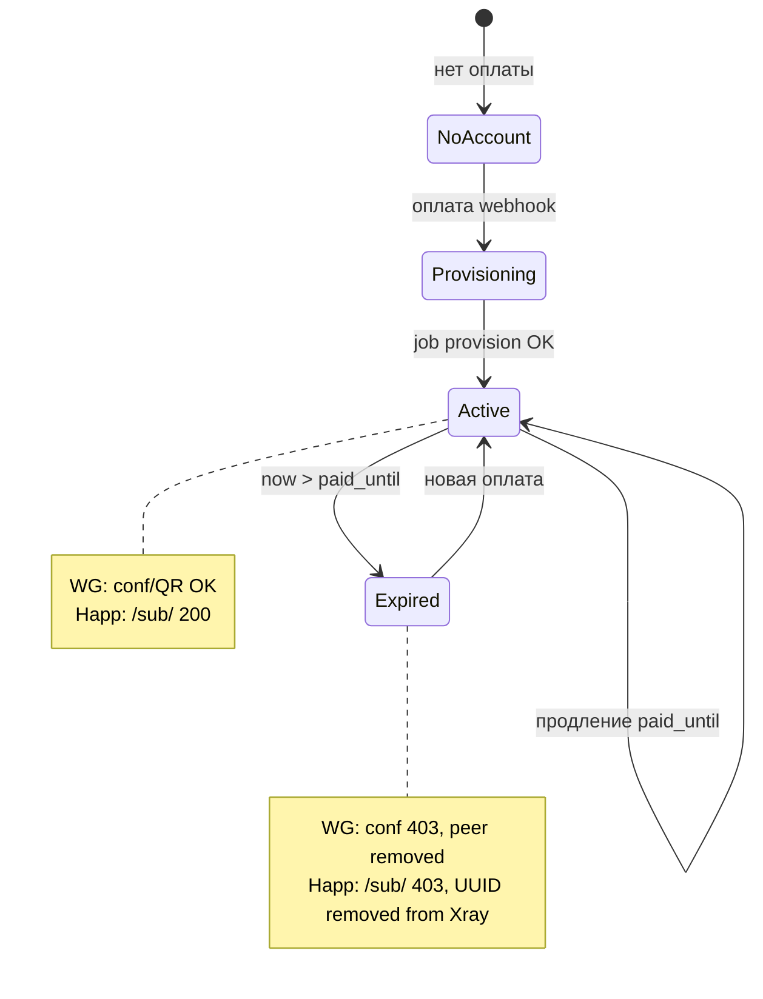

# Handoff: AiMonkeyVPN — бот, анти-абуз, приоритет Happ + WireGuard (запасной)

**Для кого:** другая ML/агент-система, которая продолжит работу без доступа к прошлому чату.  
**Дата:** 2026-05-17 (статус реализации ниже); **обновление UX 2026-06-19** — Happ первым в боте.  
**Прод-сервер:** `149.154.65.180`, домен `aladdin-ai.ru`  
**Бот:** `@AiMonkeyStars_bot` → раздел **🌐 AiMonkeyVPN**

---

## 1. Что мы строим (одним абзацем)

Пользователь **платит в Telegram-боте** за VPN на срок (например 30 дней). Сервер выдаёт доступ двумя путями **в одном тарифе**:

1. **Основной — Happ** (ссылка `https://aladdin-ai.ru/sub/<токен>` → приложение **Happ**; протокол **VLESS + Reality** на сервере; профиль `mobile-rf` для 4G).
2. **Запасной — WireGuard** (файл `.conf` или QR → приложение WireGuard; меню «🔀 Запасные способы»).

**Один оплаченный период** = один `paid_until` в `vpn.db`. После окончания срока доступ должен **отключаться на сервере**, а не «жить вечно по сохранённой ссылке».

**Прод `.env` (2026-06-19):** `VPN_AUTO_SEND_HAPP_AFTER_PAID=true`, `VPN_AUTO_SEND_WG_AFTER_PAID=false`.

---

## 2. Словарь простым языком

| Термин | Что это | Аналогия |
|--------|---------|----------|
| **AiMonkeyVPN** | Название продукта в боте | «Магазин ключей» в Telegram |
| **WireGuard** | Отдельное **бесплатное приложение** + протокол VPN (UDP) | «Дверь с ключом-файлом» |
| **Happ** | Отдельное **бесплатное приложение** из App Store / Google Play | «Дверь с ключом-ссылкой» — **не наш продукт** |
| **Streisand / V2Box / v2rayNG** | Другие приложения для **того же** запасного способа, что и Happ | Запасные «двери», если Happ не подошёл |
| **Протокол VLESS + REALITY** | Технология на **сервере** (Xray, порт 8443) | «Замок», который открывает запасная ссылка |
| **Запасная ссылка** | `https://…/sub/<opaque_token>` | Одна ссылка; приложение само скачивает настройки VLESS |
| **opaque_token** | Секретный id в URL, привязан к аккаунту в `vpn.db` | Пароль к подписке |
| **paid_until** | ISO-дата окончания оплаченного периода | «Действует до …» |
| **vpn_active / vpn_expired** | Статус в БД | активен / срок кончился |

### Happ — это VPN или протокол?

**Happ — это приложение (клиент) на телефоне, не протокол и не наш VPN-сервис.**

- Пользователь ставит **Happ** из магазина.
- Вставляет **одну ссылку** из бота (`/sub/…`).
- Happ запрашивает у нашего сервера текст с URI `vless://…` и подключается к **нашему Xray**.
- Протокол на проводе — **VLESS + REALITY** (это настраивает сервер, не Happ).

**WireGuard** — другой протокол и другое приложение (файл `.conf`, не ссылка `/sub/`).

**Итого:** два **способа входа** в **один оплаченный VPN**, не два разных VPN-продукта.

---

## 3. Архитектура (куда смотреть в коде)

```
Пользователь Telegram
        │
        ▼
telegram_stars_shop_bot/          ← UX, кнопки, тексты, Copy Text
  bot/handlers/vpn.py
  bot/services/vpn_connect_copy.py   ← тексты «как подключить»
  bot/services/vpn_user_links.py       ← URL /sub/ + Copy Text
  bot/services/vpn_payment_hook.py     ← оплата → provision
        │ HMAC
        ▼
aladdin-shop-vpn-api/              ← vpn.db, jobs, GET /sub/, POST /wg/conf
  routes/health.py                   ← GET /sub/{opaque_token}  ⚠️ анти-абуз P0
  routes/internal.py                 ← POST /wg/conf  ✓ paid_until проверяется
  worker.py                          ← expire по paid_until, wg-peer-down
        │
        ▼
Сервер: wg0 (UDP 51820), xray (TCP 8443), nginx → /sub/
```

**Базы:**
- `shop.db` — заказы, пользователи, рефералка VPN.
- `vpn.db` — `vpn_accounts` (status, paid_until, opaque_token, xray_client_uuid, WG keys).

**Прод-пути:**
- Код бота: `/opt/aladdin-telegram-shop-bot/current_app`
- Релизы: `/opt/aladdin-telegram-shop-bot/releases/<TS>/`
- vpn-api: `/opt/aladdin-shop-vpn-api`

---

## 4. Что уже сделано (бот + интеграция)

### Бот (UX)
- [x] Раздел VPN: оплата, legal gate, тарифы.
- [x] 📥 Файл / 📷 QR, авто-отправка после оплаты.
- [x] Тексты простым языком (файл, QR, WireGuard vs запасная).
- [x] **Приоритет запасного клиента: Happ** (в копирайте; см. `vpn_connect_copy.py`).
- [x] Кнопки **📋 Скопировать запасную** / **👥 Скопировать для друга** (только при `vpn_active`).
- [x] Экран **📋 Запасная ссылка**, таблица двух способов.
- [x] Админ `/admin_vpn_health`, ops health в фоне.
- [x] Git-коммит `07b48f35`, прод-релиз `20260516-173349`.

### Сервер (инфра)
- [x] Provision после оплаты, WG peer up/down.
- [x] `GET /sub/<token>` — выдача VLESS подписки.
- [x] Воркер ~60 с → `vpn_expired` + `wg-peer-down.sh`.

### Что НЕ закрыто (анти-абуз) — главная задача для ML-агента

| ID | Проблема | Приоритет |
|----|----------|-----------|
| **P0** | `/sub/` не проверяет `paid_until` сразу (только `vpn_expired` после воркера) | 🔴 |
| **P0-WG** | WireGuard уже лучше: `wg/conf` + peer-down — **поддерживать и тестировать** | 🔴 |
| **P1-Happ** | После expire Xray может принимать старый VLESS (кэш в Happ) — нужен **per-user UUID** + **xray-peer-down** | 🔴 |
| P2 | Ротация `opaque_token` при expire (job `rotate_url` в доке, в коде нет) | 🟡 |
| P3 | Rate limit / алерты шаринга ссылки | 🟢 |

---

## 5. Модель доступа (как должно работать после анти-абуз)



**Правило:** доступ = `status == vpn_active` **И** `paid_until > now_utc`.

---

## 6. План реализации анти-абуз (пошагово)

### Фаза P0 — API (1 PR в `aladdin_shop_vpn_api`)

**Цель:** запасная ссылка и WireGuard ведут себя одинаково по сроку.

1. Создать `aladdin_shop_vpn_api/subscription_access.py`:
   ```python
   def assert_subscription_allowed(row) -> None:
       # status must be vpn_active
       # parse paid_until, must be > now UTC
       # else HTTP 403 with clear detail
   ```

2. В `routes/health.py` → `GET /sub/{opaque_token}`:
   - SELECT status, paid_until, xray_client_uuid (уже есть status).
   - Вызвать `assert_subscription_allowed` **до** `build_subscription_body`.
   - Отклонить также: `vpn_expired`, `vpn_failed`, `vpn_manual_override`, `vpn_provisioning` (403).

3. Убедиться, что `POST /internal/v1/wg/conf` уже проверяет `paid_until` (да — не ломать).

4. **Тесты** (`tests/`):
   - active + будущий paid_until → 200;
   - active + прошлый paid_until → 403 (даже до воркера);
   - vpn_expired → 403.

5. Деплой vpn-api, smoke: `curl /sub/<test_token>` до/после expire.

**Критерий приёмки P0:** после искусственного `paid_until` в прошлом `/sub/` сразу 403, не 200.

---

### Фаза P1 — WireGuard + Happ на сервере (приоритет)

#### P1-A WireGuard (уже есть — проверить на проде)

| Шаг | Действие |
|-----|----------|
| 1 | В env vpn-api: `VPN_WG_POST_EXPIRE_SCRIPT=/opt/aladdin-shop-vpn-api/scripts/wg-peer-down.sh` |
| 2 | Timer воркера: `OnUnitActiveSec=60` |
| 3 | Тест: expire аккаунта → `wg show wg0` — peer нет; `.conf` не коннектится |

#### P1-B Happ / Xray (сделать)

**Проблема:** сейчас часто один `VPN_XRAY_DEFAULT_CLIENT_UUID` на всех → нельзя отключить одного пользователя.

| Шаг | Действие | Файлы |
|-----|----------|-------|
| 1 | При provision: генерировать `xray_client_uuid` (uuid4) в `vpn_accounts` | `worker.py` (частично есть `_ensure_xray_client_uuid`) |
| 2 | Скрипт `deploy/scripts/xray-peer-up.sh <telegram_user_id>` — добавить UUID в `/opt/xray/config.json`, `systemctl reload xray` | новый |
| 3 | Скрипт `deploy/scripts/xray-peer-down.sh <telegram_user_id>` — удалить UUID, reload | новый |
| 4 | Env: `VPN_XRAY_POST_PROVISION_SCRIPT`, `VPN_XRAY_POST_EXPIRE_SCRIPT` | `env.example`, settings |
| 5 | В `worker.py` / `_expire_stale_active_accounts` и `_handle_revoke`: вызывать xray-peer-down при `vpn_expired` | `worker.py` |
| 6 | `build_subscription_body` — только UUID этого пользователя, не default | `subscription_util.py` |
| 7 | Smoke: оплата → `/sub/` → подключение в **Happ** → expire → `/sub/` 403 → **Happ не коннектится** | drill |

**Критерий приёмки P1:** пользователь с истёкшим тарифом не подключается ни через WireGuard, ни через Happ (даже без «обновить подписку» в Happ).

---

### Фаза P2 — ротация токена (опционально)

1. Job type `rotate_opaque_token` в `worker.py`.
2. При переходе в `vpn_expired`: `opaque_token = secrets.token_urlsafe(24)`.
3. Старая ссылка → 404 unknown token.
4. **Продуктовое решение:** при **новой оплате** — выдавать новый токен или восстанавливать старый (зафиксировать в legal).

---

### Фаза P3 — бот (минимум)

| Задача | Файл |
|--------|------|
| При `vpn_expired` в «🧪 Проверить VPN» — текст «Срок истёк, продлите» | `vpn.py` |
| Не показывать Copy запасную (уже есть) | `vpn_user_links.py` |
| Текст: после срока удалить профиль в **Happ** | `vpn_connect_copy.py` ✓ |

Деплой бота: rsync → `releases/<TS>` → symlink `current_app` → `systemctl restart aladdin-telegram-bot`.

---

## 7. Приоритет приложений в UX (уже в боте)

| Уровень | Способ | Рекомендуемое приложение |
|---------|--------|---------------------------|
| 1 | Основной | **Happ** (VLESS + Reality, ссылка `/sub/…`) |
| 2 | Запасной | **WireGuard** (файл `.conf` / QR) |
| 3 | Запасной альт. | Streisand, V2Box (iOS), v2rayNG (Android) — та же ссылка, что Happ |
| 4 | Третий fallback | OpenVPN Connect + файл из бота |

Тексты: `bot/services/vpn_connect_copy.py` — функции `vpn_wg_vs_backup_table_html`, `vpn_backup_link_explainer_html`.

---

## 8. Векторы абуза (чеклист для тестов)

| # | Сценарий | Ожидание после P0+P1 |
|---|----------|----------------------|
| 1 | Сохранил `/sub/`, месяц прошёл, обновил подписку в Happ | 403, нет конфига |
| 2 | Сохранил `/sub/`, не обновляет, старый профиль в Happ | Не коннектится (UUID снят) |
| 3 | Старый `.conf` WireGuard | Peer removed, нет handshake |
| 4 | Продлил подписку | Снова 200 на `/sub/`, WG conf OK |
| 5 | Переслал ссылку другу пока active | Работает у друга (шаринг; P3 — лимиты) |
| 6 | Кнопка в боте после expire | Нет «Скопировать запасную» |

---

## 9. Drill с телефона (после кода)

См. `docs/VPN_QUARTERLY_DRILL_CHECKLIST.md`:

1. Оплата `vpn_30d` в боте (не test-grant).
2. WireGuard Wi‑Fi — OK уже у админов.
3. **Happ** + запасная ссылка на **4G**.
4. Дождаться expire тестового аккаунта или сдвинуть `paid_until` → повторить 2–3.

---

## 10. Команды деплоя (бот)

```bash
LOCAL="/path/to/telegram_stars_shop_bot"
TS=$(date +%Y%m%d-%H%M%S)
ssh root@149.154.65.180 "mkdir -p /opt/aladdin-telegram-shop-bot/releases/${TS}/telegram_stars_shop_bot"
rsync -az --delete -e "ssh -i ~/.ssh/aladdin_server" \
  --exclude '.git' --exclude '__pycache__' --exclude '.venv' --exclude 'data' --exclude '.env' \
  "${LOCAL}/" "root@149.154.65.180:/opt/aladdin-telegram-shop-bot/releases/${TS}/telegram_stars_shop_bot/"
ssh root@149.154.65.180 "
  ln -sfn /opt/aladdin-telegram-shop-bot/releases/${TS} /opt/aladdin-telegram-shop-bot/current_release
  ln -sfn /opt/aladdin-telegram-shop-bot/releases/${TS}/telegram_stars_shop_bot /opt/aladdin-telegram-shop-bot/current_app
  systemctl restart aladdin-telegram-bot.service
"
```

**Не копировать:** `.env`, `data/`, `shop.db`.

---

## 11. Связанные документы

| Документ | Содержание |
|----------|------------|
| `docs/VPN_DEVELOPER_OVERVIEW_RU.md` | Оплата → provision |
| `docs/VPN_SHOP_API.md` | Эндпоинты API |
| `docs/VPN_TASKS_STATUS.md` | Реестр vpn-00…40 |
| `docs/VPN_QUARTERLY_DRILL_CHECKLIST.md` | Прогон с телефона |
| `aladdin_shop_vpn_api/deploy/VPN04_WIREGUARD_RUNBOOK.md` | WG |
| `aladdin_shop_vpn_api/deploy/VPN05_XRAY_SUBSCRIPTION_RUNBOOK.md` | `/sub/` |

---

## 12. Статус реализации (2026-05-17)

| Фаза | Статус | Где |
|------|--------|-----|
| **P0** `/sub/` + `paid_until` | ✅ прод | `subscription_access.py`, `routes/health.py` |
| **P1-WG** timer + `wg-peer-down` | ✅ прод | `verify_prod_vpn_p1.sh`, env `VPN_WG_POST_EXPIRE_SCRIPT` |
| **P1-Happ** xray up/down + per-user UUID | ✅ прод | `xray-peer-*.sh`, worker |
| **P2** ротация `opaque_token` при expire/revoke | ✅ код + прод | `worker.py` (`new_opaque_token()`), тест `test_worker_expires_*` |
| **P3** nginx rate limit | ✅ прод | `limit_req zone=vpn_sub_limit` на `/sub/` |
| **P3** шаринг-алерт | ✅ код + прод | `sub_access_watch.py`, `VPN_SUB_ACCESS_ALERT_PER_HOUR=120`, `bot/services/sub_access_hot.py` + `vpn_ops_health` |
| Напоминания 7/3/1/0/expired | ✅ прод | `vpn_expiry_notify*.py`, loop в `main.py` |
| Продление дней | ✅ прод | `vpn_payment_hook.compute_paid_until_after_purchase` |
| **Drill** оплата + Happ 4G | ⏳ телефон | `VPN_QUARTERLY_DRILL_CHECKLIST.md` § Drill Happ |

**Деплой 2026-05-17:** vpn-api rsync → `/opt/aladdin-shop-vpn-api`, бот релиз `20260517-135636`, сервисы `active`, `/health` 8090/8091 OK.

---

## 13. Порядок работ для ML-агента (TL;DR)

1. Прочитать этот файл и `vpn_connect_copy.py`.
2. **Drill с телефона** — оплата `vpn_30d`, Happ на 4G, журнал в `VPN_QUARTERLY_DRILL_CHECKLIST.md`.
3. После expire на тест-аккаунте: старая `/sub/` → **404**, WG без handshake, алерт ops при шаринге.

**Не путать:** Happ ≠ протокол; анти-абуз для Happ = закрыть `/sub/` + снять UUID в Xray + ротация токена. WireGuard = peer-down.
