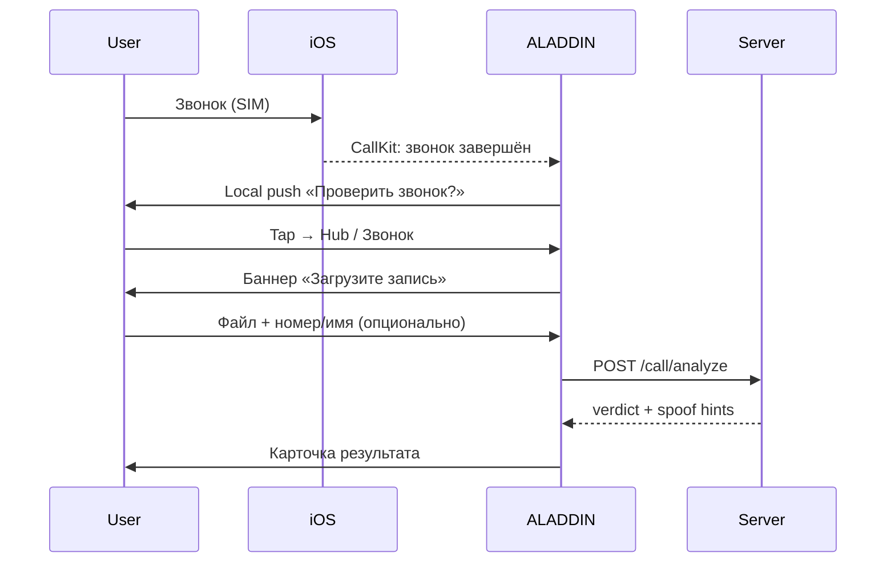

# Antifake — продуктовый scope «фейковые звонки» (af-4-01)

**Build:** 232 · **Статус:** SSOT для маркетинга, FAQ, App Store Review Notes  
**Связанные id:** `af-4-01`, `af-4-03`, `af-4-05`, `af-8-06`, `ux-1-10`

---

## Что мы обещаем (честно)

| Обещание | Как в продукте | Когда |
|----------|----------------|-------|
| Проверка **записи** телефонного разговора после звонка | Hub → вкладка «Звонок» → загрузить файл → `POST /api/antifake/call/analyze` | ✅ build 232 |
| Подсказка **после** завершения звонка загрузить запись | Local push + deep link `aladdin://antifake/call-check` → баннер на вкладке «Звонок» | ✅ build 232 |
| Метка «возможный мошенник?» для номеров из **синхронизированного списка** | Call Directory Extension + `GET /api/antifake/call-directory` | ✅ build 232 (seed + sync) |
| Эвристики **spoof** (номер ≠ отображаемое имя) при анализе записи | Server: `caller_id` + `display_name` в `/call/analyze` | ✅ build 232 |
| Короткая проверка голоса **по кнопке** (5 с) | Hub → вкладка «Голос» | ✅ build 232 |

**Формулировка для пользователя:**  
«ALADDIN помогает проверить подозрительный звонок **после разговора** — по записи, если она у вас есть, и по подсказкам по номеру. Это не прослушивание звонков в фоне.»

---

## Что мы не обещаем

| Не обещаем | Причина |
|------------|---------|
| Слушать все PSTN-звонки в реальном времени | iOS не даёт доступ к аудио обычного звонка сторонним приложениям |
| Автоматически сбрасывать звонок по ML | Нет доступа + риск ложных срабатываний (банк, врач, школа) |
| 100% точность «это мошенник» | Вердикт: `likely_fake` / `uncertain` / `likely_real` |
| Перехват FaceTime / WhatsApp / Zoom | Закрытые приложения, нет API |
| Блокировку **любого** незнакомого номера без списка | Только Call Directory по загруженному списку |

Подробнее: [ANTIFAKE_APPLE_LIMITS_AND_CLAIMS.md](./ANTIFAKE_APPLE_LIMITS_AND_CLAIMS.md)

---

## Пользовательский сценарий M2 (звонки)

**Параллельно (если включён Call Directory):**  
номера из `/call-directory` показываются с меткой в системном звонке — без доступа к содержимому разговора.

---

## Технические границы

| Компонент | Bundle / API | Premium |
|-----------|--------------|---------|
| Hub вкладка «Звонок» | `AntifakeMediaCheckView` | Да |
| Post-call observer | `AntifakeCallObserverService` (CallKit) | Hub доступен |
| Call Directory | `family.aladdin.ios.ALADDINCallDirectory` | Да |
| Analyze API | `POST /api/antifake/call/analyze` multipart | Да |
| Spoof heuristics | `antifake_service._analyze_caller_spoof_heuristics` | Да |

---

## Критерии приёмки af-4-01

- [x] Документ с явным «обещаем / не обещаем»
- [x] Согласован с onboarding p.6 и FAQ (`faq_phone_scam`, `faq_fake_voices`)
- [x] Не противоречит App Store Privacy / CallKit guidelines
- [ ] Юридический review (вне scope build 232)

---

*Обновлять при изменении Call Directory, post-call flow или маркетинговых claims (`af-8-06`).*
