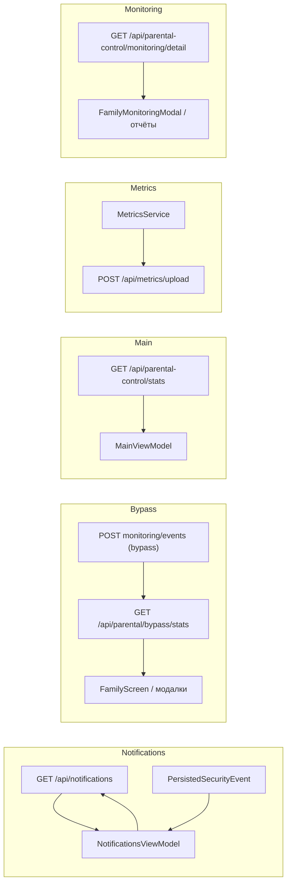

# Сборка 190 — передача контекста для другой ML/кодинг-системы

Документ для **внешнего агента**: что уже сделано в продукте, зачем, и что осталось. Язык — рабочий, без лишнего жаргона.

---

## 1. Зачем этот файл

- Чтобы **новая модель/разработчик** за один проход поняла: цели интеграции родительского контроля, уведомлений, метрик и разделения слоёв защиты (DNS vs Safari vs «угрозы»).
- Чтобы не терять связь между **экранами приложения**, **API** и **аналитикой**.
- Чтобы список **оставшихся задач** (P0–P5) был исполнимым чек-листом.

---

## 2. Продуктовая цель (простыми словами)

1. **Родитель** видит правдивые данные: что заблокировано, что мониторится, были ли попытки обхода.
2. **Разные механизмы не смешиваются в одной цифре без пояснения**: системный DNS (Smart DNS / DoH), Safari Content Blocker и «счётчик угроз» с сервера — это разные вещи.
3. **Уведомления** — единая лента с сервера, с возможностью подтянуть локально сохранённые события без дублей.
4. **Офлайн**: где возможно — показываем кэш/локальный журнал и не врём, что это «живой сервер».

---

## 3. Что уже сделано раньше (полный спектр работ по дорожной карте int-*)

Ниже — **логика**, не обязательно каждый файл в этом коммите.

### Уведомления и безопасность

| ID | Суть | Зачем пользователю |
|----|------|-------------------|
| **int-1** | Зафиксирована «карта данных» в комментарии у `NotificationsViewModel` | Один источник правды для разработки |
| **int-2** | Бэкенд: ingest событий мониторинга → bypass stats + in-app события | Счётчики обхода и уведомления согласованы с сервером |
| **int-3** | iOS: обработка bypass из приложения + remote push (APNs) | Родитель узнаёт о попытках обхода вовремя |
| **int-4** | После успешного `GET /api/notifications` мерж с `PersistedSecurityEvent` по `correlation_id` | Нет дублей «одно событие дважды» |

### Главная и семья

| ID | Суть | Зачем |
|----|------|--------|
| **int-5**, **impl-1** | Подписи и hints к `threatsBlocked` / семейной статистике (RU/EN) | Цифра не выглядит как «всё подряд» |
| **int-6** | Parent Dashboard блок обхода — **не делаем** | Информация в Уведомлениях и РК |
| **int-7**, **impl-3** | FamilyScreen: убраны фейковые демо-числа content block | Честный UX |
| **int-8** | FamilyControls: корректное поведение ребёнок vs родитель (Managed Settings / подсказки) | Нет ложных ожиданий при Screen Time |

### Сеть и Safari (отдельно от «угроз»)

| ID | Суть | Зачем |
|----|------|--------|
| **int-9** | На главной отдельные строки Smart DNS и Safari CB; `MainViewModel` тянет флаги из `DNSProtectionManager` / `ContentBlockerManager`; уведомление `networkLayerIndicatorsRefresh`; метрики `network_protection_smart_dns_state`, `network_protection_safari_cb_state`, `safari_content_blocker_rules_changed` | Пользователь и аналитика видят **разные слои**, а не одну абстрактную «защиту» |

### Родительский контроль — модалки

| ID | Суть | Зачем |
|----|------|--------|
| **int-12**, **int-13** | В модалках «Мониторинг» и «Отчёты» на `FamilyScreen`: блок **локального** статуса DNS/Safari на **телефоне родителя** + тексты, что данные по ребёнку — с сервера | Нет путаницы «это ребёнок или мой телефон» |
| **int-10** | Файл `QA_INTEGRATION_INT10.md` — ручные сценарии QA | Повторяемая проверка после релиза |
| **int-11**, **impl-2** | Уведомления: статистика и формулировки под типы (в т.ч. «тип угрозы») | Фильтры осмысленнее |

### Прочее закрытое

- **int-14** объединено с int-7 (карточка контент-блока семьи).

### Закрыто дополнительно (после v1.0)

- **int-15** + **p1-1** / **p1-4** — выровнены формулировки главная ↔ уведомления ↔ отчёты (RU/EN: см. ключи в §9 changelog v1.1); фильтр «Угрозы» и подписи статистики не обещают ту же метрику, что счётчик угроз на главной.

---

## 4. Ключевые файлы и потоки (для ориентации)

| Область | Где смотреть |
|---------|----------------|
| Уведомления, merge, фильтры | `ViewModels/NotificationsViewModel.swift`, `Screens/12_NotificationsScreen.swift` |
| Главная, семья, DNS/CB строки | `ViewModels/MainViewModel.swift`, `Screens/01_MainScreen.swift` |
| РК модалки мониторинг/отчёты | `Screens/02_FamilyScreen.swift` (`FamilyMonitoringModal`, `FamilyReportsModal`, `FamilyNetworkLayersLocalStatusBlock`) |
| DNS | `Core/Managers/DNSProtectionManager.swift` |
| Safari CB | `Core/ContentBlocker/ContentBlockerManager.swift` |
| API детализации мониторинга | `APIService.getParentalMonitoringDetail`, модель `ParentalMonitoringDetailResponse` |
| Bypass stats | `APIService.getBypassStats`, `ParentalControlManager.localBypassAggregates` (fallback) |
| Метрики приложения | `Core/Monitoring/MetricsService.swift` → `AppConfig.Endpoint.metricsUpload` (без обязательной авторизации) |
| QA чек-лист | `QA_INTEGRATION_INT10.md` |

---

## 5. Что нужно сделать дальше (план до «100%») — задачи Cursor To-Do

**Нормативное описание контрактов P0 (эндпоинты, поля, матрица типов):** [`docs/P0_API_CONTRACTS.md`](./P0_API_CONTRACTS.md).

Каждая задача ниже имеет **id** в Cursor (`p0-*` … `p5-*`). Ниже — **зачем** простым языком.

### [P0] Бэкенд — без этого клиент не может гарантировать полноту

| ID | Что сделать | Зачем |
|----|-------------|--------|
| **p0-1** | Документировать контракт `GET /api/notifications`: поля, `type`, `metadata.correlation_id`, read; таблица type → клиентский `NotificationKind` | Иначе фильтры и счётчики на экране расходятся с сервером |
| **p0-2** | Цепочка обхода: ingest → агрегаты `GET /api/parental/bypass/stats` + запись в ленту уведомлений / push с тем же `correlation_id` | Одна попытка обхода = один след в отчётах и в ленте |
| **p0-3** | Зафиксировать `monitoring/detail`: поля, пустые ответы, ошибки | Мониторинг/отчёты не «ломаются молча» |
| **p0-4** | Принять на ingest метрик новые `user_action` (DNS/CB, аномалии уведомлений) | Продуктовый и тех. мониторинг не теряет события |

### [P1] Клиент и ясность

| ID | Что сделать | Зачем |
|----|-------------|--------|
| **p1-1** + **int-15** | Единый глоссарий RU/EN по экранам | Пользователь не видит противоречий |
| **p1-2a** | Паритет данных на `07_ParentalControlScreen` | Одинаковая логика с семьёй |
| **p1-2b** | Паритет на `02_FamilyScreen` | То же |
| **p1-2c** | Таблица экран → API, при необходимости общий helper | Меньше дублирования и багов при правках |
| **p1-3** | Refresh при смене выбранного ребёнка | Не показываем чужую статистику |
| **p1-4** | После глоссария: числа фильтров уведомлений ⟷ тексты | Нет «угрозы» в тексте и другого в счётчике |

### [P2] Продуктовое решение

| ID | Что сделать | Зачем |
|----|-------------|--------|
| **p2-1** | Если нужен статус Safari/DNS **ребёнка** в РК — события с детского устройства + поля в API | Иначе родитель не видит реальность ребёнка |
| **p2-2** | **Или** оставить только локальный статус родителя — дописать Help/UI | Честно объяснить, что блок в модалке про этот iPhone |

**Зафиксировано для продукта:** линия **p2-2** — в модалках РК/семьи блок DNS/Safari описывает **этот iPhone родителя**; данные по выбранному ребёнку остаются серверными (карточки мониторинга и т.д.). Задача **p2-1** снята с дорожной карты.

### [P3] Согласованность цифр и офлайн

| ID | Что сделать | Зачем |
|----|-------------|--------|
| **p3-1** | Экран «Аналитика» vs главная/семья — один источник или явные подписи | Нет ложного сравнения разных метрик |
| **p3-2** | Единая политика бейджей офлайн/кэша | Пользователь понимает, когда данные «не свежие» |

### [P4] Качество

| ID | Что сделать | Зачем |
|----|-------------|--------|
| **p4-1** | Unit-тесты: merge уведомлений, bypass fallback, маппинг типов | Регрессии до продакшена |
| **p4-2** | QA по `QA_INTEGRATION_INT10` + int-15 + смена ребёнка | То, что тесты не покрывают |
| **p4-3** | Ревью дублей API при открытии экранов | Скорость и стабильность |

**p4-3 (заметка):** при последовательном открытии главной, семьи и РК один и тот же endpoint может вызываться с нескольких экранов подряд — это осознанный trade-off ради актуальности после навигации. Перед оптимизацией сверяться с **p1-3** (смена ребёнка) и не отдавать устаревший скоуп.

### [P5] Документация и релиз

| ID | Что сделать | Зачем |
|----|-------------|--------|
| **p5-1** | Одна диаграмма потоков (Mermaid): notifications, bypass, monitoring, metrics | Онбординг команды |
| **p5-2** | Версионирование API и minimal app version | Безопасные релизы сервера |

---

## 6. Инструкция для другой ML-системы (как выполнять задачи)

1. **Не смешивать** метрики bypass, DNS/CB и «угроз» в одной подписи без контекста.
2. Любое изменение **типов уведомлений** — синхронизировать с **p0-1** и фильтрами в `NotificationsViewModel`.
3. Новые **user_action** — добавить в контракт **p0-4** и в `MetricsService` только безопасные параметры (без секретов; санитизация уже есть).
4. Перед изменением текстов — свериться с **int-15 / p1-1**.
5. После изменений в родительском контроле — прогнать **QA_INTEGRATION_INT10** и сценарий смены ребёнка (**p1-3**).

---

## 7. Сборка 190

- Номер сборки (**CFBundleVersion** / `CURRENT_PROJECT_VERSION` / `AppConfig.buildNumber`) поднят до **190** для выравнивания всех таргетов и теста `AppConfigTests`.
- Этот документ и связанные правки оформлены одним коммитом под релиз **build 190**.

---

## 8. История версии документа

| Версия | Изменение |
|--------|-----------|
| 1.0 | Создан для передачи контекста при переходе на build 190; объединены дорожная карта int-*, план P0–P5 и файловые ориентиры |
| 1.1 | Добавлены §9–§10: таблица экран → API (p1-2c) и диаграмма потоков Mermaid (задел p5-1); тексты int-15 выровнены в `LocalizationManager` / `Localizable.strings`; при смене `parental_selected_child_id` обновляются семейные модалки и экран РК (p1-3). |
| 1.2 | Ссылка на нормативный контракт P0: [`docs/P0_API_CONTRACTS.md`](./P0_API_CONTRACTS.md); на серверной стороне репозитория — расширены описание metadata уведомлений и учёт канонических `user_action` в `metrics_router.py`. |
| 1.3 | Зафиксирована линия **p2-2**; подписи аналитики vs главная (**p3-1**), время последнего обновления семьи/ленты (**p3-2**); в `AppConfig` — `apiContractVersion` и `minimumClientBuildForApiContract` (**p5-2**, см. P0 §«Версии клиента»). |

---

## 9. Экран → API (краткая матрица, p1-2c)

| Экран / модалка | Основные endpoint’ы | Примечание |
|-----------------|---------------------|------------|
| Главная (`MainViewModel`) | `GET /api/parental-control/stats` (агрегаты семьи), метрики через `MetricsService` → `POST /api/metrics/upload` | `threatsBlocked` — защита устройств; DNS/CB — отдельные флаги (int-9). |
| Уведомления (`NotificationsViewModel`) | `GET /api/notifications`, read/bulk при необходимости | Лента + merge с `PersistedSecurityEvent` по `correlation_id` (int-4). |
| Семья — карточка обхода | `GET /api/parental/bypass/stats` (+ локальный журнал при ошибке) | Скоуп: выбранный ребёнок (`parental_selected_child_id`). |
| Семья — модалка мониторинга | `GET /api/parental-control/monitoring/detail` через **`ParentalControlManager.shared.getMonitoringDetail`** (паритет p1-2a/b), тогглы через `ComponentConfigurationService` | После p1-3: перезагрузка при смене ребёнка. |
| Семья — модалка отчётов | `monitoring/detail`, bypass stats | Отчёты и подозрительная активность — поля detail. |
| РК экран 07 | `getStats`, `getBypassStats`, модалки те же Family* | Выбор ребёнка синхронизируется через `AppStorage`. |

---

## 10. Потоки данных (Mermaid, задел p5-1)

