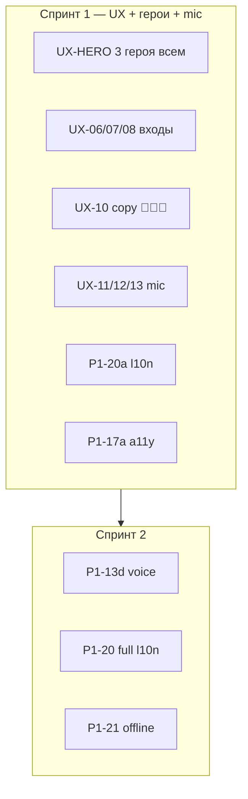

# Companion — финальный план кода (без Rive, без QA)

> **Версия:** 2.0 · **Дата:** 2026-05-29  
> **Назначение:** дорожная карта **только для написания кода**. Device QA, TestFlight, GATE — **в конце**.  
> **Трекер `[x]`:** [COMPANION_CODE_TODO_TRACKER.md](./COMPANION_CODE_TODO_TRACKER.md)  
> **Главный план:** [COMPANION_MASTER_PLAN_v1.md](./COMPANION_MASTER_PLAN_v1.md) · **102 задачи:** [COMPANION_PROGRESS_TRACKER.md](./COMPANION_PROGRESS_TRACKER.md)

---

## 0. Продуктовое решение PO (зафиксировано 29.05.2026)

### Три героя — для всех пользователей

| Было (legacy) | Стало (план v2) |
|---------------|-----------------|
| child → только **unicorn**; genie скрыт | **unicorn + aladdin + genie** доступны **всем** age_band при включённом companion |
| Карточка Rewards обещает 3 героев, child видит 1 | **Копирайт = реальность:** везде **🦄 🧑 🧞** (Аладдин-**человек**, не джинн-путаница) |
| age_policy режет genie для child | **BE + capabilities + iOS Hub** отдают **3 карточки**; контент остаётся **PG** (witty preset по-прежнему **не** для child) |

**Безопасность не ослабляем:** policy_engine, L1–L3 этика, родительский consent, post-LLM moderation (P1-22) — без изменений.

**Задачи под решение:** **UX-HERO-01…03** (Спринт 1, блок A).

---

## 1. Чеклист «всё предусмотрели?»

| Проблема (6 шляп) | Задача в плане | Спринт |
|-------------------|----------------|--------|
| Ложный копирайт «3 героя», child видит 1 | **UX-HERO-01…03** + **UX-10** | 1 |
| На карточке 🦄🧞 без Аладдина | **UX-10** единый набор 🦄🧑🧞 | 1 |
| Долгий путь в companion | **UX-06** big button «Друзья» | 1 |
| Нет связи pet → чат | **UX-07** | 1 |
| Legacy Hub/Conversation | **UX-08** | 1 |
| Tap+hold+swipe сложно детям | **UX-12** child mic упрощённый | 1 |
| Нет обучения mic | **UX-11** coach 3 шага | 1 |
| «Микрофон занят» непонятно | **UX-13** детское сообщение | 1 |
| Хардкод RU | **P1-20a** параллельно Sprint 1 | 1 |
| Trust/emotion шум на сцене | **UX-14** minimal overlay (child) | 1 |
| VoiceOver не системно | **P1-17a** baseline a11y новых входов | 1 |
| EN смесь языков (остальное) | **P1-20** полный Companion l10n | 2 |
| Голос WS без genie | **P1-13d** | 2 |
| Offline / rate limit / moderation | **P1-21, P1-18, P1-22** | 2–3 |
| Placeholder art | **HERO-3-07** (Rive, отдельно) | после 5 |

---

## 2. Карта спринтов (v2)

| Спринт | Срок | Фокус |
|--------|------|-------|
| **1** | ~3–4 дня | **UX полный:** входы + 3 героя для всех + copy + mic + l10n/a11y baseline | ✅ |
| **2** | ~3–5 дней | Голос WS + полная локализация + offline + a11y deep | ✅ |
| **3** | ~5–7 дней | XCUITest, rate limit, moderation, ADR, Store meta | ✅ |
| **4** | ~1–2 нед | Postgres, orchestrator, domains, эмпатия | ⏳ |
| **5** | позже | P2 search/media/senior, P3, Adult |
| **Rive** | отдельно | 07 → 11c → GATE-EMO → P1-19 screenshots |
| **QA** | в конце | TF, device, GATE-* |



---

## 3. Спринт 1 — UX, герои, mic (~3–4 дня)

### Блок A — три героя для всех (копирайт = доверие)

| ID | Простыми словами | Код |
|----|------------------|-----|
| **UX-HERO-01** | Backend: child/teen/parent/senior получают **unicorn, aladdin, genie** в `allowed_characters` | `age_policy.py`, capabilities router, pytest |
| **UX-HERO-02** | iOS Hub/Home: **3 карточки** для всех; фильтр только по API, не хардкод child=unicorn | `CompanionHomeScreen`, `CompanionHubScreen`, `CompanionCapabilitiesService` |
| **UX-HERO-03** | Voice WS: **genie** в config + `audio.stop` (сейчас только unicorn/aladdin) | `ai_voice_ws_router.py` |

**Иконки канон (везде одинаково):**

| Герой | Emoji | Имя в UI |
|-------|-------|----------|
| unicorn | 🦄 | Единорог |
| aladdin | 🧑 | Аладдин |
| genie | 🧞 | Джин |

> **Не путать:** 🧑 = человек OB_01; 🧞 = джин OB_03. В копирайте **всегда трое**.

### Блок B — входы в «Мир героев»

| ID | Решение | Файлы |
|----|---------|-------|
| **UX-06** | **Big button «Друзья» 🦄** в `ChildInterfaceScreen` (как `bigButtonsGrid`), **не** абстрактный tab | `08_ChildInterfaceScreen.swift` |
| **UX-07** | Кнопка **«Поговорить с единорогом»** в `UnicornPetView` → `companionHome` + hero=unicorn | `UnicornPetView.swift` |
| **UX-08** | Legacy `.companionHub` / `.companionConversation` → redirect `companionHome` + tab | `ALADDINApp.swift`, `NavigationManager.swift` |
| **UX DoD** | Rewards ✅ + Друзья + pet + legacy → **один push** `companionHome` | audit grep |

### Блок C — копирайт и карточки

| ID | Решение |
|----|---------|
| **UX-10** | **`companionWorldHeroCard`:** текст «Три друга: 🦄 Единорог, 🧑 Аладдин, 🧞 Джин»; строки через l10n; **те же 3 emoji** в HStack |
| **UX-10b** | Все marketing-строки Companion (Home tabs, empty state, Rewards) — **3 героя**, без «только единорог» |

### Блок D — голос для детей

| ID | Решение |
|----|---------|
| **UX-11** | **Mic coach** при первом входе: 3 шага («Зажми → Говори → Отпусти»); `@AppStorage` `companion_mic_coach_seen` |
| **UX-12** | **Child profile (`age_band=child`):** hold-only **или** крупная кнопка **«Говори»** на сцене; tap+swipe — teen+ |
| **UX-13** | Ошибка Assistant conflict: **«Закрой другого помощника — нажми сюда»** + deep link hint, не технический текст |

### Блок E — UI polish

| ID | Решение |
|----|---------|
| **UX-14** | Child: **trust + emotion text** убрать с hero overlay → только в «Моё» или иконка ❤️; teen+ — как сейчас |
| **UX-14b** | После Rive: emotion → цвет/анимация, минимум текста на сцене |

### Блок F — параллельно Sprint 1 (не ждать Sprint 2)

| ID | Решение |
|----|---------|
| **P1-20a** | **Все новые строки Sprint 1** сразу RU+EN (Друзья, coach, карточка, mic hints) |
| **P1-17a** | VoiceOver + Dynamic Type на: кнопка Друзья, coach, big mic, карточка Rewards |

**UX-09** (GATE R6/R8) — только финальный QA.

---

## 4. Спринт 2 — голос + полный l10n + offline (~3–5 дней)

| ID | Простыми словами |
|----|------------------|
| **P1-13d** | Voice WS production polish (если UX-HERO-03 не закрыл полностью): TTS path, error handling |
| **P1-20** | **Полная** локализация Companion: Home tabs, Mine, Conversation, Hub — убрать весь хардкод RU |
| **P1-17** | Accessibility **deep pass:** stream, feedback, cosmetics, trust card |
| **P1-21** | Offline: последний thread + черновик |

---

## 5. Спринт 3 — prod hardening (~5–7 дней)

| ID | Задача |
|----|--------|
| **P1-14** | XCUITest: Kids → Друзья → Companion → message |
| **P1-18** | Rate limit 429 + iOS UI |
| **P1-22** | Post-LLM moderation |
| **P1-16** | ADR hot path |
| **P1-19 (часть)** | App Store metadata без Rive screenshots |

---

## 6. Спринт 4 — BE масштаб (~1–2 недели)

**P1-12** Postgres/Redis · **P2-02** orchestrator · **P2-12** domains · **P2-13/15/16** эмпатия

---

## 7. Спринт 5 — Grok parity

**P2-01…08, P2-14, P3-*, A-*** — без изменений v1. **Не без Rive:** P2-09, P2-17.

---

## 8. Порядок работ внутри Sprint 1 (рекомендуемый)

```text
1. UX-HERO-01 → UX-HERO-02 → UX-HERO-03   (3 героя — фундамент copy)
2. UX-10 + P1-20a                          (карточка + строки RU/EN)
3. UX-06 → UX-07 → UX-08 → UX DoD          (входы)
4. UX-11 → UX-12 → UX-13                   (mic)
5. UX-14 + P1-17a                          (overlay + a11y)
```

---

## 9. Ключевые файлы

```
# Sprint 1 — герои
security/.../age_policy.py
security/api/routers/*companion*
CompanionHomeScreen.swift · CompanionHubScreen.swift
CompanionCapabilitiesService.swift

# Sprint 1 — UX
08_ChildInterfaceScreen.swift · UnicornPetView.swift
ChildRewardsScreen.swift (companionWorldHeroCard)
CompanionConversationScreen.swift (mic, overlay)
LocalizationManager.swift

# Sprint 1 — voice policy
ai_voice_ws_router.py
```

---

## 10. Связь документов

| Документ | Роль |
|----------|------|
| [COMPANION_MASTER_PLAN_v1.md](./COMPANION_MASTER_PLAN_v1.md) | Продукт P0→P3 |
| **Этот файл (v2)** | Код-спринты + PO решение «3 героя всем» |
| [COMPANION_CODE_TODO_TRACKER.md](./COMPANION_CODE_TODO_TRACKER.md) | Ежедневные `[x]` |
| [COMPANION_UNIFIED_HOME_UX.md](./COMPANION_UNIFIED_HOME_UX.md) | Обновить после UX-08 (legacy) |

---

*Следующий шаг: **Sprint 4** — P1-12 → P2-02 → P2-12/13/15/16.*
