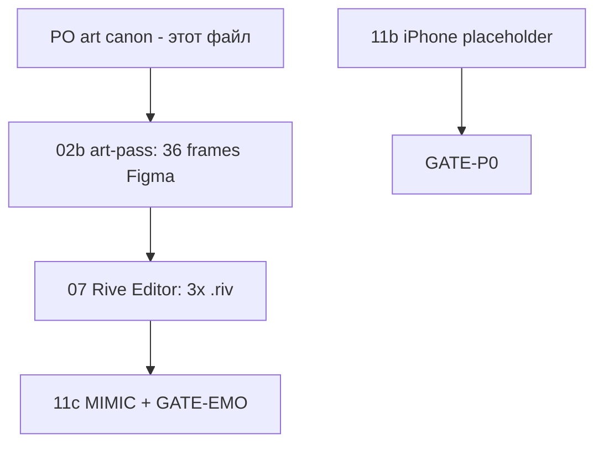

# Companion — канон согласованного art (PO ✅ 2026-05-27)

> **Единственный файл «где лежат картинки».** Не искать в чате — открывай этот документ.  
> **Правило экспорта:** на макетах Companion и в `.riv` — **только герой**, без текста, UI, точек, wordmark.

**Связанные:** [COMPANION_HERO_SOURCES_PO_2026-05-27.md](./COMPANION_HERO_SOURCES_PO_2026-05-27.md) · [COMPANION_RIVE_EXPORT_CHECKLIST.md](./COMPANION_RIVE_EXPORT_CHECKLIST.md) · [TRACKER](./COMPANION_PROGRESS_TRACKER.md)

---

## Сводка PO (зафиксировано)

| Герой | `character_id` | Production master (02b-PO-lock ✅) | Референсы mood |
|-------|----------------|-----------------------------------|----------------|
| **Единорог** | `unicorn` | ✅ **v2 cinematic** · Figma `25:2` | **1** |
| **Аладдин-человек** | `aladdin` | ✅ **только OB_01** · `81:54` | **1** |
| **Джин** | `genie` | ✅ **OB_03 headfix** · Figma `122:2` | OB_04 / 06 / 07 (палитра, не master) |

> **PO lock 2026-05-28:** для **HERO-3-07** (`genie.riv`) использовать **OB_03 headfix** — `docs/assets/onboarding_OB03_APP_360x480_FILL_headfix_v1.png`, сетка `GRID_12_genie_emotions_OB03`. Ряд OB_02–06 (`101:2`) — только для сравнения, не для export.

---

## 1. Единорог — `unicorn`

### Согласованный master (единственный источник правды)

| Что | Где |
|-----|-----|
| **PNG master** | `ALADDIN_iOS/docs/assets/unicorn_CONCEPT_PO_v2_cinematic.png` |
| **Figma Companion** | файл `vwKcGPUUEZjgayEHNn0BJM` → страница `01_Unicorn` → фрейм **`unicorn/CONCEPT_PO_v2_Cinematic`** · node **`25:2`** |
| **Прямая ссылка Figma** | https://www.figma.com/design/vwKcGPUUEZjgayEHNn0BJM/Companion-Heroes?node-id=25-2 |
| **Стиль** | Cinematic 3D render — как OB_01 / джин ([ALADDIN_Onboarding_Prompts.md](./ALADDIN_Onboarding_Prompts.md) — «cute small unicorn, lavender-pink fur, golden horn») |
| **Размер artboard** | **360 × 480 pt** (все 12 эмоций — вариации этого героя) |

### Не использовать

- `unicorn/CONCEPT_v1`, `CONCEPT_A…E` — deprecated (Figma-круги).
- OB_05 как «копия единорога» — там другой персонаж (космический страж); только **mood** PG.

### Промпт-ядро (для доработок / 12 эмоций)

```
cute small unicorn, soft lavender-pink fluffy fur, big expressive eyes,
glowing golden spiral horn, gentle smile, golden magical particles,
highly detailed 3D render style, volumetric lighting, cinematic,
family-friendly, no text on image, pastel lavender pink and golden palette
```

---

## 2. Аладдин-человек — `aladdin`

### Единственный согласованный референс (PO ✅ — только страница 01)

**Figma onboarding:** `KvkUdyb5Ll31Z9FSzCbpNl` · [FIGMA_ONBOARDING.env](./FIGMA_ONBOARDING.env)

| OB | Экран | Слой hero | Node ID | Ссылка Figma |
|----|-------|-----------|---------|--------------|
| **01** | Семья | `OnboardingHero_01` | **`81:54`** | [open](https://www.figma.com/design/KvkUdyb5Ll31Z9FSzCbpNl?node-id=81-54) |

**Все 12 эмоций** `aladdin` рисуются как вариации **этого** героя (лицо, худи индиго, золото, cinematic 3D).

### PNG master (репозиторий, art-pass 02b)

| Файл | Путь |
|------|------|
| **aladdin_master_OB01.png** | `docs/assets/aladdin_master_OB01.png` (export слоя `81:54`) |

### PNG в Xcode (если есть)

| Asset Catalog | Путь |
|---------------|------|
| `OnboardingHero_01` | `Assets.xcassets/OnboardingHero_01.imageset/` |

> Экспорт для Companion: слой **`81:54`** без scrim/текста → crop персонажа → 12× `aladdin/emotion/*` 360×480 в Figma `02_Aladdin_Human`.

### Не использовать для `aladdin`

| Источник | Почему |
|----------|--------|
| **OB_02** (`103:54`) | Экран «ИИ» — визуал **джина**, не человек |
| **OB_07** (`122:54`) | Кадр **джина** + UI приглашения — не референс human |
| 🧞 emoji / genie art | `character_id` **`aladdin`** = только **человек** OB_01 |

---

## 3. Джин — `genie`

### Production master (PO lock ✅ 2026-05-28)

| Что | Где |
|-----|-----|
| **Master** | **OB_03** — родительский контроль, headfix crop **360×480** |
| **PNG** | `docs/assets/onboarding_OB03_APP_360x480_FILL_headfix_v1.png` |
| **Figma Companion** | `03_Genie` → **`GRID_12_genie_emotions_OB03`** · node **`122:2`** |
| **Ссылка** | https://www.figma.com/design/vwKcGPUUEZjgayEHNn0BJM/Companion-Heroes?node-id=122-2 |
| **PO row (сравнение)** | `PO_MASTER_OB02_06_360x480` · `101:2` — OB_02–06, **не** для export |

### Mood-референсы (онбординг, read-only — не master)

| OB | Node | Роль |
|----|------|------|
| **04** | `117:54` | Космос, куб, палитра |
| **06** | `117:88` | Свечение рук — без timeline UI |
| **07** | `122:54` | Силуэт/золото на груди — **без** сферы семьи и UI |

Аниматор: лицо/тело из **OB_03**; при необходимости фон/свечение — из 04/06/07, без UI-слоёв.

### Deprecated для master (не класть в `genie.riv`)

- `genie_master_OB07_crop_360x480.png` — заменён на **OB_03 headfix** для production.
- OB_02 как единственный референс — не использовать.

---

## 4. Figma Companion — куда класть production art

**Файл:** https://www.figma.com/design/vwKcGPUUEZjgayEHNn0BJM/Companion-Heroes · key `vwKcGPUUEZjgayEHNn0BJM`

| Страница | 12 фреймов | Имена |
|----------|------------|--------|
| `01_Unicorn` | из master v2 | `unicorn/emotion/{idle,happy,…}` |
| `02_Aladdin_Human` | только **OB_01** | `aladdin/emotion/*` |
| `03_Genie` | из **OB_03 headfix** | `genie/emotion/*` |

**Сетка эмоций (12):** `idle` · `listening` · `thinking` · `happy` · `playful` · `sad` · `comfort` · `celebrate` · `curious` · `nostalgic` · `excited` · `alert`  
(`speaking` — только в Rive/Motion, не 13-й постер.)

---

## 5. Что делать с согласованными картинами — порядок работ



| Шаг | ID | Кто | Действие |
|-----|-----|-----|----------|
| **1** | **02b** | Дизайн / агент | Из master/OB вырезать **только героя** → вставить в **36 фреймов** 360×480 **без текста на арте** |
| **2** | **07** | Аниматор | Rive Editor: import → State Machine `emotion` + `mouth_open` → export `unicorn.riv` `aladdin.riv` `genie.riv` |
| **3** | — | Dev | Положить в `Resources/Companion/` → `python3 scripts/companion_riv_size_gate.py` |
| **4** | **11b** | PO/QA | Device build **210**: D10, MOTION, MIMIC, SPEECH — [чеклист](./COMPANION_HERO3_11_QA_CHECKLIST.md) |
| **5** | **11c** | QA | После **07** — повтор MIMIC на production `.riv` |
| **6** | GATE | Приёмка | GATE-P0 после 11b · GATE-EMO после 07+11c |

**iOS-код менять не нужно** — только замена файлов в бандле.

### Команды после `.riv`

```bash
cd ALADDIN_iOS
python3 scripts/companion_riv_size_gate.py --dir Resources/Companion
./scripts/verify_companion_rive_ios_bundle.sh
# Xcode → реальный iPhone → Мир героев
```

---

## 6. Обновления трекера (после art-pass)

| Задача | Когда ставить `[x]` |
|--------|---------------------|
| **HERO-3-02b** | 36/36 frames с **согласованным** art (не круги) |
| **HERO-3-07** | 3 production `.riv` в бандле + riv gate |
| **HERO-3-11b** | Device PASS |
| **HERO-3-11c** | После 07, device PASS |

---

*Последнее обновление: 2026-05-28 · PO lock: единорог v2, алладин OB_01, джин **OB_03 headfix** (04/06/07 = mood only).*
