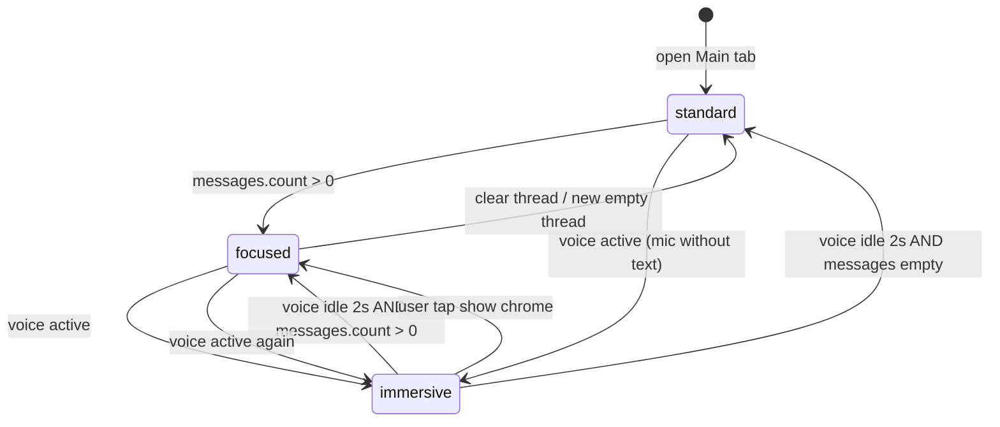

# Companion Hero — Adaptive Immersive Layout (AIL)

**Статус:** утверждено к реализации (ADR **§6.2b**)  
**Дата:** 2026-06-04  
**Цель на device:** видимый герой **~72–75%** высоты экрана в режиме разговора (голос), без изменения Figma/Rive **360×480**.

**Связанные документы:**

| Документ | Роль |
|----------|------|
| [GROK_COMPANION_ARCHITECTURE_FOR_ALADDIN.md](./GROK_COMPANION_ARCHITECTURE_FOR_ALADDIN.md) §6.2b | ADR-якорь |
| [COMPANION_ML_MASTER_ONE_FILE.md](./COMPANION_ML_MASTER_ONE_FILE.md) §5 | План-факт «56% vs ⅓» |
| [COMPANION_HERO_ART_CANON.md](./COMPANION_HERO_ART_CANON.md) | MIMIC-Q1, safe zone лица |
| [COMPANION_PROGRESS_TRACKER.md](./COMPANION_PROGRESS_TRACKER.md) | `[x]` после закрытия задач **HERO-UX-AIL-*** |

---

## 0. Резюме за 30 секунд

| | |
|--|--|
| **Проблема** | Сейчас видимый герой **~36%** экрана (`0.56` зоны × `scaledToFit` × portrait art в широком stage). |
| **Решение** | **3 режима** (`standard` / `focused` / `immersive`) — комбинация долей зон + `fit`/`fill` + видимость chrome. |
| **Не трогаем** | Figma/Rive **360×480**, Hub **96 pt**, Wellness **48 pt**, pipeline **02b → 07 → 07b**. |
| **Меняем** | Только iOS presentation: `CompanionHeroLayout`, views, `CompanionHomeScreen` tab bar, баннеры (P1). |
| **PR** | Один PR **P0** (AIL core); отдельный PR **P1** (баннеры). |

---

## 1. Цели и не-цели

### 1.1 Цели

1. При **голосовом** диалоге — ощущение «говорю с героем лицом к лицу» (**72–75%** видимой высоты героя).
2. При **текстовом** чате — заметно крупнее, чем сейчас (**~49%** в `focused`), tab bar остаётся.
3. До первого сообщения — текущий семейный home (**standard**, 56/28 от GR).
4. Сохранить PG: всегда есть **выход** из immersive (жест / тап / back).

### 1.2 Не-цели (явно отклонено)

| Не делаем | Почему |
|-----------|--------|
| Fullscreen route 100% viewport | Ломает 4 вкладки Kids, отдельный navigation stack |
| Новый artboard Figma (ландшафт) | Блокер HERO-3-07, месяцы работы |
| Изменение Hub 96 / Wellness 48 | Другие экраны, вне scope |
| Всегда `0.92 + fill` без режимов | Родители/дети теряют навигацию |

### 1.3 Оговорки (приняты)

- **~75%, не 100%** — снизу остаются субтитр + input (**~10–14%** экрана).
- **`fill`** — crop по бокам/низу; лицо должно быть в верхней safe zone art (MIMIC-Q1 ≥96 pt на короткой стороне **сцены**).
- **Выход из immersive** — обязателен в P0 (см. §6).

---

## 2. Три режима (канон продукта)

### 2.1 Таблица режимов

| Режим | `ConversationPresence` | Когда включается | hero / chat (от GR) | Масштаб | Chrome |
|-------|------------------------|------------------|---------------------|---------|--------|
| **standard** | `.standard` | Старт «Главное», нет сообщений в треде, ушли с immersive >30 с | **0.56 / 0.28** | `fit` | `headerBar` + `homeTabBar` как сейчас |
| **focused** | `.focused` | `messages.count > 0` или фокус в input / отправка текста | **0.72 / 0.20** | `fit` | tab bar **видим** |
| **immersive** | `.immersive` | Голос: `isRecording` \| `isPreparingRecording` \| `voiceSession.isAwaitingReply` \| `speechOutput.isSpeaking` | **0.88 / 0.12** | **`fill`**, anchor **bottom** | tab bar **скрыт** (height 0 или opacity 0); header **компактный** |

> **Детский профиль:** те же доли; опционально tab bar в immersive **opacity 0.35** вместо полного скрытия (A/B на QA) — по умолчанию **скрыт**, как в таблице.

### 2.2 Приоритет режимов (если несколько триггеров)

```
immersive  >  focused  >  standard
```

Пример: идёт голос **и** есть история сообщений → остаёмся в **immersive**.

### 2.3 Константы layout (новый код)

Добавить в `CompanionHeroLayout.swift`:

```swift
enum ConversationPresence: Equatable {
    case standard
    case focused
    case immersive
}

struct PresenceMetrics {
    let heroZoneFraction: CGFloat
    let chatZoneFraction: CGFloat
    let contentMode: HeroStageContentMode  // fit | fill
}

enum HeroStageContentMode {
    case fit
    case fillBottom  // scaledToFill + bottom alignment
}

static func presenceMetrics(_ presence: ConversationPresence) -> PresenceMetrics {
    switch presence {
    case .standard:  return .init(hero: 0.56, chat: 0.28, mode: .fit)
    case .focused:   return .init(hero: 0.72, chat: 0.20, mode: .fit)
    case .immersive: return .init(hero: 0.88, chat: 0.12, mode: .fillBottom)
    }
}
```

Старые `heroZoneHeightFraction` / `chatZoneHeightFraction` оставить как **alias** для `.standard` (обратная совместимость тестов/доков).

### 2.4 Ожидаемые метрики на iPhone 393×852

| Режим | Зона hero (% экрана) | **Видимый герой** (% экрана) | Чат (% экрана) |
|-------|----------------------|------------------------------|----------------|
| standard (сейчас) | ~43% | **~36%** | ~21% |
| focused | ~55% | **~49%** | ~17% |
| immersive | ~78% | **~72–75%** | ~9–11% |

Формула проверки: `python3` скрипт из [COMPANION_ML_MASTER_ONE_FILE.md](./COMPANION_ML_MASTER_ONE_FILE.md) §5 (GR ≈653 standard, ≈759 immersive при скрытом tab ~62 pt).

---

## 3. Диаграмма состояний



**Таймер выхода из immersive:** `2.0 s` после `!isVoiceActive` (debounce, чтобы не мигало между фразами TTS).

```swift
var isVoiceActive: Bool {
    speechManager.isRecording
    || speechManager.isPreparingRecording
    || voiceSession.isAwaitingReply
    || speechOutput.isSpeaking
}
```

---

## 4. Карта файлов и изменений

### 4.1 Ядро layout

| Файл | Изменение |
|------|-----------|
| `UI/Companion/CompanionHeroLayout.swift` | `ConversationPresence`, `presenceMetrics`, `conversationMetrics(contentSize:presence:)` |
| `UI/Companion/CompanionHeroRasterView.swift` | Параметр `contentMode: HeroStageContentMode`; `fill` → `.scaledToFill()` + frame alignment bottom |
| `UI/Companion/CompanionHeroAnimatedView.swift` | То же для Rive path |
| `UI/Companion/CompanionHeroAvatarView.swift` | Проброс `contentMode` в raster/animated |
| `UI/Companion/CompanionHeroRiveHost.swift` | FitBox / layout для fill (если используется Rive) |

### 4.2 Экран разговора

| Файл | Изменение |
|------|-----------|
| `Screens/CompanionConversationScreen.swift` | `@State private var presence: ConversationPresence`; `resolvePresence()`; передать в `conversationMetrics`; `onChange` голоса/сообщений; callback `onPresenceChange` |
| `Screens/CompanionConversationScreen.swift` `heroStage` | Фон immersive: меньше opacity grouped background; overlay blur (§5.3) |
| `Screens/CompanionConversationScreen.swift` `heroStatusOverlay` | В immersive — компактный chip в **верхнем** safe area (не −48 pt снизу stage) |

### 4.3 Home + chrome

| Файл | Изменение |
|------|-----------|
| `Screens/CompanionHomeScreen.swift` | `@State private var mainTabChromeHidden = false`; скрытие `homeTabBar` + компактный `headerBar` при immersive **только** `tab == .main` |
| **Новый** `Core/Companion/CompanionHomeChromeState.swift` (опционально) | `ObservableObject` с `presence` для связи Main ↔ Home без циклических зависимостей |

**Рекомендуемая связь (P0):**

```swift
// CompanionHomeScreen — case .main:
CompanionConversationScreen(
    embeddedInHome: true,
    onPresenceChange: { presence in
        withAnimation(.easeInOut(duration: 0.25)) {
            mainTabChromeHidden = (presence == .immersive)
            headerCompact = (presence == .immersive)
        }
    },
    ...
)
```

`homeTabBar`: если `mainTabChromeHidden` → `frame(height: 0).opacity(0).allowsHitTesting(false)` (освобождает **~62 pt** → GR ближе к immersive расчёту).

### 4.4 Документация (этот спринт)

| Файл | Изменение |
|------|-----------|
| `docs/GROK_COMPANION_ARCHITECTURE_FOR_ALADDIN.md` | §6.2b + ссылка сюда |
| `docs/COMPANION_ML_MASTER_ONE_FILE.md` | §5.3 ссылка на AIL |
| `docs/COMPANION_IMPLEMENTATION_TODOS.md` | Описания **HERO-UX-AIL-01…06** |

### 4.5 Вне scope P0 (не менять)

- `CompanionHubScreen.swift` — Hub 96 pt
- `WellnessPillarEmotionView` — 48 pt
- Figma / `.riv` assets
- Backend API

---

## 5. Детали UI по режимам

### 5.1 standard

- Поведение **1:1** с текущим production.
- `conversationMetrics(..., presence: .standard)` ≡ старые 0.56/0.28.

### 5.2 focused

- Триггер: `!messages.isEmpty` (после первой отправки/загрузки кэша).
- `chatZone` min height **72 pt** (одна строка субтитра).
- Tab bar и header **без изменений**.

### 5.3 immersive

| Элемент | Поведение |
|---------|-----------|
| **heroStage** | `fillBottom`; stage на всю `heroZoneHeight`; padding bottom overlay **8 pt** (не 48) |
| **heroStatusOverlay** | Перенос в **top** HStack: эмоция + trust chip; `.ultraThinMaterial` |
| **Чипы смены героя** | Остаются в overlay, **горизонтальный scroll**, не увеличивать высоту |
| **childSceneSpeakButton** | Позиция от нижнего safe hero, не перекрывать лицо |
| **companionDialogueStrip** | Max **2 строки**; фон `.ultraThinMaterial`; cornerRadius 16 |
| **inputBar** | Без изменений логики; визуально привязан к низу экрана |
| **Фон сцены** | `Color.clear` или градиент персонажа — убрать серый «ящик» 0.3 opacity |

### 5.4 Выход из immersive (P0 — обязательно)

| Жест / действие | Результат |
|-----------------|-----------|
| **Тап по верхней safe area** (48 pt) | `presence = .focused` (или `.standard` если нет сообщений); показать tab bar |
| **Свайп вниз** от верхнего края hero (опционально P0.1) | То же |
| **Смена вкладки** Wellness/Герои/Мой мир | Сброс `presence = .standard`, chrome visible |
| **Back chevron** | Как сейчас — уход с экрана |

Accessibility: VoiceOver hint «Двойной тап вверху — показать меню».

---

## 6. P0 — один PR (ядро AIL)

**ID в трекере (предложение):** `HERO-UX-AIL-01` … `HERO-UX-AIL-04`  
**Оценка:** 1–2 dev-дня + 0.5 дня device QA.

### 6.1 Чеклист задач P0

| ID | Задача | Файлы | Критерий готовности |
|----|--------|-------|---------------------|
| **AIL-01** | `ConversationPresence` + metrics | `CompanionHeroLayout.swift` | Unit: три режима → правильные fractions |
| **AIL-02** | `contentMode` fit/fill | Raster + Animated + Avatar | PNG unicorn: лицо не обрезано на 393×852 immersive |
| **AIL-03** | `resolvePresence()` + voice debounce | `CompanionConversationScreen.swift` | Запись → immersive; конец TTS +2s → focused/standard |
| **AIL-04** | Первое сообщение → focused | то же | Отправка текста без голоса → 0.72/0.20 |
| **AIL-05** | `onPresenceChange` → Home tab bar | `CompanionHomeScreen.swift` | immersive: tab bar height 0; выход: анимация 0.25s |
| **AIL-06** | Компактный header в immersive | `CompanionHomeScreen.swift` | Только back + короткий title / chip героя |
| **AIL-07** | Overlay top + dialogue material | `CompanionConversationScreen.swift` | Статус не съедает 48 pt снизу stage |
| **AIL-08** | Тап верхней зоны → exit immersive | `CompanionConversationScreen.swift` | Tab bar снова видим |
| **AIL-09** | ADR §6.2b + этот план | `docs/` | GROK + MASTER ссылки |

### 6.2 Порядок коммитов внутри PR

1. Layout enum + metrics (AIL-01) — компилируется, поведение = standard.
2. Raster/Animated fill (AIL-02).
3. Conversation presence logic (AIL-03, AIL-04).
4. Home chrome (AIL-05, AIL-06).
5. Overlay polish (AIL-07, AIL-08).
6. Docs (AIL-09).

### 6.3 Псевдокод `resolvePresence`

```swift
private func resolvePresence(
    messagesEmpty: Bool,
    isVoiceActive: Bool,
    userPinnedChrome: Bool  // после тапа «показать меню»
) -> ConversationPresence {
    if userPinnedChrome && !isVoiceActive {
        return messagesEmpty ? .standard : .focused
    }
    if isVoiceActive { return .immersive }
    if !messagesEmpty { return .focused }
    return .standard
}
```

`userPinnedChrome` сбрасывается в `false` при новом `isVoiceActive == true`.

### 6.4 Регрессии — что проверить в P0

- [ ] Standalone `CompanionConversationScreen` (`embeddedInHome: false`) — immersive работает без Home (toolbar вместо tab bar).
- [ ] Смена героя на чипах в immersive.
- [ ] Hold-to-talk child / toggle adult.
- [ ] Поворот **не** поддерживаем в v1 (portrait only) — зафиксировать в QA.
- [ ] iPhone SE (малая высота) — min stage 96 pt, субтитр читаем.
- [ ] iPhone 15 Pro Max — целевые **72–75%** видимого героя.

---

## 7. P1 — баннеры и стабильность высоты

**PR отдельно** после P0 на device.

| ID | Задача | Поведение в immersive |
|----|--------|----------------------|
| **AIL-10** | Wellness pillar banner | Свёртка в **одну строку chip** или `hidden` |
| **AIL-11** | Wellness recap / entry banner | Скрыть; показать иконку «i» в input bar |
| **AIL-12** | `CompanionUsageBanner` | Под input, не в GR |
| **AIL-13** | Memory chips row | Горизонтальный scroll **над** input, max height 32 pt |
| **AIL-14** | Legal consent banner | Не скрывать (compliance) |

**Критерий P1:** при всех баннерах включённых высота hero **не прыгает** >8 pt между сменами режимов.

---

## 8. P2 — настройка родителя (не блокер)

| ID | Задача |
|----|--------|
| **AIL-15** | `AppStorage("companion_hero_presence_pin")` enum: `auto` \| `always_focused` \| `always_standard` |
| **AIL-16** | UI в Parent settings / Companion settings |
| **AIL-17** | Analytics: `companion_presence_mode` + dwell time |

---

## 9. QA и приёмка

### 9.1 Device matrix

| Устройство | standard | focused | immersive |
|------------|----------|---------|-----------|
| iPhone SE 3 | ✓ | ✓ | герой ≥65% экрана |
| iPhone 15 | ✓ | ✓ | **72–75%** |
| iPhone 15 Pro Max | ✓ | ✓ | **72–75%** |

### 9.2 Три героя (после HERO-3-07)

| Герой | MIMIC-Q1 лицо | fill crop |
|-------|---------------|-----------|
| unicorn | ✓ | рог не обрезает глаза |
| aladdin | ✓ | плащ/низ допустим crop |
| genie | ✓ | дым/хвост низ |

### 9.3 Accessibility

- [ ] VoiceOver: режим не озвучивается каждую секунду (только при смене).
- [ ] Reduce Motion: отключить анимацию 0.25s chrome, оставить смену layout.
- [ ] Dynamic Type: субтитр 2 строки max в immersive.

### 9.4 Скриншоты для sign-off

1. standard — первый вход.  
2. focused — после текста.  
3. immersive — во время `speaking`.  
4. exit immersive — tab bar вернулся.

---

## 10. Риски и откат

| Риск | Митигация | Откат |
|------|-----------|-------|
| fill обрезает лицо | QA трёх masters; anchor bottom | feature flag `AIL_ENABLED = false` → только standard |
| Tab bar «застрял» скрытым | Тап top + смена вкладки | — |
| GR переполнен баннерами | P1 | P1 до релиза в prod если баннеры активны |
| Rive отличается от PNG | Одинаковый `contentMode` в host | — |

**Feature flag (рекомендуется в P0):**

```swift
// AppConfig или CompanionCapabilitiesService
static var heroImmersiveLayoutEnabled: Bool { true }  // false = только standard
```

---

## 11. Связь с pipeline Rive / Figma

| Этап | Влияние AIL |
|------|-------------|
| **02b Figma** ✅ | Нет — 360×480 остаётся |
| **HERO-3-07 .riv** | Export с лицом в верхних **60%** artboard |
| **11c GATE-EMO** | Smoke в **трёх** presence на device |
| **11b placeholder** | P0 можно катить на PNG masters |

AIL **не блокирует** HERO-3-07; параллельно.

---

## 12. Итоговая таблица «что утверждено»

| Параметр | Значение |
|----------|----------|
| Архитектура | **Adaptive Immersive Layout (AIL)** — комбинированное решение |
| ADR | **GROK §6.2b** |
| Целевой видимый герой | **72–75%** (immersive) |
| Режимы | standard / focused / immersive |
| Реализация | **P0 один PR**, P1 баннеры, P2 настройка родителя |
| Art canon | **360×480**, Hub **96**, Wellness **48** — без изменений |

---

## 13. Статус реализации (2026-06-04)

| Этап | Статус |
|------|--------|
| **P0** AIL core | ✅ в коде |
| **P1** chip rail `CompanionConversationBannersSection` | ✅ |
| **P2** `HeroPresencePinMode` в «Мой мир» (родитель) | ✅ |

## 14. Следующий шаг для разработчика

1. Device QA §9 (iPhone 15: immersive + chip rail + pin «Крупный»).
2. После HERO-3-07 — MIMIC-Q1 crop на `fill` для трёх `.riv`.
