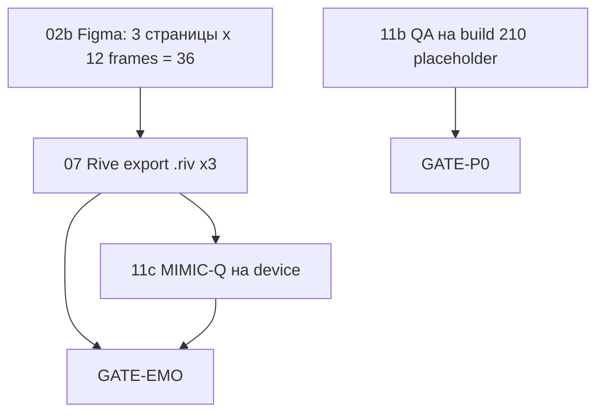

# 🧞 Companion — СТАРТ ДЛЯ СЛЕДУЮЩЕЙ ML-СИСТЕМЫ

> **Открой этот файл первым.** Здесь — что уже сделано, что делать дальше, и полный каталог документов и кода.  
> **Дата:** 2026-05-28 · **Handoff №3** — см. [COMPANION_ML_HANDOFF_2026-05-28.md](./COMPANION_ML_HANDOFF_2026-05-28.md) · [Rive connect](./COMPANION_RIVE_CONNECT_NODE_MCP.md)

---

## 0. За 60 секунд

| | |
|---|---|
| **Продукт** | AI-компаньон для детей/семьи: 3 героя, голос, эмоции, trust, вход **Kids → Игры → Мир героев** |
| **Визуал** | **2D Rive** (не 3D), сцена **56%** экрана, субтитр снизу — как Grok Companions |
| **Репозиторий** | `git@github.com:sergey234/ALADDIN_FAMILY.git` · ветка **`master`** |
| **Рабочая папка iOS** | `/Users/sergejhlystov/ALADDIN_NEW/ALADDIN_NEW/mobile_apps/ALADDIN_iOS` |
| **Build iOS** | **210** (`AppConfig.buildNumber`) |
| **Прогресс** | **67 / 102 (66%)** · HERO-3: **26 / 26** ✅ |
| **Главный TODO** | [COMPANION_PROGRESS_TRACKER.md](./COMPANION_PROGRESS_TRACKER.md) — ставь `[x]` только после реальной проверки |

### Что делать дальше (критический путь)



| Шаг | ID | Кто | Действие |
|-----|-----|-----|----------|
| **1** | ~~**HERO-3-02b**~~ | — | ✅ 36 frames Figma |
| **2** | **HERO-3-07** | Аниматор | Rive Editor → [5 steps](./COMPANION_RIVE_EDITOR_5_STEPS.md) · [CONNECT](./COMPANION_RIVE_CONNECT_NODE_MCP.md) |
| **3** | **HERO-3-11b** | QA / владелец | Device: D10, MOTION-Q, SPEECH-Q — [чеклист](./COMPANION_HERO3_11_QA_CHECKLIST.md) |
| **4** | **HERO-3-11c** | QA | Повтор MIMIC-Q после production `.riv` |
| **5** | **GATE-P0 / GATE-EMO** | Приёмка | После 11b + 07 |

**iOS-код под `.riv` уже готов** — после **07** меняются только файлы в бандле, не архитектура.

---

## 1. Порядок чтения (рекомендуется)

Читай **по номеру** в первый день. Не нужно читать все 23 файла подряд.

| # | Документ | Зачем | Время |
|---|----------|-------|-------|
| **1** | **Этот файл** (`COMPANION_ML_HANDOFF_START_HERE.md`) | Карта и next steps | 10 мин |
| **2** | [COMPANION_HERO_ART_CANON.md](./COMPANION_HERO_ART_CANON.md) | **PO ✅ art** — где лежат все картинки | 5 мин |
| **3** | [COMPANION_PROGRESS_TRACKER.md](./COMPANION_PROGRESS_TRACKER.md) | Единый список 102 задач с `[x]` | 15 мин |
| **4** | [COMPANION_100_PERCENT_PARALLEL.md](./COMPANION_100_PERCENT_PARALLEL.md) | План vs факт, кто что закрывает | 5 мин |
| **5** | [COMPANION_FIGMA_STATUS.md](./COMPANION_FIGMA_STATUS.md) | **Аудит Figma** — что реально в файле | 5 мин |
| **6** | [COMPANION_RIVE_EXPORT_CHECKLIST.md](./COMPANION_RIVE_EXPORT_CHECKLIST.md) | **HERO-3-07** — размеры, SM, export | 10 мин |
| **7** | [COMPANION_HERO3_11_QA_CHECKLIST.md](./COMPANION_HERO3_11_QA_CHECKLIST.md) | Device QA 11b / 11c | 10 мин |
| **8** | [COMPANION_HEROES_3_FIGMA_RIVE_PLAN.md](./COMPANION_HEROES_3_FIGMA_RIVE_PLAN.md) | Полная спека 3 героов (§2.2 Motion, §2.3 Mimic) | по необходимости |
| **9** | [COMPANION_ML_HANDOFF_2026-05-27.md](./COMPANION_ML_HANDOFF_2026-05-27.md) | SSH, BE, скрипты, история | по задаче |

---

## 2. Что уже сделано ✅ (не переделывать)

### 2.1 Продукт и iOS (build 210)

| Сделано | Где в коде / доках |
|---------|-------------------|
| Единый вход **«Мир героев»** (Главное / Герои / Моё) | `CompanionHomeScreen`, [UNIFIED_HOME_UX](./COMPANION_UNIFIED_HOME_UX.md) |
| Layout **56%** герой + субтитр | `CompanionHeroLayout`, `CompanionConversationScreen` |
| Rive host + placeholder `.riv` ×3 | `CompanionHeroRiveHost`, `Resources/Companion/` |
| **08b PASS** на реальном iPhone (placeholder art) | [08b checklist](./COMPANION_08B_DEVICE_CHECKLIST.md) |
| **TTS на текстовые ответы** + toggle в «Моё» | `CompanionSpeechOutput`, `CompanionMineTabView` |
| Hub: Rive-превью вместо только emoji | `CompanionHubHeroPreview` |
| CI fix `VoiceAudioSessionCoordinator.Consumer.companion` | commit `30e917b2` |
| pytest companion **46 passed** (11a) | `Tests/test_companion*.py` |

### 2.2 Backend / OPS

| Сделано | Документ |
|---------|----------|
| P0 MVP (19/19), P1 (11/11), CX (6/6), OPS (4/4) | [TRACKER](./COMPANION_PROGRESS_TRACKER.md) |
| Deploy + verify prod 27.05 | `COMPANION_DEPLOY_P0.md`, HERO-3-10 |
| 3 героя BE + age_policy (genie не child) | `companion_persona`, routers |

### 2.3 Figma (только спека)

| Сделано | Не путать с |
|---------|-------------|
| Страница **`00_Spec`**: ADR, Motion, Mimic, Sign-off, RIVE_EXPORT | ❌ это **не** 36 готовых кадров |
| **HERO-3-17** sign-off PO 2026-05-26 | разблокирует рисование 02b |

---

## 3. Что НЕ сделано ⏳ (твоя работа)

| ID | Задача | Блокер визуала «полноценный герой» |
|----|--------|-----------------------------------|
| **HERO-3-02b** | 36 фреймов в Figma (`01`–`03`) | **Да** — без art нечего экспортировать |
| **HERO-3-07** | Production `.riv` ×3 | **Да** — сейчас кружки/placeholder на device |
| **HERO-3-11b** | Device QA на placeholder | Нет — можно параллельно |
| **HERO-3-11c** | MIMIC после 07 | После 07 |
| **GATE-P0** | Ждёт 11b | |
| **GATE-EMO** | Ждёт 07 + D10/11c | |

### Почему на device «кружки», а не герои

- В бандле лежат **placeholder** `.riv` (~15 KB), не финальный art.
- **«Главное»** — прямоугольник 56% (код верный); внутри Rive рисует заглушку.
- **Джин** не виден на **child**-профиле — по дизайну (teen/parent only).

---

## 4. Figma — правда на 2026-05-27

| Ресурс | URL / ключ |
|--------|------------|
| **Companion Heroes** | https://www.figma.com/design/vwKcGPUUEZjgayEHNn0BJM/Companion-Heroes |
| **File key** | `vwKcGPUUEZjgayEHNn0BJM` |
| **Env** | [FIGMA_COMPANION.env](./FIGMA_COMPANION.env) |
| **Онбординг (READ-ONLY!)** | `KvkUdyb5Ll31Z9FSzCbpNl` — **не редактировать** |

| Страница Figma | Статус |
|----------------|--------|
| `00_Spec` | ✅ есть |
| `01_Unicorn` | ❌ **создать** + 12 frames |
| `02_Aladdin_Human` | ❌ **создать** + 12 frames |
| `03_Genie` | ❌ **создать** + 12 frames |

Подробный аудит: [COMPANION_FIGMA_STATUS.md](./COMPANION_FIGMA_STATUS.md)

**Размеры для 02b и 07:**

| Параметр | Значение |
|----------|----------|
| Artboard Rive | **360 × 480 pt** |
| Сцена на телефоне | ~**56%** высоты, прямоугольник |
| Лицо (QA) | короткая сторона ≥ **96 pt** |
| Файлы | `< 500 KB` каждый |
| SM inputs | `emotion` (triggers) + `mouth_open` (0…1) |

---

## 5. Команды (копируй в терминал)

```bash
# Рабочая директория
cd /Users/sergejhlystov/ALADDIN_NEW/ALADDIN_NEW/mobile_apps/ALADDIN_iOS

# Backend tests
PYTHONPATH=. python3 -m pytest Tests/test_companion*.py -q

# Rive size gate (после замены .riv)
python3 scripts/companion_riv_size_gate.py --dir Resources/Companion

# iOS bundle check
./scripts/verify_companion_rive_ios_bundle.sh

# Xcode build (simulator)
xcodebuild -scheme ALADDIN -destination 'platform=iOS Simulator,name=iPhone 16' build

# Prod verify (нужен SSH)
./scripts/verify_companion_p0_prod.sh
```

**Git (последние коммиты Companion):**

| Commit | Содержание |
|--------|------------|
| `80aa62a7` | docs: Figma audit, tracker |
| `0bde7929` | build 210: TTS text, Hub preview |
| `30e917b2` | fix CI: `.companion` audio consumer |
| `6fe20feb` | Мир героев, Rive host, build 209 |

---

## 6. Полный каталог документов `docs/COMPANION_*`

Все пути относительно:  
`ALADDIN_NEW/mobile_apps/ALADDIN_iOS/docs/`

### 6.1 🟢 Старт и трекинг (читать в первую очередь)

| Файл | Назначение |
|------|------------|
| **COMPANION_ML_HANDOFF_START_HERE.md** | **Этот файл** — входная точка |
| **COMPANION_PROGRESS_TRACKER.md** | **102 задачи** `[x]`/`[ ]` — единственный источник прогресса |
| **COMPANION_100_PERCENT_PARALLEL.md** | План vs факт, зоны ответственности |
| **COMPANION_ML_HANDOFF_2026-05-27.md** | Handoff: BE, SSH, скрипты, индекс кода |
| **COMPANION_ML_HANDOFF_FULL.md** | Расширенный handoff (часть устарела — сверять с TRACKER) |

### 6.2 🎨 Figma · Rive · герои (HERO-3)

| Файл | Назначение |
|------|------------|
| **COMPANION_FIGMA_STATUS.md** | Аудит Figma: что есть / чего нет |
| **FIGMA_COMPANION.env** | URL, file key, страницы |
| **COMPANION_HEROES_3_FIGMA_RIVE_PLAN.md** | Мастер-план 3 героев, §2.1–2.3, QA |
| **COMPANION_FIGMA_PRODUCT_DECISIONS.md** | PO-решения, 12 vs 13 emotions |
| **COMPANION_2D_VS_3D_ADR.md** | ADR: 2D Rive, не SceneKit |
| **COMPANION_RIVE_EXPORT_CHECKLIST.md** | **HERO-3-07** DoD export |
| **COMPANION_RIVE_UNBLOCK.md** | SPM RiveRuntime, симулятор 15.x |
| **COMPANION_HERO3_MOTION_MIMIC_SIGNOFF.md** | HERO-3-17 sign-off |
| **COMPANION_HERO3_READINESS_MATRIX.md** | Матрица Spec/BE/iOS/.riv/QA |
| **ALADDIN_Character_Bible.md** | Character Bible §4 (герои) |

### 6.3 ✅ QA и device

| Файл | Назначение |
|------|------------|
| **COMPANION_HERO3_11_QA_CHECKLIST.md** | **11b / 11c**: D10, MOTION, MIMIC, SPEECH |
| **COMPANION_08B_DEVICE_CHECKLIST.md** | Rive на device (08b) |
| **COMPANION_FINAL_PLAN_AND_VERIFICATION.md** | GATE-EMO, D10 таблица, регресс |
| **COMPANION_UNIFIED_HOME_UX.md** | UX «Мир героев» |
| **COMPANION_GATE_CX_D01_D03_2026-05-26.md** | CX gate сценарии |
| **COMPANION_GATE_DIALOG_REGRESS_REPORT_2026-05-26.md** | R1–R19 регресс |
| **COMPANION_OPS05_DOD_2026-05-26.md** | OPS DoD |

### 6.4 🏗 Архитектура · деплой · планирование

| Файл | Назначение |
|------|------------|
| **COMPANION_MASTER_PLAN_v1.md** | Roadmap P0→P3 |
| **COMPANION_IMPLEMENTATION_TODOS.md** | Описание каждой задачи по ID |
| **COMPANION_MODULAR_ARCHITECTURE.md** | Модули платформы |
| **COMPANION_DEPLOY_P0.md** | Деплой VPS, env |
| **GROK_COMPANION_ARCHITECTURE_FOR_ALADDIN.md** | Grok parity, API |
| **GROK_FULL_FEATURE_MATRIX.md** | 102 фичи трассировка |

### 6.5 🔧 Инфраструктура (вне docs/)

| Файл | Назначение |
|------|------------|
| `../.github/workflows/companion-gate.yml` | CI: pytest + riv gate |
| `../.cursor/rules/prod-no-mock-bypass.mdc` | **Prod: no mock bypass** |
| `../scripts/companion_riv_size_gate.py` | Лимит 500 KB на `.riv` |
| `../scripts/deploy_companion_p0.sh` | Деплой |
| `../scripts/verify_companion_p0_prod.sh` | Prod verify |

---

## 7. Каталог кода iOS (Companion)

База: `ALADDIN_NEW/mobile_apps/ALADDIN_iOS/`

### 7.1 Экраны

| Файл | Роль |
|------|------|
| `Screens/CompanionHomeScreen.swift` | Корень: вкладки Главное / Герои / Моё |
| `Screens/CompanionConversationScreen.swift` | **56%** сцена + субтитр + mic + TTS |
| `Screens/CompanionHubScreen.swift` | Выбор героя (вкладка Герои) |
| `Screens/CompanionMineTabView.swift` | Trust, TTS toggle, история |
| `Screens/ChildRewardsScreen.swift` | Вход «Мир героев» из Игр |

### 7.2 UI / Rive

| Файл | Роль |
|------|------|
| `UI/Companion/CompanionHeroLayout.swift` | 56% / 28%, artboard 360×480 |
| `UI/Companion/CompanionHeroAvatarView.swift` | Rive → shell → procedural |
| `UI/Companion/CompanionHeroRiveHost.swift` | RiveRuntime, sim 15 guard |
| `UI/Companion/CompanionHeroAnimatedView.swift` | Emoji fallback |
| `UI/Companion/CompanionHubHeroPreview.swift` | Hub preview 88pt |
| `UI/Companion/CompanionDialogueStrip.swift` | Субтитр |
| `UI/Companion/CompanionHeroEmotion+Timeline.swift` | Debounce 400 ms |

### 7.3 Core

| Файл | Роль |
|------|------|
| `Core/Voice/CompanionVoiceSession.swift` | WebSocket голос |
| `Core/Voice/CompanionSpeechOutput.swift` | TTS AVSpeech |
| `Core/Audio/VoiceAudioSessionCoordinator.swift` | `.companion` consumer |
| `Core/Services/CompanionAPIService.swift` | REST |
| `Core/Models/CompanionModels.swift` | DTO, emotions |
| `Core/Config/AppConfig.swift` | build **210** |

### 7.4 Ресурсы

| Путь | Роль |
|------|------|
| `Resources/Companion/unicorn.riv` | Placeholder → заменить в **07** |
| `Resources/Companion/aladdin.riv` | Placeholder |
| `Resources/Companion/genie.riv` | Placeholder |

### 7.5 Backend (в том же репо)

| Путь | Роль |
|------|------|
| `security/services/ai_platform/companion_*.py` | Persona, emotions, chat |
| `app/routers/companion*.py` | API routes |
| `Tests/test_companion*.py` | 46 pytest |

---

## 8. Правила для ML (обязательно)

1. **Прогресс** — только в [COMPANION_PROGRESS_TRACKER.md](./COMPANION_PROGRESS_TRACKER.md); не выдумывай %.
2. **Figma onboarding** `KvkUdyb5Ll31Z9FSzCbpNl` — **read-only**, не удалять.
3. **Prod** — no mock bypass: `.cursor/rules/prod-no-mock-bypass.mdc`.
4. **`[x]` на 11b/08b/07** — только после device/файлов/аудита, не «на словах».
5. **Коммиты** — только если пользователь просит; **push** — явно.
6. **HERO-3-02** = spec в `00_Spec`; **02b** = 36 frames — не смешивать.
7. Симулятор **iOS 15.x**: Rive **выключен** (краш Metal); QA Rive — **реальный iPhone**.

---

## 9. Сценарии «что открыть, если…»

| Ситуация | Открой |
|----------|--------|
| Нужен общий план спринта | [COMPANION_MASTER_PLAN_v1.md](./COMPANION_MASTER_PLAN_v1.md) |
| Рисовать в Figma | [COMPANION_FIGMA_STATUS.md](./COMPANION_FIGMA_STATUS.md) + [HEROES_3_PLAN](./COMPANION_HEROES_3_FIGMA_RIVE_PLAN.md) §5 |
| Export в Rive | [COMPANION_RIVE_EXPORT_CHECKLIST.md](./COMPANION_RIVE_EXPORT_CHECKLIST.md) |
| Падает CI / Xcode | [COMPANION_RIVE_UNBLOCK.md](./COMPANION_RIVE_UNBLOCK.md) |
| Тест на iPhone | [COMPANION_HERO3_11_QA_CHECKLIST.md](./COMPANION_HERO3_11_QA_CHECKLIST.md) |
| Деплой на VPS | [COMPANION_DEPLOY_P0.md](./COMPANION_DEPLOY_P0.md) + [ML_HANDOFF_2026-05-27](./COMPANION_ML_HANDOFF_2026-05-27.md) §SSH |
| Пользователь: «герой молчит» | Проверь toggle **Моё → Озвучивать**; mic = voice WS; текст = TTS build 210 |
| Пользователь: «кружки не герои» | Это **07** / **02b**, не баг layout |

---

## 10. Чеклист первого дня для новой ML

- [ ] Прочитал §0–§3 этого файла  
- [ ] Открыл [TRACKER](./COMPANION_PROGRESS_TRACKER.md) — понял 66/102 и открытые HERO-3  
- [ ] Прочитал [FIGMA_STATUS](./COMPANION_FIGMA_STATUS.md) — 0/36 frames  
- [ ] Прогнал `pytest Tests/test_companion*.py` — ожидаю 46 passed  
- [ ] Понял: следующий **продуктовый** шаг — **02b → 07**; **параллельно** — **11b** на build 210  
- [ ] Не трогал onboarding Figma  

---

## 11. Связь с предыдущим handoff

| Документ | Статус |
|----------|--------|
| [COMPANION_ML_HANDOFF_2026-05-27.md](./COMPANION_ML_HANDOFF_2026-05-27.md) | Актуален для BE/SSH; цифры — сверять с TRACKER |
| [COMPANION_ML_HANDOFF_FULL.md](./COMPANION_ML_HANDOFF_FULL.md) | Архив, детали VPS |

**При расхождении цифр** — верь [COMPANION_PROGRESS_TRACKER.md](./COMPANION_PROGRESS_TRACKER.md).

---

*Конец handoff. Следующая ML: начни с §0, затем TRACKER, затем 02b или 11b по роли пользователя.*
