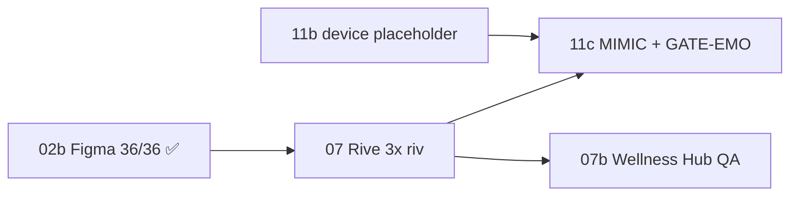

# Companion + Rive + Figma — единый файл для ML (контекст + layout)

> **Следующая ML-система — Rive и шаги 07+:** открой первым [**COMPANION_ML_RIVE_HANDOFF_MASTER.md**](./COMPANION_ML_RIVE_HANDOFF_MASTER.md)

> **Дата:** 2026-06-04 · **Репо:** `ALADDIN_NEW/mobile_apps/ALADDIN_iOS`  
> **Цель:** вся критичная информация в **одном месте** + ссылки на детальные документы.  
> **Трекер задач:** [COMPANION_PROGRESS_TRACKER.md](./COMPANION_PROGRESS_TRACKER.md) — единственный источник `[x]`/`[ ]` (90/102).

---

## 0. За 60 секунд

| | |
|--|--|
| **Продукт** | AI-компаньон: 3 героя, 2D Rive, вход **Kids → Игры → Мир героев** |
| **Figma 02b** | ✅ **36/36** live MCP 2026-06-04 → [аудит](./COMPANION_FIGMA_AUDIT_LIVE_2026-06-04.md) |
| **Блокер визуала** | **HERO-3-07** — 3× production `.riv` (не Figma) |
| **Rive план** | [RIVE_MASTER_PLAN.md](./RIVE_MASTER_PLAN.md) |
| **Build** | см. `AppConfig` / TRACKER (актуально **216** в трекере) |

**Критический путь:** ~~02b~~ ✅ → **07** → **11c** → **GATE-EMO** · параллельно **11b** (placeholder).

---

## 1. Подключение к Figma (обязательно для агента)

### 1.1 Файлы и ключи (Companion — основной art)

| Параметр | Значение |
|----------|----------|
| **Design file** | [Companion-Heroes](https://www.figma.com/design/vwKcGPUUEZjgayEHNn0BJM/Companion-Heroes) |
| **File key** | `vwKcGPUUEZjgayEHNn0BJM` |
| **Env** | [FIGMA_COMPANION.env](./FIGMA_COMPANION.env) |
| **Team (ваш)** | `1634136191275652287` · [recents](https://www.figma.com/files/team/1634136191275652287/recents-and-sharing) |
| **MCP аккаунт (live)** | Sergey21 · `sergey21.02.84@gmail.com` |

### 1.2 Как подключить Figma MCP в Cursor (как раньше)

1. **Cursor → Settings → MCP** → сервер **Figma** (`https://mcp.figma.com/mcp`) → **Connect** (OAuth).
2. В репо уже есть в `.cursor/mcp.json` и `~/.cursor/mcp.json`:

```json
"figma": { "type": "http", "url": "https://mcp.figma.com/mcp" }
```

3. **Figma Desktop** на Mac — открыт **Companion-Heroes**.
4. После Connect: **Reload Window** или новый чат.
5. Проверка: `whoami` → `get_metadata` fileKey `vwKcGPUUEZjgayEHNn0BJM`, nodeId `4:2` / `5:2` / `6:2`.

Подробно: [FIGMA_MCP_ENABLE.md](./FIGMA_MCP_ENABLE.md)

### 1.3 Запасной путь — REST API (без MCP)

1. Figma → Settings → Security → **Personal access token** (`figd_...`).
2. Локально в [FIGMA_COMPANION.env](./FIGMA_COMPANION.env) (не коммитить):

```env
FIGMA_ACCESS_TOKEN=figd_...
```

3. Аудит:

```bash
cd ALADDIN_iOS
python3 scripts/audit_companion_figma_02b.py
```

### 1.4 Онбординг Figma — READ-ONLY

| | |
|--|--|
| File key | `KvkUdyb5Ll31Z9FSzCbpNl` |
| Env | [FIGMA_ONBOARDING.env](./FIGMA_ONBOARDING.env) |
| Правило | **Не редактировать** OB_00–07 — только референс для art |

### 1.5 Страницы Companion Figma (node ID)

| Страница | nodeId | Роль |
|----------|--------|------|
| `00_Spec` | `0:1` | Motion, Mimic, Sign-off, `02_DONE_36_frames` |
| `01_Unicorn` | `4:2` | 12× `unicorn/emotion/*` |
| `02_Aladdin_Human` | `5:2` | 12× `aladdin/emotion/*` (только OB_01) |
| `03_Genie` | `6:2` | 12× в `GRID_12_genie_emotions_OB03` (`122:2`) |

---

## 2. Аудит Figma HERO-3-02b (live 2026-06-04) ✅

**Итог: PASS 36/36** — [COMPANION_FIGMA_AUDIT_LIVE_2026-06-04.md](./COMPANION_FIGMA_AUDIT_LIVE_2026-06-04.md)

| Страница | Кадры 360×480 | 12 эмоций | Master PO |
|----------|---------------|-----------|-----------|
| `01_Unicorn` | 12× `unicorn/emotion/*` | idle…alert ✅ | v2 cinematic (`25:2` на Spec) |
| `02_Aladdin_Human` | 12× `aladdin/emotion/*` | ✅ | **только OB_01** |
| `03_Genie` | 12× `genie/emotion/*` | ✅ | **OB_03 headfix** |
| `00_Spec` | `02_DONE_36_frames` ✅ | — | — |

- **`speaking`** в Figma **нет** (верно — только Rive **07** + `mouth_open`).
- v1.1: 12 имён могут быть **один master** на героя — мимика в **Rive 07**.

Сводка статуса: [COMPANION_FIGMA_STATUS.md](./COMPANION_FIGMA_STATUS.md)

---

## 3. Подключение к Rive

### 3.1 Единый план Rive (PO ✅)

**Старт:** [RIVE_MASTER_PLAN.md](./RIVE_MASTER_PLAN.md)

| Правило | Значение |
|---------|----------|
| Файлы | **только** `unicorn.riv` · `aladdin.riv` · `genie.riv` |
| Путь | `Resources/Companion/` |
| Artboard | **360 × 480 pt** |
| **Не делать** | 4× `wellness_*.riv`, 160×160, `WellnessPillarRiveHost` |
| Wellness Hub | **07b** — те же 3 `.riv`, 48pt на карточке |

### 3.2 Rive MCP (локально, опционально)

В `~/.cursor/mcp.json`:

```json
"rivemcp": { "command": "/usr/local/bin/rivemcp", "args": [], "env": {} }
```

### 3.3 State Machine (HERO-3-07)

| Input | Тип | Значения |
|-------|-----|----------|
| `emotion` | triggers | `idle` … `alert` + **`speaking`** (фаза, не 13-й постер Figma) |
| `mouth_open` | Number | **0…1** (TTS / голос) |

Имена 1:1 с `CompanionHeroRiveMapping` · BE `companion_emotions.py`.

### 3.4 Export DoD

| # | Действие | Документ |
|---|----------|----------|
| 1 | Import PNG из `docs/assets/` | [COMPANION_HERO_ART_CANON](./COMPANION_HERO_ART_CANON.md) |
| 2 | Rive Editor export ×3 | [COMPANION_RIVE_EXPORT_CHECKLIST](./COMPANION_RIVE_EXPORT_CHECKLIST.md) |
| 3 | Gate размер | `python3 scripts/companion_riv_size_gate.py --dir Resources/Companion` |
| 4 | Bundle | `./scripts/verify_companion_rive_ios_bundle.sh` |
| 5 | QA device | [COMPANION_HERO3_11_QA_CHECKLIST](./COMPANION_HERO3_11_QA_CHECKLIST.md) **11c** |

**Gate файла:** каждый `.riv` ≥ **25 KB** (production), **< 500 KB**.

### 3.5 Порядок аниматора (one-pager)

1. `unicorn.riv` → MIMIC-Q1 на iPhone  
2. `aladdin.riv` → MIMIC-Q1  
3. `genie.riv` → MIMIC-Q1  
4. **GATE-EMO** в чате (**11c**)  
5. Wellness Hub 48pt + чат — smoke

**Не:** 3D, 4 wellness riv, 160×160 artboard.

---

## 4. Размеры: Figma ↔ Rive ↔ iOS

| Слой | Размер | Примечание |
|------|--------|------------|
| **Figma** 36 кадров | **360 × 480 pt** | канон 02b |
| **Rive artboard** | **360 × 480** | `CompanionHeroLayout.riveArtboardSize` |
| **Онбординг** | 393 × 852 | только **источник** art, не размер Companion |
| **Чат (device)** | масштаб rect ~ширина−24 × stageH | не фикс. 360 на экране |
| **Companion Hub «Герои»** | **96 pt** круг | `hubThumbnailDiameterPt` |
| **Wellness карточки** | **48 pt** | `WellnessPillarEmotionView` override |
| **Лицо QA (чат)** | min **96 pt** короткая сторона | MIMIC-Q1 на крупной сцене |

---

## 5. UI «Главное» — план-факт (iPhone 393×852 pt)

> **Источник правды:** `CompanionHeroLayout.swift` + `CompanionConversationScreen.heroStage`  
> **Скрипт сверки:** `python3` по формулам из `conversationMetrics` (см. ниже).

### 5.0 Путаница «56%» vs «⅓ экрана» — оба верны

| Формулировка | План/док | Факт в коде | Факт на **весь экран** |
|--------------|----------|-------------|------------------------|
| **Зона heroStage** | «56% высоты» (GROK §6.2) | `heroZoneHeight = geo.height × **0.56**` | **~43%** экрана (366pt) |
| **Видимый персонаж** (PNG/Rive `scaledToFit`) | часто читают как «56%» | artboard **360×480** в `stageSize` ~369×310 | **~36%** высоты экрана (**≈⅓**) |

**Почему персонаж ~⅓, а не 56%:** телефон **широкий** (369×310 stage ≈ 1.2:1), art **портрет** (360×480 = 0.75:1) → `scaledToFit` вписывает по **высоте**, по бокам пусто + сверху/снизу в зоне серый фон.

**Grok Ani:** персонаж на **весь viewport** (другой продукт 18+, 3D). У нас **семейный** layout: герой + субтитр + ввод + 4 вкладки — осознанный компромисс ADR 2D.

### 5.1 Доли зон — **факт** (% от полного экрана 852pt)

| Зона | % экрана | pt (≈) | Код |
|------|----------|--------|-----|
| Safe area | ~11% | 93 | система |
| `headerBar` | ~5% | 42 | `CompanionHomeScreen` |
| `homeTabBar` | ~7% | 62 | 4 вкладки |
| **GeometryReader** | **~77%** | 653 | `tabContent` |
| ↳ **heroStage** | **~43%** | 366 | `× 0.56` от GR |
| ↳ **видимый герой** (bitmap) | **~36%** | 310 | `scaledToFit` 360×480 |
| ↳ **chatZone** | **~21%** | 183 | `× 0.28`, min 88 |
| ↳ баннеры | 0…+ | variable | wellness/recap/chips **вне** 56/28 |
| **inputBar** | ~10–14% | 88+ | вне GR |

**GROK §6.2** Input ~6% — в коде `inputBar` тяжелее (padding, mic hint).

### 5.2 Размеры art — план-факт (совпадают ✅)

| Слой | План | Код | Device |
|------|------|-----|--------|
| Figma / Rive artboard | 360×480 | `riveArtboardSize` | Inspect ✅ |
| `layout.stageSize` (чат) | масштаб из 360×480 | `conversationMetrics` | ~369×310, не фикс. 360 |
| Hub «Герои» | 96pt (доки 88 — **устарело**) | `hubThumbnailDiameterPt = **96**` | ✅ |
| Wellness chip | 48pt | `WellnessPillarEmotionView` 48×48 | ✅ |

### 5.1 Что внутри зоны героя («Главное»)

| Элемент | Код |
|---------|-----|
| Сцена | `CompanionHeroAvatarView`, `conversationFullBody`, `layout.stageSize` |
| Оверлей 48pt | `heroStatusOverlay` — эмоция, trust, голос |
| Чипы 🦄/Аладдин/🧞 | `embeddedInHome && availableCharacters.count > 1` |
| Чат | `CompanionDialogueStrip` (субтитр, не пузыри) |
| Ввод | `inputBar` под GeometryReader |

**Вкладка «Герои»** = `CompanionHubScreen` (**96 pt** превью), не 56/28.

Код: `CompanionHeroLayout.swift`, `CompanionConversationScreen.swift`, `CompanionHomeScreen.swift`  
UX: [COMPANION_UNIFIED_HOME_UX.md](./COMPANION_UNIFIED_HOME_UX.md) · API layout: [GROK_COMPANION_ARCHITECTURE_FOR_ALADDIN.md](./GROK_COMPANION_ARCHITECTURE_FOR_ALADDIN.md) §6.2  
**AIL (72–75% в голосе):** [COMPANION_HERO_IMMERSIVE_IMPLEMENTATION_PLAN.md](./COMPANION_HERO_IMMERSIVE_IMPLEMENTATION_PLAN.md) · ADR **§6.2b**

### 5.2 QA-риск: баннеры

При wellness chip + recap + memory chips сумма может **переполнить** GR (~132pt баннеров) — герой/чат визуально сжимаются. Device QA с включёнными баннерами.

---

## 6. Иерархия документов (что открыть когда)

| Уровень | Файл | Роль |
|---------|------|------|
| **0 — этот файл** | **COMPANION_ML_MASTER_ONE_FILE.md** | Figma+Rive+layout+аудит+пути |
| **1 — вход (legacy)** | [COMPANION_ML_HANDOFF_START_HERE.md](./COMPANION_ML_HANDOFF_START_HERE.md) | Расширенная карта + каталог |
| **1 — TODO** | [COMPANION_PROGRESS_TRACKER.md](./COMPANION_PROGRESS_TRACKER.md) | 102 задачи `[x]` |
| **2 — продукт** | [COMPANION_MASTER_PLAN_v1.md](./COMPANION_MASTER_PLAN_v1.md) | Roadmap P0→P3 |
| **2 — Rive** | [RIVE_MASTER_PLAN.md](./RIVE_MASTER_PLAN.md) | Только Rive pipeline |
| **2 — handoff ML** | [COMPANION_ML_HANDOFF_NEXT_SYSTEM.md](./COMPANION_ML_HANDOFF_NEXT_SYSTEM.md) | BE, stream, deploy |
| **3 — герои** | [COMPANION_HEROES_3_FIGMA_RIVE_PLAN.md](./COMPANION_HEROES_3_FIGMA_RIVE_PLAN.md) | Motion §2.2, Mimic §2.3 |
| **3 — art** | [COMPANION_HERO_ART_CANON.md](./COMPANION_HERO_ART_CANON.md) | Masters, PNG, node ID |
| **3 — ADR** | [COMPANION_2D_VS_3D_ADR.md](./COMPANION_2D_VS_3D_ADR.md) | 2D only |
| **3 — Grok** | [GROK_COMPANION_ARCHITECTURE_FOR_ALADDIN.md](./GROK_COMPANION_ARCHITECTURE_FOR_ALADDIN.md) | API + UX |
| **3 — задачи** | [COMPANION_IMPLEMENTATION_TODOS.md](./COMPANION_IMPLEMENTATION_TODOS.md) | Описание ID |
| **3 — Wellness Rive** | [WELLNESS_PILLAR_RIVE_PLAN.md](./WELLNESS_PILLAR_RIVE_PLAN.md) | 07b pillar→emotion |

---

## 7. План реализации (критический путь)



| ID | Статус | Кто | Действие |
|----|--------|-----|----------|
| **HERO-3-02b** | ✅ | — | 36/36 live 2026-06-04 |
| **HERO-3-07** | ⏳ | Аниматор | 3× production `.riv` |
| **HERO-3-11b** | ⏳ | QA | D10, MOTION, MIMIC на iPhone |
| **HERO-3-11c** | ⏳ | QA | После **07** |
| **GATE-EMO** | ⏳ | PO | После 07 + 11c |
| **r100-7-07** | ⏳ | — | После production `.riv` |

---

## 8. Риски (не меняя стратегию)

| # | Риск | Действие |
|---|------|----------|
| 1 | Art, не dev | 02b ✅ → фокус **07** |
| 2 | 13 states + `mouth_open` в одном `.riv` | MIMIC-Q1 после **каждого** героя |
| 3 | Hub 48pt | Wellness: силуэт + `color_hex`; чат: лицо ~32% экрана |
| 4 | 3D vs «вау» | Вау = lip-sync + фазы; 3D до закрытия 07/11c |
| 5 | 4 маскота на дорожку | Только новый PO-ADR, не `wellness_*.riv` |

---

## 9. Правила для ML (обязательно)

1. **Прогресс** — только [COMPANION_PROGRESS_TRACKER.md](./COMPANION_PROGRESS_TRACKER.md).
2. **Figma Companion** — MCP `user-figma` или token; fileKey `vwKcGPUUEZjgayEHNn0BJM`.
3. **Onboarding Figma** `KvkUdyb5Ll31Z9FSzCbpNl` — **read-only**.
4. **Prod** — [prod-no-mock-bypass.mdc](../.cursor/rules/prod-no-mock-bypass.mdc).
5. **`[x]` на 07/11b/11c** — только после device / riv gate / live audit.
6. **02** = spec `00_Spec`; **02b** = 36 frames — не смешивать.
7. **Rive QA** — реальный **iPhone** (iOS 15 sim: Rive/Metal unstable).
8. **Не заказывать** 4× wellness riv, 160×160.

---

## 10. Команды

```bash
cd /Users/sergejhlystov/ALADDIN_NEW/ALADDIN_NEW/mobile_apps/ALADDIN_iOS

# Figma audit (нужен FIGMA_ACCESS_TOKEN в FIGMA_COMPANION.env)
python3 scripts/audit_companion_figma_02b.py

# Rive import paths hint
./scripts/companion_07_prepare_rive_import.sh

# После .riv
python3 scripts/companion_riv_size_gate.py --dir Resources/Companion
./scripts/verify_companion_rive_ios_bundle.sh

# BE tests
PYTHONPATH=. python3 -m pytest Tests/test_companion*.py -q
```

---

## 11. Ключевой код iOS

| Файл | Роль |
|------|------|
| `UI/Companion/CompanionHeroLayout.swift` | 56%/28%, 360×480, 96pt hub |
| `Screens/CompanionConversationScreen.swift` | Главное: сцена + overlay + чат |
| `Screens/CompanionHomeScreen.swift` | 4 вкладки |
| `Screens/WellnessPillarEmotionView.swift` | Hub 48pt, 07b |
| `UI/Companion/CompanionHeroRiveHost.swift` | `.riv` + production gate ≥25KB |
| `Resources/Companion/*.riv` | Placeholder → заменить в **07** |

---

## 12. Прикреплённые файлы (обязательный набор)

### Figma
- [FIGMA_COMPANION.env](./FIGMA_COMPANION.env)
- [FIGMA_MCP_ENABLE.md](./FIGMA_MCP_ENABLE.md)
- [COMPANION_FIGMA_AUDIT_LIVE_2026-06-04.md](./COMPANION_FIGMA_AUDIT_LIVE_2026-06-04.md)
- [COMPANION_FIGMA_STATUS.md](./COMPANION_FIGMA_STATUS.md)
- [COMPANION_02B_ART_PASS_LOG.md](./COMPANION_02B_ART_PASS_LOG.md)

### Rive
- [RIVE_MASTER_PLAN.md](./RIVE_MASTER_PLAN.md)
- [COMPANION_RIVE_EXPORT_CHECKLIST.md](./COMPANION_RIVE_EXPORT_CHECKLIST.md)
- [COMPANION_RIVE_EDITOR_5_STEPS.md](./COMPANION_RIVE_EDITOR_5_STEPS.md)
- [WELLNESS_PILLAR_RIVE_PLAN.md](./WELLNESS_PILLAR_RIVE_PLAN.md)
- [COMPANION_RIVE_UNBLOCK.md](./COMPANION_RIVE_UNBLOCK.md)

### Art / PO
- [COMPANION_HERO_ART_CANON.md](./COMPANION_HERO_ART_CANON.md)
- [COMPANION_HERO3_11_QA_CHECKLIST.md](./COMPANION_HERO3_11_QA_CHECKLIST.md)

### PNG (import Rive)
- `docs/assets/unicorn_master_crop_360x480.png`
- `docs/assets/aladdin_master_OB01_crop_360x480.png`
- `docs/assets/onboarding_OB03_APP_360x480_FILL_headfix_v1.png`

---

## 13. Инструкция одной строкой для новой ML

> Открой **COMPANION_ML_MASTER_ONE_FILE.md** → **TRACKER** → делай **HERO-3-07** (3× `.riv`) + **11b/11c** на iPhone; Figma **02b ✅**; Rive только [RIVE_MASTER_PLAN](./RIVE_MASTER_PLAN.md).

---

*Обновляй этот файл при смене аудита Figma, критического пути или layout-констант в коде.*
