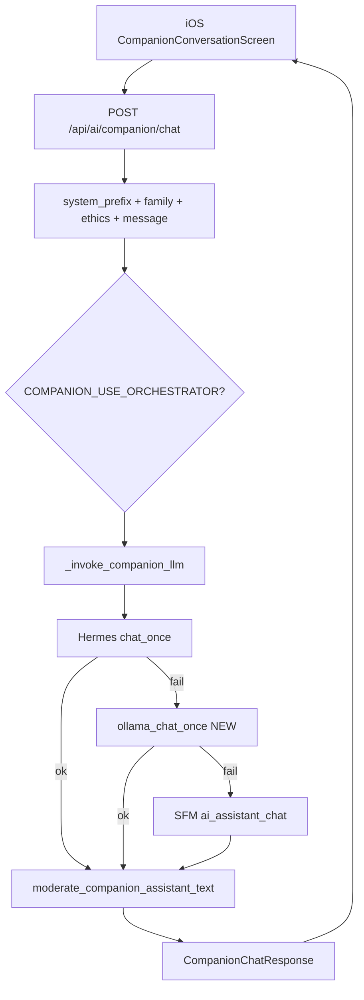

# Companion LLM Phase 2 — Ollama + DeepSeek fallback (handoff для ML-системы)

> **Дата:** 2026-05-31 · **Статус:** план к реализации (код Phase 2 ещё не в prod)  
> **Связанные доки:** [HERMES_VPS_AUDIT.md](./HERMES_VPS_AUDIT.md) · [COMPANION_DEPLOY_P0.md](./COMPANION_DEPLOY_P0.md) · [stt_env.example](../scripts/stt_env.example)

---

## 0. За 60 секунд

| | |
|---|---|
| **Задача** | Добавить **живой LLM-fallback** между Hermes и SFM, когда OpenRouter/Hermes падает (402/429/timeout) |
| **Не трогаем** | iOS UI, ElevenLabs TTS, Yandex STT, post-LLM moderation, trust/ethics |
| **Primary (как сейчас)** | Hermes CLI → OpenRouter → `deepseek/deepseek-v4-flash` + skills KB |
| **Fallback NEW** | Прямой DeepSeek через **Ollama Cloud** (короткий prompt, **без** `hermes chat`) |
| **Last resort** | SFM rules (как сейчас) |
| **Репо** | `git@github.com:sergey234/ALADDIN_FAMILY.git` · `master` |
| **Путь iOS/backend** | `/Users/sergejhlystov/ALADDIN_NEW/ALADDIN_NEW/mobile_apps/ALADDIN_iOS` |
| **VPS prod** | `root@149.154.65.180` · `/opt/aladdin-backend` · `https://aladdin-ai.ru` |
| **Prod env сейчас** | `AI_BACKEND=hermes` · `COMPANION_USE_ORCHESTRATOR=1` · STT Yandex ON |

---

## 1. Проблема, которую решаем

### Сейчас (prod)

```
Ребёнок → POST /api/ai/companion/chat
              ↓
         Hermes + OpenRouter (skills, KB ALADDIN)
              ↓ fail (402 credits, 429, timeout)
         SFM шаблоны («Я отвечаю по базе знаний…»)
```

**Симптом:** UX резко падает — ответ «робот», хотя API жив (HTTP 200).

**Причины fail Hermes (см. HERMES_VPS_AUDIT):**

- OpenRouter free/low credits → **402**
- `deepseek-v4-pro` + тяжёлый Hermes agent-prompt → **402** (prompt > лимит tier)
- 429 / rotator keys exhausted
- Hermes timeout (~150s cap в коде)

### Цель Phase 2

```
Hermes OK     → живой ответ + tools hermes:...
Hermes FAIL   → Ollama DeepSeek Flash (живой, дешевле/фикс $20)
Ollama FAIL   → SFM (как сейчас)
```

---

## 2. Архитектура (целевая)



### Точки врезки в коде

| Шаг | Файл | Функция |
|-----|------|---------|
| HTTP entry | `security/api/routers/ai_companion_router.py` | `companion_chat()` |
| LLM delegate | тот же | `_invoke_companion_llm()` |
| Companion context | `security/api/routers/ai_assistant_router.py` | `_ai_companion_context_chat()` ← **главная правка** |
| Hermes | `security/services/hermes_client.py` | `chat_once()` |
| NEW Ollama | `security/services/llm_providers/ollama_client.py` | `chat_once()` |
| Moderation | `security/services/ai_platform/companion_post_llm_moderation.py` | `moderate_companion_assistant_text()` |
| Cost | `security/services/ai_platform/companion_cogs.py` | `record_turn_cogs()` |

### Важно: Ollama **не** через Hermes CLI

Hermes `-Q -s aladdin-security-kb` добавляет **огромный agent-prompt** → дорого и 402 на Pro.

Ollama fallback принимает **уже готовый** `prefixed` текст из `companion_chat` (character prefix + family hint + user message).

---

## 3. Модели — что выбирать

| Модель | Роль | Комментарий |
|--------|------|-------------|
| `deepseek/deepseek-v4-flash` | Hermes primary (OpenRouter) | ✅ уже prod |
| `deepseek-v4-flash:cloud` | **Ollama fallback** | быстро, дешевле GPU-time |
| `deepseek-v4-pro:cloud` | только `chat_mode=think` | тяжёлая; не default fallback |
| `deepseek-chat-v3.1:cloud` | reserve | стабильный запас |

**Не ставить v4-pro как default fallback** — повторите 402 из HERMES_VPS_AUDIT.

---

## 4. Экономика (когда Phase 2 окупается)

| Ollama Cloud Pro | ~$20/мес, лимит по **GPU-time**, не «бесконечные токены» |
| OpenRouter | pay-as-you-go за токены |

**Phase 2 имеет смысл, если:**

- OpenRouter **> $25–40/мес** стабильно, **или**
- **> 3–5%** companion-turns уходят в SFM fallback, **или**
- частые 402/429 ломают UX

**Phase 2-lite (быстрее):** direct OpenRouter `/chat/completions` без Hermes — 2–3 дня кода, тот же DeepSeek Flash, без подписки Ollama. Делать **до** Ollama, если нужен быстрый win.

---

## 5. План по фазам

### Phase 2.0 — Метрики (3–7 дней, код + отчёт)

**Цель:** измерить боль до нового LLM.

| Задача | Детали |
|--------|--------|
| Лог `llm_path` | `hermes` \| `sfm` \| (позже `ollama`) на каждый companion turn |
| Поля | `user_id`, `character_id`, `chat_mode`, `tools_used`, `hermes_err` (redacted) |
| Хранение | `companion_platform.db` + structured log `/var/log/aladdin-backend/companion_llm.log` |
| Алерт | SFM fallback **> 3%/час** → `companion_llm_cost_alert.sh` или новый скрипт |

**DoD:** CSV/отчёт за 7 дней: total turns, % hermes, % sfm, p95 latency, OR spend estimate.

**Предлагаемый patch (Phase 2.0):**

```python
# ai_companion_router.py после _invoke_companion_llm
logger.info(
    "companion_llm_path path=%s tools=%s chat_mode=%s",
    path,  # hermes | sfm | ollama
    assistant_resp.tools_used,
    body.chat_mode,
)
```

---

### Phase 2.1 — `ollama_client.py` + tests (5–7 дней)

**Новые файлы:**

```
security/services/llm_providers/
  __init__.py
  ollama_client.py
```

**Env template:** `scripts/ollama_env.example`

```env
# Phase 2 — OFF until smoke PASS
FEATURE_COMPANION_OLLAMA_FALLBACK=0
# shadow = call Ollama but return Hermes/SFM to user (week 1 prod test)
# FEATURE_COMPANION_OLLAMA_FALLBACK=shadow

OLLAMA_API_BASE=https://ollama.com/api
OLLAMA_API_KEY=
OLLAMA_MODEL=deepseek-v4-flash:cloud
OLLAMA_TIMEOUT_SEC=45
OLLAMA_MAX_OUTPUT_TOKENS=1024
OLLAMA_TEMPERATURE=0.4
```

**API контракт `ollama_chat_once(message: str) -> Tuple[bool, str, Optional[str]]`**

- HTTP POST (Ollama cloud chat API — сверить с docs на момент реализации)
- User message = full `prefixed` string from companion (already includes character system text)
- Errors: timeout, 401, 429, empty body → `(False, "", err)`
- **Never** log full message in prod (PII) — только len + hash prefix

**Tests:** `Tests/security/test_ollama_client.py` — mock HTTP, как `test_companion_stt_providers.py`.

**Dependency:** `requests` уже в `backend/requirements.txt` (STT proxy).

---

### Phase 2.2 — 3-tier chain в `_ai_companion_context_chat` (3–4 дня)

**Файл:** `security/api/routers/ai_assistant_router.py`

**Псевдокод:**

```python
async def _ai_companion_context_chat(request, user):
    cloud_message = _llm_message_or_http422(...)

    # [1] Hermes (unchanged)
    if hermes_available():
        ok, text, err = hermes_chat_once(cloud_message, skill=None)
        if ok and text.strip() and not is_probable_mock_response(text):
            return ChatMessageResponse(..., tools_used=["hermes:companion"], ...)

    # [2] Ollama NEW
    if _ollama_fallback_enabled():  # not shadow for user response
        ok, text, err = ollama_chat_once(cloud_message)
        if ok and text.strip():
            return ChatMessageResponse(..., tools_used=["ollama:deepseek-v4-flash"], ...)

    # [3] SFM (unchanged)
    ...
```

**Feature flag:**

```python
# security/services/ai_platform/feature_flags.py
COMPANION_OLLAMA_FALLBACK = os.getenv("FEATURE_COMPANION_OLLAMA_FALLBACK", "0").strip().lower()
# values: 0 | 1 | shadow
```

**Shadow mode:** Hermes отвечает пользователю; Ollama вызывается async/log-only для сравнения качества.

**Post-moderation:** без изменений — **обязательна** для Ollama path.

---

### Phase 2.3 — VPS deploy + smoke (2–3 дня)

**Новые скрипты (по образцу STT):**

```
scripts/vps_smoke_companion_llm.py    # modes: hermes | ollama | chain | all
scripts/vps_enable_ollama_fallback.sh
scripts/ollama_env.example
scripts/backup_aladdin_env.sh           # optional: cron .env backup
```

**Smoke modes:**

| Mode | Проверка |
|------|----------|
| `hermes` | `hermes chat -q "ping" -Q` OK |
| `ollama` | direct Ollama client OK |
| `chain` | mock Hermes fail → Ollama OK |
| `all` | JWT → `/api/ai/companion/chat` → `tools_used` not only SFM |

**Deploy:**

```bash
# Mac
cd mobile_apps/ALADDIN_iOS
./scripts/deploy_companion_p0.sh root 149.154.65.180 ~/.ssh/aladdin_server

# VPS — после правки .env (secrets!)
cp /opt/aladdin-backend/.env /opt/aladdin-backend/backups/.env.$(date +%Y%m%d_%H%M%S)
python3 scripts/vps_smoke_companion_llm.py --mode all
systemctl restart aladdin-backend
python3 scripts/vps_smoke_companion_llm.py --mode all
```

---

### Phase 2.4 — Shadow на prod (1 неделя)

```env
FEATURE_COMPANION_OLLAMA_FALLBACK=shadow
```

| Метрика | Порог |
|---------|-------|
| Ollama p95 latency | < 8 s |
| Moderation block rate | ≤ Hermes |
| Empty/ garbage rate | < 1% |
| Manual review (50 samples) | качество ≥ SFM |

---

### Phase 2.5 — Enable (1 день)

```env
FEATURE_COMPANION_OLLAMA_FALLBACK=1
```

Smoke `--mode all` → **PASS** → мониторинг 48 h.

---

### Phase 2.6 — Роутинг по `chat_mode` (опционально)

| chat_mode | Primary | Fallback |
|-----------|---------|----------|
| `fast` | Hermes Flash | Ollama Flash |
| `reasoning` | Hermes | Ollama Flash |
| `think` | Hermes (Pro if credits) | Ollama Pro или Flash |

iOS уже шлёт `chat_mode` в `CompanionAPIService.sendChat()`.

---

## 6. Безопасность

| Требование | Реализация |
|------------|------------|
| Детская модерация | `moderate_companion_assistant_text()` — **все** пути |
| PII in prompt | `redact_pii()` до LLM — уже в `companion_chat` |
| Secrets | только VPS `.env` / `secrets/` — **never git** |
| Kill switch | `FEATURE_COMPANION_OLLAMA_FALLBACK=0` |
| Mock in prod | `is_probable_mock_response` + `mock_allowed()` gates |

---

## 7. iOS — что делать ML-команде

**Ничего менять не обязательно** для Phase 2.

Опционально для analytics:

- парсить `tools_used` в ответе `/chat` (`hermes:companion` vs `ollama:deepseek-v4-flash` vs SFM tools)
- build **220+** уже на prod git

Capabilities: поле `provider` в `companion_server_stt` — для STT; для LLM provider в capabilities **не блокер**.

---

## 8. Handoff checklist (копируй в трекер)

```
[ ] Прочитать docs/HERMES_VPS_AUDIT.md
[ ] Phase 2.0: 7 дней метрик Hermes vs SFM (llm_path logging)
[ ] Ollama Pro аккаунт + API key на VPS (secrets only, не git)
[ ] security/services/llm_providers/ollama_client.py + Tests/security/test_ollama_client.py
[ ] Patch _ai_companion_context_chat (3-tier: Hermes → Ollama → SFM)
[ ] feature_flags: FEATURE_COMPANION_OLLAMA_FALLBACK=0|shadow|1
[ ] scripts/vps_smoke_companion_llm.py + vps_enable_ollama_fallback.sh
[ ] scripts/ollama_env.example + backup .env runbook
[ ] Shadow 1 неделя на prod
[ ] FEATURE=1 + smoke PASS + 48h monitor
[ ] iOS: без изменений; проверить tools_used в analytics (optional)
```

---

## 9. Prod env reference (2026-05-31)

```bash
# /opt/aladdin-backend/.env (фрагмент, без секретов)
AI_BACKEND=hermes
COMPANION_USE_ORCHESTRATOR=1
FEATURE_COMPANION_SERVER_STT=1
COMPANION_STT_PROVIDER=auto
YANDEX_SPEECHKIT_FOLDER_ID=b1gq4oltf9876gvvumt3
# YANDEX_SPEECHKIT_API_KEY=...
FEATURE_NEURO_TTS_ENABLED=1
# ELEVENLABS in secrets/elevenlabs.env
```

Hermes config (отдельно):

- `/root/.hermes/config.yaml` — model, skills
- `/root/.hermes/.env` — OpenRouter keys
- Skills: `aladdin-security-kb`, `aladdin-sfm-tools`

---

## 10. Что НЕ делать

1. **Не** заменять Hermes primary — skills дают знание ALADDIN.
2. **Не** вызывать Ollama через `hermes chat` CLI.
3. **Не** убирать SFM last-resort.
4. **Не** включать fallback без shadow + smoke.
5. **Не** коммитить `.env`, API keys, Ollama key.
6. **Не** трогать STT/TTS pipeline в Phase 2.

---

## 11. Приоритеты (итог для PO)

| Приоритет | Решение |
|-----------|---------|
| **Сейчас** | Hermes + OpenRouter v4-flash + бэкап `.env` + smoke STT/LLM |
| **Phase 2 быстрый** | OpenRouter **direct** fallback (optional, before Ollama) |
| **Phase 2 полный** | Ollama Cloud DeepSeek Flash $20/mo |
| **Всегда** | SFM последний; moderation; iOS без изменений |

---

## 12. Контакты и команды

```bash
# SSH
ssh -i ~/.ssh/aladdin_server root@149.154.65.180

# Hermes smoke
/opt/aladdin-backend/venv/bin/hermes chat -q "1+1?" -Q -s aladdin-security-kb

# Backend restart
systemctl restart aladdin-backend && systemctl is-active aladdin-backend

# STT smoke (existing)
cd /opt/aladdin-backend && python3 scripts/vps_smoke_family_stt.py --mode stt

# LLM smoke (after Phase 2.3)
cd /opt/aladdin-backend && python3 scripts/vps_smoke_companion_llm.py --mode all
```

**Git:**

```bash
cd /Users/sergejhlystov/ALADDIN_NEW/ALADDIN_NEW/mobile_apps/ALADDIN_iOS
git remote -v   # origin git@github.com:sergey234/ALADDIN_FAMILY.git
git branch --show-current   # master
```

---

## 13. История изменений документа

| Дата | Версия | Автор | Изменение |
|------|--------|-------|-----------|
| 2026-05-31 | 1.0 | Cursor agent | Первый handoff Phase 2 Ollama+DeepSeek |
