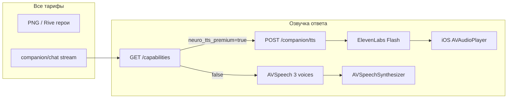

# Companion — Premium озвучка (нейро-TTS) и дорожная карта голоса

**Обновлено:** 2026-05-29  
**Источник правды по `[x]`:** [COMPANION_PROGRESS_TRACKER.md](./COMPANION_PROGRESS_TRACKER.md)  
**Cursor TODO:** [COMPANION_CURSOR_TODO_STAGE2_3.md](./COMPANION_CURSOR_TODO_STAGE2_3.md)

---

## Продуктовое правило (зафиксировано)

| Слой | Free / Trial / Basic | Premium |
|------|----------------------|---------|
| **Картинки героев** | PNG / Rive — **одинаково красиво** | То же |
| **Озвучка ответов** | Apple **AVSpeech** — 3 разных `voice id` (🦄🧞🧑) | **ElevenLabs Flash** (нейро-TTS) |
| **LLM / диалог** | OpenRouter / Hermes (общий путь) | То же |
| **Юмор / рассуждение** | Промпты + LLM | То же (TTS не заменяет LLM) |

> Визуал **не** продаём отдельно от звука: меняется **только озвучка** по тарифу.

---

## Техническая схема



**Backend**

- Модуль `companion_neuro_tts` в capabilities: `ui.neuro_tts_premium`, `hero_visual_tier: all`
- `POST /api/ai/companion/tts` — только `subscription_level=premium` + `FEATURE_NEURO_TTS_ENABLED=1`
- Лимиты: `check_voice_allowed` + `record_voice_seconds` (как mic/voice)
- Кэш: до **30** фраз (hash text+character+locale)

**iOS**

- `CompanionCapabilitiesService.neuroTtsPremiumEnabled`
- `CompanionSpeechOutput`: Premium → `CompanionNeuroTTSPlayer` → API; иначе AVSpeech с Katya / Yuri / Milena (RU)

**Env (VPS)**

```bash
FEATURE_NEURO_TTS_ENABLED=1
ELEVENLABS_API_KEY=...
ELEVENLABS_MODEL=eleven_flash_v2_5
# Пилот: сначала genie
ELEVENLABS_VOICE_GENIE=...
ELEVENLABS_VOICE_UNICORN=...
ELEVENLABS_VOICE_ALADDIN=...
```

---

## Спринт 1–2 (почти $0) — база

| # | Задача | Статус |
|---|--------|--------|
| S1-01 | 2 ключа OpenRouter + rotator + retry 401/429 | ✅ код + VPS cron |
| S1-02 | Мониторинг fallback (`hermes_llm_watchdog.sh`) | ✅ |
| S1-03 | 3 голоса **AVSpeech** (разные voice id) | ✅ iOS |
| S1-04 | PNG герои на экране (fallback без Rive) | ✅ |
| S1-05 | Честный offline / ошибка LLM (без «47 угроз») | ✅ SFM + companion context |
| S1-06 | Hermes не падать: ключи + retry + запасной API | ✅ rotator; 2-й ключ в `hermes_keys.txt` ⏳ ops |
| S1-07 | Шаблоны угроз — только security intent | ✅ |

---

## Спринт 3–4 (Premium) — нейро-TTS

| # | Задача | Статус |
|---|--------|--------|
| S3-02 | **VOICE-PREM-04:** три voice id (unicorn, genie, aladdin) | ⏳ [гайд](./COMPANION_ELEVENLABS_VOICES_RU.md) |
| S3-01 | **VOICE-PREM-03:** пилот Flash на **genie** + prewarm | ⏳ **после 04** + API key |
| S3-03 | Параллельно: **запросить прайс Yandex SpeechKit** (сравнение) | ⏳ бизнес |
| S3-04 | API `POST /companion/tts` + capability `neuro_tts_premium` | ✅ код |
| S3-05 | 🔊 / авто-озвучка + лимиты минут (usage_meters) | ✅ лимиты; UI toggle уже в «Моё» |
| S3-06 | Кэш 20–30 фраз на сервере | ✅ `COMPANION_TTS_CACHE_MAX=30` |
| S3-07 | Deploy VPS + verify | ⏳ после ключей ElevenLabs |

---

## Спринт 5+ (по желанию)

| # | Задача | Статус |
|---|--------|--------|
| S5-01 | Production Rive (аниматор) | ⏳ HERO-3-07 PO |
| S5-02 | Прямой OpenRouter fallback без Hermes CLI | ⏳ |
| S5-03 | Pre-warm кэш приветствий (cron) | ⏳ |

---

## 2027+ (если метрики Premium ок)

| # | Задача |
|---|--------|
| 27-01 | Realtime voice beta (Premium+) — отдельный COGS слой |
| 27-02 | «Как кино» — lip-sync + streaming audio (не в MVP) |

---

## Отдельные пункты в трекере 102 (вне закрытых спринтов)

Добавлены в [COMPANION_PROGRESS_TRACKER.md](./COMPANION_PROGRESS_TRACKER.md) секция **VOICE-PREM**:

| ID | Описание |
|----|----------|
| **VOICE-PREM-01** | Capability + backend TTS gate |
| **VOICE-PREM-02** | iOS neuro player + AVSpeech 3 voices |
| **VOICE-PREM-03** | ElevenLabs genie pilot |
| **VOICE-PREM-04** | unicorn + aladdin voices |
| **VOICE-PREM-05** | SpeechKit pricing compare |
| **VOICE-PREM-06** | VPS env + E2E Premium device |

---

## Hermes / LLM (не путать с TTS)

| Вопрос | Ответ |
|--------|--------|
| Hermes не падать? | Ключи + rotate + watchdog + честный текст при сбое |
| Полноценный диалог? | Да, пока жив OpenRouter; голос — слой B (TTS) |
| ElevenLabs заменяет LLM? | **Нет** — только озвучка готового текста |

---

## Стоимость (ориентир)

| Компонент | Оценка |
|-----------|--------|
| LLM (Flash) | ~$20–200/мес по MAU |
| ElevenLabs Flash | ~$0.05 / 1k символов; кэш + 🔊-only снижает |
| AVSpeech | $0 |
| SpeechKit | TBD после прайса |

---

## Чеклист ops (следующий шаг)

1. Добавить `HERMES_OPENROUTER_KEYS_FILE` второй ключ на VPS  
2. `FEATURE_NEURO_TTS_ENABLED=1` + ElevenLabs env  
3. `./scripts/deploy_companion_p0.sh`  
4. Premium JWT smoke: `capabilities` → `neuro_tts_premium: true`  
5. TestFlight: free = AVSpeech, premium = нейро (если ключи есть)
