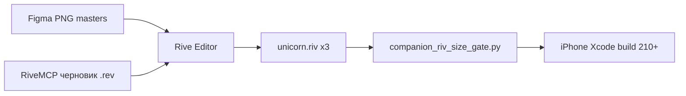

# Companion — подключение Rive (Editor · Node · RiveMCP)

**Обновлено:** 2026-05-28 · **Сессия:** установка Node + RiveMCP + пробный export  
**Входит в главный план:** [COMPANION_100_PERCENT_PARALLEL.md](./COMPANION_100_PERCENT_PARALLEL.md) · [COMPANION_MASTER_PLAN_v1.md](./COMPANION_MASTER_PLAN_v1.md) § дорожная карта HERO-3-07

---

## 1. Три способа работать с `.riv` (не путать)

| Способ | Что это | Роль в ALADDIN |
|--------|---------|----------------|
| **Rive Editor** (`Rive.app`) | GUI на Mac: import PNG, слои, SM, export | **Основной** путь production art |
| **Node** | Программа для npm/npx (`/usr/local/bin/node`) | Нужна для установки RiveMCP; **не** рисует героя сама |
| **RiveMCP** | MCP-сервер в Cursor (~139 tools) | **Черновик** SM / простые фигуры; доработка в Editor |

**Не путать с Lottie** — другой runtime в iOS; миграция = переписать `CompanionHeroRiveHost`.

**PNG bridge (iOS):** пока `unicorn.riv` &lt; ~25 KB — приложение показывает `Resources/Companion/*_master.png` (`CompanionHeroRasterView`).

---

## 2. Что установлено на Production Mac (2026-05-28)

| Компонент | Путь | Версия |
|-----------|------|--------|
| Mac | Intel x86_64 (i7-4850HQ) | — |
| **Node** (Homebrew) | `/usr/local/bin/node` | **v26.0.0** |
| **npm** | `/usr/local/bin/npm` | 11.x |
| **rivemcp** | `/usr/local/bin/rivemcp` | **1.3.6** |
| **Rive Editor** | `/Applications/Rive.app` | Production (уже был) |

```bash
# Проверка
/usr/local/bin/node --version
/usr/local/bin/rivemcp --version
/usr/local/bin/rivemcp --help
```

Если в обычном терминале `command not found`:

```bash
echo 'export PATH="/usr/local/bin:$PATH"' >> ~/.zshrc && source ~/.zshrc
```

---

## 3. Подключение RiveMCP к Cursor

### 3.1 Файлы конфигурации

| Файл | Область |
|------|---------|
| `~/.cursor/mcp.json` | глобально (все проекты) |
| `ALADDIN_iOS/.cursor/mcp.json` | только iOS-проект |

Содержимое (полный путь к бинарнику — Cursor не зависит от PATH):

```json
{
  "mcpServers": {
    "rivemcp": {
      "command": "/usr/local/bin/rivemcp",
      "args": [],
      "env": {}
    }
  }
}
```

**Альтернатива** (если бинарник не стартует):

```json
"command": "/usr/local/bin/npx",
"args": ["-y", "rivemcp"]
```

### 3.2 Активация в Cursor

1. `Cmd+Shift+P` → **Developer: Reload Window**
2. **Settings → Tools & MCP** → сервер **`rivemcp`** → статус **Connected**
3. В Agent доступны tools **`user-rivemcp-*`** (create_project, export_riv, add_trigger, …)

### 3.3 Установка с нуля (повтор)

```bash
brew install node
npm install -g rivemcp
```

Документация upstream: [rivemcp-releases](https://github.com/paradoxsyn/rivemcp-releases) · [rivemcp.stunning.gg](https://rivemcp.stunning.gg)

### 3.4 Лицензия RiveMCP

- **3 бесплатных export** на машину (fingerprint).
- На 2026-05-28 использовано **2** (черновик unicorn) → остался **1**.
- Ключ: `RIVEMCP_LICENSE_KEY` в `env` блока `mcp.json` (не коммитить).
- Сброс кэша: `rivemcp --reset-license-cache`

---

## 4. Пробный черновик сессии 2026-05-28

| Файл | Размер | Назначение |
|------|--------|------------|
| `Resources/Companion/unicorn_mcp_draft.rev` | ~2.2 KB | открыть в **Rive.app**, import PNG, доработать |
| `Resources/Companion/unicorn_mcp_draft.riv` | ~388 B | runtime-скелет (SM без layers — warning) |

**Production не трогали:** `unicorn.riv` / `aladdin.riv` / `genie.riv` (~15 KB placeholder).

Создано через MCP: artboard 360×480, овал, SM `HeroSM`, 13 triggers + `mouth_open`.

```bash
open -a Rive "…/Resources/Companion/unicorn_mcp_draft.rev"
```

---

## 5. Контракт iOS (обязательно для любого export)

| Параметр | Значение |
|----------|----------|
| Artboard | **360 × 480** pt |
| State Machine | 13 **Trigger** inputs (имена ниже) |
| Number input | **`mouth_open`** 0…1 |
| Файлы бандла | `Resources/Companion/{unicorn,aladdin,genie}.riv` |
| Gate | `python3 scripts/companion_riv_size_gate.py` — production **> ~25 KB**, &lt; 500 KB |

**Triggers (копировать точно):**

```
idle listening thinking speaking happy playful sad comfort
celebrate curious nostalgic excited alert
```

Код: `UI/Companion/CompanionHeroRiveHost.swift` · `CompanionHeroRiveMapping`

---

## 6. Рекомендуемый пайплайн (production)



| Шаг | Документ |
|-----|----------|
| Ручной export (5 шагов) | [COMPANION_RIVE_EDITOR_5_STEPS.md](./COMPANION_RIVE_EDITOR_5_STEPS.md) |
| День 1 unicorn | [COMPANION_RIVE_EDITOR_DAY1_UNICORN.md](./COMPANION_RIVE_EDITOR_DAY1_UNICORN.md) |
| Brief / Motion / Mimic | [COMPANION_RIVE_ANIMATOR_BRIEF.md](./COMPANION_RIVE_ANIMATOR_BRIEF.md) · [PLAN_SUPPLEMENT](./COMPANION_RIVE_ANIMATOR_PLAN_SUPPLEMENT.md) |
| Checklist 07 | [COMPANION_RIVE_EXPORT_CHECKLIST.md](./COMPANION_RIVE_EXPORT_CHECKLIST.md) |
| Скрипты | `scripts/companion_07_*.sh` |

**После каждого production `.riv`:** device **11c** MIMIC-Q1.

---

## 7. Что RiveMCP может / не может для OB-art

| Может | Не может |
|-------|----------|
| Скелет SM, triggers, `mouth_open` | Figma OB_03 / unicorn v2 1:1 без рук |
| Простые фигуры, keyframes | Заменить аниматора на 07 |
| `load_riv` → правка → `export_riv` | Обойти лимит 3 export без ключа |
| Export `.rev` для Editor | Production без polish в Rive.app |

---

## 8. Скрипты iOS (HERO-3-07)

```bash
cd ALADDIN_NEW/mobile_apps/ALADDIN_iOS
./scripts/companion_07_sync_master_png_to_bundle.sh
./scripts/companion_07_prepare_rive_import.sh
./scripts/companion_07_open_in_rive.sh unicorn   # aladdin | genie
python3 scripts/companion_riv_size_gate.py --dir Resources/Companion
./scripts/verify_companion_rive_ios_bundle.sh
```

---

## 9. Ошибки (troubleshooting)

| Симптом | Решение |
|---------|---------|
| MCP красный в Cursor | Reload Window; проверить `ls /usr/local/bin/rivemcp` |
| `npx` not found в MCP | Использовать полный путь к `rivemcp` (§3.1) |
| На iPhone статичный PNG | `.riv` всё ещё placeholder (&lt; 25 KB) |
| iOS не переключает эмоцию | Имя trigger не совпало (регистр) |
| Rive `--help` зависает | Это GUI app, не CLI — использовать Editor |

---

*Связанный краткий файл:* [COMPANION_RIVEMCP_SETUP.md](./COMPANION_RIVEMCP_SETUP.md)
