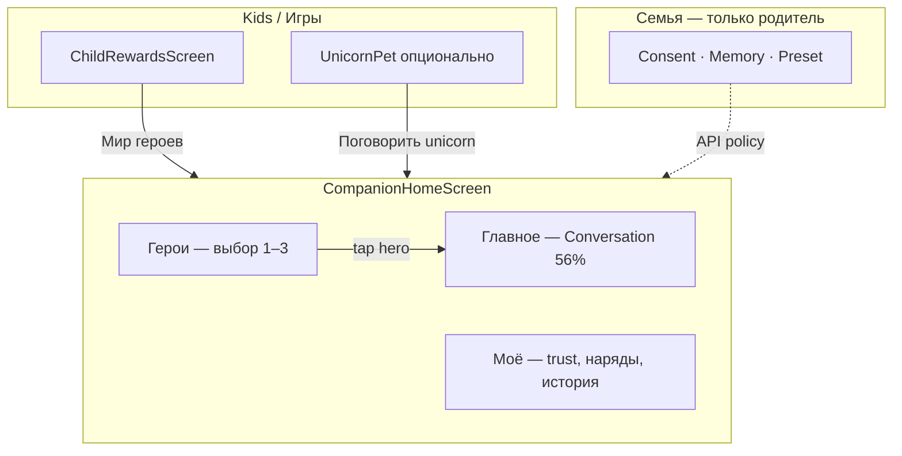

# Companion — единый «Мир героев» (UX + миграция)

**Дата:** 2026-05-27  
**Статус:** Фаза 1 в коде · E+C (таб Kids + Companion Home)  
**Связано:** [COMPANION_HEROES_3_FIGMA_RIVE_PLAN.md](./COMPANION_HEROES_3_FIGMA_RIVE_PLAN.md) · [COMPANION_PROGRESS_TRACKER.md](./COMPANION_PROGRESS_TRACKER.md)

---

## 1. Итог одной строкой

**Не удаляем** трёх героев, Rive, BE, API. **Объединяем UI** в один экран **`CompanionHomeScreen`** (3 вкладки). Старые `CompanionHubScreen` / `CompanionConversationScreen` остаются как **внутренние вкладки**, не как отдельные «разделы приложения».

---

## 2. Что НЕ убираем из кода

| Слой | Остаётся |
|------|----------|
| BE | `unicorn` · `aladdin` · `genie`, `age_policy`, persona, emotions |
| iOS UI | `CompanionHero*`, Rive, 56% layout, субтитр, voice |
| Сервисы | `CompanionAPIService`, streaming, analytics |
| Родитель | `FamilyScreen` — consent, память, preset (**только Семья**) |
| Игра | `unicornPet` — отдельно; опциональная ссылка → Home |

---

## 3. Что меняем / убираем (UI-навигация)

| Было | Фаза 1 | Фаза 2 |
|------|--------|--------|
| Вход: карточка «Поговорить с героем» | → **«Мир героев»** → `.companionHome` | Таб Kids «Друзья» |
| `.companionHub` отдельный push | → Home вкладка **Герои** | deprecated alias |
| `.companionConversation` отдельный push | → Home вкладка **Главное** | deprecated alias |
| Sheet наряды в разговоре | Скрыт в embedded; **Моё** | удалить sheet |
| Sheet правила в разговоре | Первый запуск + **Моё** | toolbar убрать |
| История в Hub + sheet | Только **Моё** | Hub без истории |

**Файлы не удаляем** в Фазе 1 — только **режим `embeddedInHome`** и новый **`CompanionHomeScreen`**.

---

## 4. Карта навигации

---

## 5. Вкладки Companion Home

| Вкладка | Содержимое | child | teen/parent |
|---------|------------|-------|-------------|
| **Главное** | Rive-сцена 56%, субтитр, ввод, mic | unicorn | последний герой + **chip** 🦄🧑🧞 |
| **Герои** | Карточки API (без «замков» для child) | 1 карточка | 3 карточки |
| **Моё** | Trust, наряды, история threads, правила | то же | то же |

**Фон:** общий gradient purple/blue (как Hub).

---

## 6. Входы (iOS)

| Откуда | Куда |
|--------|------|
| `ChildRewardsScreen` | `.companionHome` |
| `unicornPet` (фаза 2) | `.companionHome` + `characterId=unicorn` |
| Legacy `.companionHub` | Home, tab **Герои** |
| Legacy `.companionConversation` | Home, tab **Главное** |

---

## 7. Задачи (оценка)

| ID | Задача | Объём | Блок |
|----|--------|-------|------|
| **UX-01** | `CompanionHomeScreen` + 3 вкладки | M | Фаза 1 ✅ |
| **UX-02** | `CompanionMineTabView` | S | Фаза 1 ✅ |
| **UX-03** | embeddedInHome Hub/Conversation | M | Фаза 1 ✅ |
| **UX-04** | Hero chip на сцене (teen+) | S | Фаза 1 ✅ |
| **UX-05** | Вход «Мир героев» | XS | Фаза 1 ✅ |
| **UX-06** | Таб Kids «Друзья» | S | Фаза 2 |
| **UX-07** | Ссылка из unicornPet | XS | Фаза 2 |
| **UX-08** | Удалить legacy navigation cases | S | Фаза 3 |
| **UX-09** | GATE навигации R6/R8 | S | QA |

---

## 8. DoD Фаза 1

- [ ] Один push из Kids → **Companion Home** (не Hub→Conversation chain)
- [ ] child: только unicorn в API и UI
- [ ] teen: chip переключает героя без выхода из Home
- [ ] Наряды/история/правила доступны из **Моё**, не дублируются в toolbar разговора (embedded)
- [ ] HERO-3 Rive/08b сценарий без изменения пути

---

*При закрытии UX-01…05 — обновить [COMPANION_PROGRESS_TRACKER.md](./COMPANION_PROGRESS_TRACKER.md).*
