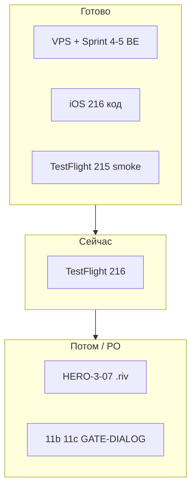

# Companion / герои-помощники — что осталось (102 задачи)

**Обновлено:** 2026-05-29  
**Источник правды по `[x]`:** [COMPANION_PROGRESS_TRACKER.md](./COMPANION_PROGRESS_TRACKER.md)  
**Этап 2–3 (Sprint 4–5 MVP):** [COMPANION_CURSOR_TODO_STAGE2_3.md](./COMPANION_CURSOR_TODO_STAGE2_3.md) — **код и VPS ✅**, см. ниже  
**Premium озвучка:** [COMPANION_PREMIUM_VOICE_PLAN.md](./COMPANION_PREMIUM_VOICE_PLAN.md) — картинки **все тарифы**, TTS **только Premium**  
**Runbook:** [COMPANION_ML_STAGE2_STAGE3_RUNBOOK.md](./COMPANION_ML_STAGE2_STAGE3_RUNBOOK.md)

---

## Сводка одной таблицей

| Категория | Готово | Осталось | Комментарий |
|-----------|--------|----------|-------------|
| **102 спринтовые задачи** | **90** | **12** | См. блоки ниже |
| **CODE v2 (без Rive)** | 49/49 | 0 | Весь код в репо |
| **Sprint 4–5 MVP (runbook)** | 6+14 | 0 код · **TF216** | Прод: Redis, orchestrator, social bridge fix |
| **HERO-3 (3 героя)** | 24/26 | **07, 11b/11c** | Production `.riv` + device QA |
| **GATE / QA** | частично | 8+ ворот | Без PO не закрывать DIALOG |

---

## ✅ Уже сделано (не переделывать)

- **P0–CX, OPS** — 40/40  
- **3 героя в API/iOS** — 🦄🧑🧞 всем при consent  
- **VPS** — Sprint 4–5, Redis stream cache, `COMPANION_USE_ORCHESTRATOR=1`, social_bridge persist fix  
- **Verify прод** — **18/18** (`verify_companion_p0_prod.sh`)  
- **GATE-OPS** — ✅ закрыт 2026-05-29  
- **TestFlight 215** — smoke chips/режимы/входы  
- **iOS build 216** (git) — COGS, workspaces, вложения (галерея iOS 15+), trust delta UI  
- **Блок G** — «Мир героев», Друзья, mic coach  

---

## 🟡 Premium озвучка (VOICE-PREM, не в 102)

| ID | Задача | Статус |
|----|--------|--------|
| VOICE-PREM-01 | Capability + `/companion/tts` gate | ✅ код |
| VOICE-PREM-02 | iOS neuro + AVSpeech×3 | ✅ код |
| VOICE-PREM-04 | **Сначала:** 3 voice id 🦄🧞🧑 | ⏳ [гайд](./COMPANION_ELEVENLABS_VOICES_RU.md) |
| VOICE-PREM-03 | **Потом:** пилот genie + prewarm | ⏳ после 04 |
| VOICE-PREM-05 | SpeechKit прайс | ✅ [сравнение](./COMPANION_TTS_PRICING_COMPARE.md) · КП Yandex ⏳ PO |
| VOICE-PREM-06 | VPS deploy + E2E Premium | ⏳ |

---

## 🔴 Осталось по 102 задачам (12 открытых)

### 1. Rive / визуал героев (главное «не 100%»)

| ID | Задача | Действие |
|----|--------|----------|
| **HERO-3-07** | Production `.riv` ×3 (unicorn, aladdin, genie) | Rive Editor → export → бандл · **только по PO** |
| **HERO-3-11b** | Device QA: MOTION, MIMIC, D10, STT/TTS | iPhone, build **216+** |
| **HERO-3-11c** | MIMIC-Q после production `.riv` | После **07** |
| **P2-09** | Figma↔Rive pipeline | Связано с **07** |
| **UX-14b** | Эмоции только анимацией (без «кривых» статик) | После production Rive |
| **P1-19** | App Store: **3 скриншота Hub с Rive** | После **07** |

### 2. Инфра / не блокер MVP

| ID | Задача | Действие |
|----|--------|----------|
| **P1-12** | Postgres store | **Не блокер:** SQLite + Redis на проде ✅ |
| **P2-17** | A/B humor_density (genie+teen) | После HERO-3, по PO |

### 3. Контрольные ворота (не трогать без PO)

| ID | Задача |
|----|--------|
| **GATE-P0** | 11b device ⏳ |
| **GATE-EMO** | 13 state + Rive + D10 |
| **GATE-EMO-EMPATHY** | 5 мин × child/teen/senior |
| **GATE-DIALOG** | D01–D10 TestFlight |
| **GATE-DIALOG-REGRESS** | R1–R19 (14/19 auto ✅) |
| **GATE-OPS** | ✅ 2026-05-29 — [signoff](./COMPANION_GATE_OPS_SIGNOFF_2026-05-29.md) |
| **GATE-CX, GATE-P1, GATE-P2, GATE-P3, GATE-PROD** | Формальное закрытие |

---

## 🟡 Следующий шаг для продукта (не в «12», но обязательно)

| # | Что | Статус |
|---|-----|--------|
| 1 | **TestFlight build 216** | ⏳ Archive → App Store Connect |
| 2 | Smoke **216**: «Моё» COGS + папки; скрепка → фото/PDF; «+N доверию»; social bridge 2× «одиноко» |
| 3 | `git push` + при необходимости commit verify script (шаг 18) |

---

## 🟢 Опционально (MVP+, не в 12)

| Пункт | Описание |
|-------|----------|
| **5.6** | Показать `tools_used` в debug / «Моё» |
| **5.9** | Дока media stub ([COMPANION_SPRINT5_MVP_ENV.md](./COMPANION_SPRINT5_MVP_ENV.md)) |
| **Реальный Search API** | Сейчас `FEATURE_WEB_SEARCH_ENABLED=0` |
| **Vision для фото** | Сейчас metadata + hint в промпт |
| **Android / Adult app** | Отдельные репо, доки ✅ |

---

## Карта: кто за что отвечает

---

## Быстрые ссылки

| Документ | Зачем |
|----------|--------|
| [COMPANION_PROGRESS_TRACKER.md](./COMPANION_PROGRESS_TRACKER.md) | Все 102 ID с `[x]` |
| [COMPANION_CURSOR_TODO_STAGE2_3.md](./COMPANION_CURSOR_TODO_STAGE2_3.md) | Этап 2–3 чеклист |
| [COMPANION_ML_HANDOFF_NEXT_SYSTEM.md](./COMPANION_ML_HANDOFF_NEXT_SYSTEM.md) | Handoff ML |
| [COMPANION_TASKS_WITHOUT_RIVE.md](./COMPANION_TASKS_WITHOUT_RIVE.md) | Дорожка без Rive |
