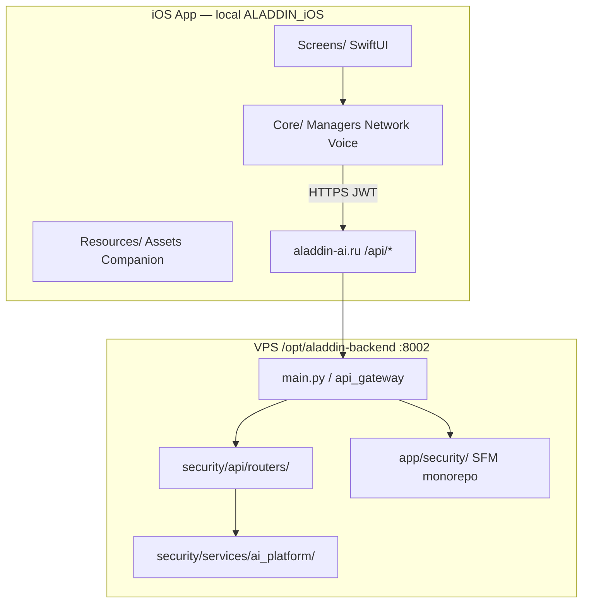
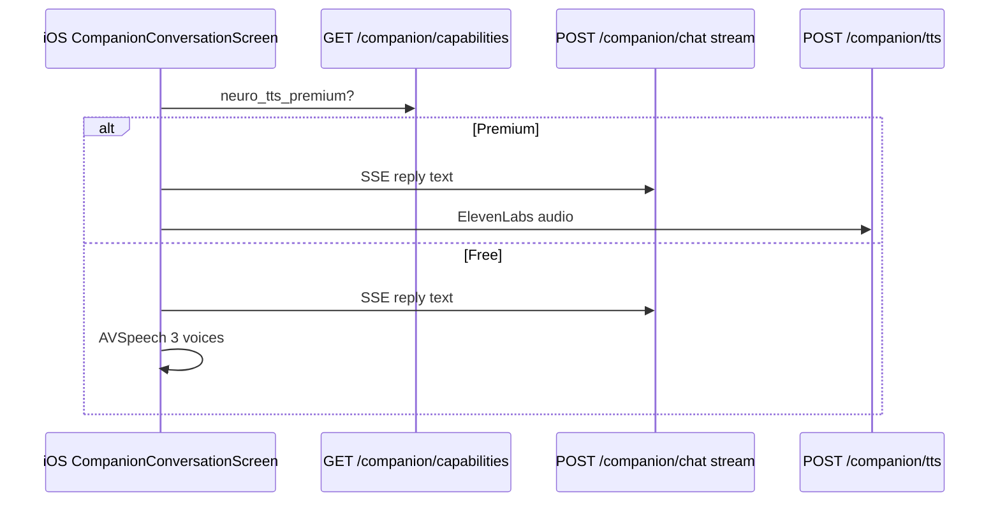

# ALADDIN Mobile — карта кодовой базы и архитектуры

**Обновлено:** 2026-05-31  
**Для:** следующей ML-системы (быстрый поиск, подсчёт LOC, деплой)  
**Git iOS (канон):** build **216** · `f8ca4e1e`  
**Companion-трекер:** [COMPANION_PROGRESS_TRACKER.md](./COMPANION_PROGRESS_TRACKER.md)

---

## 1. Два корня — не путать

| Где | Путь | Роль |
|-----|------|------|
| **Локально (источник правды iOS + BE для деплоя)** | `/Users/sergejhlystov/ALADDIN_NEW/ALADDIN_NEW/mobile_apps/ALADDIN_iOS` | Xcode, git, Companion build 216 |
| **VPS prod (runtime)** | `root@149.154.65.180:/opt/aladdin-backend` | API `:8002`, gunicorn, nginx → `aladdin-ai.ru` |
| **VPS shop bot (другой продукт)** | `/opt/aladdin-telegram-shop-bot` | Telegram Stars — **не** мобильное приложение |

> **Правило:** iOS собирается **локально**. На VPS лежит **backend** + **устаревший flat-export** Swift (папки `Screens/`, `Core/` в корне backend). Актуальный Swift — только в локальном git.

**Подключение к VPS:** [ALADDIN_SERVER_CONNECTION_GUIDE_FOR_ML_SYSTEMS.md](../ALADDIN_SERVER_CONNECTION_GUIDE_FOR_ML_SYSTEMS.md)

---

## 2. Сводка LOC (без backup/archive)

Исключены каталоги: `*backup*`, `*BACKUP*`, `*ARCHIVE*`, `CLEAN_EXPORT*`, `NEW_BACKUP*`, `venv`, `.git`, `__pycache__`, `node_modules`.

| Область | Python | Swift | **CODE итого** |
|---------|-------:|------:|---------------:|
| **Local `ALADDIN_iOS`** | 452 465 | 275 850 | **769 961** |
| **VPS `/opt/aladdin-backend`** | 409 530 | 203 479 | **651 354** |

### Два Python-дерева безопасности (главный источник путаницы)

| Дерево | Local | VPS | Что это |
|--------|------:|----:|---------|
| **`security/`** | **38 780** | **39 285** | Runtime: Companion API, routers, deploy, neuro-TTS, Hermes |
| **`app/security/`** | **273 926** | **272 684** | SFM-монолит: ai_agents, vpn, bots, family, antivirus… |
| **Вместе** | **~312 706** | **~311 969** | То, что раньше называли «300k+ строк backend» |

> Цифра **38 780** — это **только** `security/`, не весь проект.

### CSV (папка → файлы → строки)

| Файл | Содержание |
|------|------------|
| [data/mobile_loc_local.csv](./data/mobile_loc_local.csv) | Каждая папка локального репо + строка `__TOTAL__` |
| [data/mobile_loc_vps.csv](./data/mobile_loc_vps.csv) | То же для VPS `/opt/aladdin-backend` |
| [data/mobile_loc_key_trees.csv](./data/mobile_loc_key_trees.csv) | Ключевые деревья (рекурсивные суммы) |

**Пересчитать:**

```bash
# Local
python3 scripts/mobile_codebase_loc_report.py \
  --root . \
  --out docs/data/mobile_loc_local.csv

# VPS (после scp скрипта или по SSH)
ssh -i ~/.ssh/aladdin_server root@149.154.65.180 \
  'python3 /tmp/mobile_codebase_loc_report.py --root /opt/aladdin-backend --out /tmp/mobile_loc_vps.csv'
scp -i ~/.ssh/aladdin_server root@149.154.65.180:/tmp/mobile_loc_vps.csv docs/data/mobile_loc_vps.csv
```

---

## 3. Архитектура продукта (высокий уровень)



**Поток Companion (упрощённо):**



---

## 4. iOS приложение — структура каталогов

**Корень репозитория:** `mobile_apps/ALADDIN_iOS/`

| Каталог | LOC local | Назначение |
|---------|----------:|------------|
| **`Core/`** | 107 464 | Бизнес-логика, сеть, голос, модели, безопасность на устройстве |
| **`Screens/`** | 78 947 | SwiftUI-экраны (Main, Kids, Parental, **Companion**, …) |
| **`Shared/`** | 19 213 | Переиспользуемые UI-компоненты, modals |
| **`ViewModels/`** | 11 787 | MVVM для экранов |
| **`Tests/`** | 15 358 | Unit / Integration / UI tests |
| **`Resources/`** | — | Assets, **`Resources/Companion/*.riv`**, локализация |
| **`scripts/`** | 13 545 | Deploy, verify, gates, onboarding sync |
| **`security/`** | 38 780 | **Backend Python** (деploy на VPS) |
| **`app/security/`** | 273 926 | **SFM Python** (ai_agents, vpn, …) |
| **`backend/`** | 1 356 | `requirements.txt`, deploy helpers |

### 4.1 `Core/` — слои

| Подкаталог | LOC | Ответственность |
|------------|----:|-----------------|
| `Core/Localization/` | 49 594 | RU/EN строки, `LocalizationManager` |
| `Core/Network/` | 10 416 | `APIService`, `NetworkManager`, **Companion streaming**, family chat WS |
| `Core/Managers/` | 9 192 | Subscription, Parental, Antivirus, Family, DNS… |
| `Core/Models/` | 8 666 | `APIModels`, **`CompanionModels`** |
| `Core/Voice/` | 392 | **`CompanionSpeechOutput`**, **`CompanionNeuroTTSPlayer`**, `CompanionVoiceSession` |
| `Core/Services/` | 2 251 | **`CompanionAPIService`**, **`CompanionCapabilitiesService`** |
| `Core/Companion/` | 235 | Offline store, analytics, error mapper, presets |
| `Core/Audio/` | — | `SpeechManager` (STT), shared mic |
| `Core/Antivirus/` | — | On-device scan → `POST /api/antivirus/scan` |
| `Core/E2EE/` | — | Семейный чат E2EE |
| `Core/Security/` | — | Keychain |
| `Core/Config/` | — | **`AppConfig`** (URLs, build 216) |
| `Core/Navigation/` | — | **`NavigationManager`** (companion routes) |

### 4.2 Companion — iOS файлы (точки входа)

| Файл / группа | Роль |
|---------------|------|
| `Screens/CompanionHomeScreen.swift` | «Мир героев»: Главное / Герои / Моё |
| `Screens/CompanionHubScreen.swift` | Выбор 🦄🧞🧑 |
| `Screens/CompanionConversationScreen.swift` | Чат + STT + TTS + Rive/PNG hero |
| `Screens/CompanionMineTabView.swift` | Настройки, авто-озвучка, tools_used |
| `Core/Services/CompanionAPIService.swift` | REST: profile, chat, **capabilities**, **/tts** |
| `Core/Services/CompanionCapabilitiesService.swift` | `neuroTtsPremiumEnabled` ← `companion_neuro_tts` |
| `Core/Voice/CompanionSpeechOutput.swift` | Premium → neuro API; Free → AVSpeech |
| `Core/Voice/CompanionNeuroTTSPlayer.swift` | `POST /api/ai/companion/tts` |
| `Core/Models/CompanionModels.swift` | Codable + **`CompanionFeatureUI`** |
| `Resources/Companion/{unicorn,aladdin,genie}.riv` | Rive (placeholder / production) |
| `docs/assets/*_360x480*.png` | PNG fallback героев |

**~35 Swift-файлов** с `Companion` в имени.

### 4.3 Прочие ключевые экраны безопасности

| Экран | Путь | Связь с backend |
|-------|------|-----------------|
| Parental Control | `Screens/*Parental*` | `/api/parental-control/*`, `/api/parental/bypass/*` |
| Family / Chat | `Screens/*Family*`, `Core/Network/FamilyChatWebSocket` | `/api/family/*`, `wss://…/ws/family/chat` |
| Antivirus | `Core/Antivirus/` | `/api/antivirus/scan`, `/api/malware/*` |
| Child interface | `Screens/08_ChildInterfaceScreen*` | Kids → Игры → Companion |
| Main / Settings | `Screens/Main*`, Settings | AI Assistant **отдельно** от Companion |

---

## 5. Backend — две ветки Python

### 5.1 `security/` — **деплой Companion + API** (≈39k строк)

| Путь | LOC local | Назначение |
|------|----------:|------------|
| `security/api/routers/` | 17 400 | FastAPI routers; **`ai_companion_router.py`** |
| `security/services/ai_platform/` | 3 575 | Companion LLM, TTS, trust, workspaces, attachments |
| `security/services/hermes_key_rotator.py` | — | OpenRouter/Hermes rotator |
| `security/ai_agents/` | 9 401 | Agent helpers (runtime subset) |
| `security/family/` | — | Family services |
| `security/antivirus/` | — | Scan pipeline |

**Deploy:** `scripts/deploy_companion_p0.sh` → VPS `security/`  
**Verify:** `scripts/verify_companion_p0_prod.sh` (18 шагов)

#### Companion backend — ключевые модули (`security/services/ai_platform/`)

| Модуль | Назначение |
|--------|------------|
| `modules/companion_neuro_tts.py` | Capability `neuro_tts_premium` (Premium gate) |
| `companion_neuro_tts.py` | ElevenLabs Flash, кэш 30 фраз |
| `modules/companion.py` | Platform module registry |
| `companion_persona.py` | 3 героя, humor, presets |
| `companion_intent_router.py` | Domains + mood |
| `companion_store.py` | Threads, SQLite / Redis MVP |
| `companion_stream_redis.py` | SSE stream |
| `companion_attachments.py` | Фото/PDF MVP |
| `companion_cogs.py` | `GET /cogs` |
| `companion_workspaces.py` | Workspaces API |
| `companion_social_bridge.py` | Social bridge |
| `companion_post_llm_moderation.py` | Post-LLM filter |
| `feature_flags.py` | `FEATURE_NEURO_TTS_ENABLED`, … |

**Router:** `security/api/routers/ai_companion_router.py`  
Эндпоинты: `/capabilities`, `/tts`, `/chat`, `/threads`, voice WS, analytics, …

### 5.2 `app/security/` — **SFM-монолит** (≈274k строк)

| Подкаталог | LOC VPS | Содержание |
|------------|--------:|------------|
| `app/security/ai_agents/` | 79 404 | AI agents, orchestration |
| `app/security/vpn/` | ~12 000 | VPN subsystem |
| `app/security/bots/` | 26 278 | Bot integrations |
| `app/security/managers/` | 19 809 | Security managers |
| `app/security/api/routers/` | 14 180 | Доп. routers |
| `app/security/family/` | 12 189 | Family backend |
| `app/security/microservices/` | 11 964 | Microservices |
| `app/security/active/` | 12 197 | Active protection |
| `app/security/antivirus/` | ~2 900 | AV engine |

> Используется gateway / SFM. **Companion deploy** идёт из **`security/`**, не из всего `app/security/`.

### 5.3 `app/routers/` (≈8.8k)

Смежные роутеры: family, antivirus, gamification, reports compat — подключаются через `main.py`.

---

## 6. VPS — физическая карта `/opt/aladdin-backend`

| Путь на VPS | LOC | Статус |
|-------------|----:|--------|
| **`security/`** | 39 285 py | ✅ Актуальный runtime Companion |
| **`app/security/`** | 272 684 py | ✅ SFM monorepo |
| **`app/routers/`** | 8 834 py | ✅ Gateway routers |
| **`main.py`** (корень) | в `.` | ✅ Entry point gunicorn |
| **`Screens/`, `Core/`, …** (корень) | ~203k swift | ⚠️ **Stale flat-export** — не build 216 |
| **`mobile_apps/ALADDIN_iOS/`** | ~4k md | ⚠️ Только docs, **нет Swift** |
| **`backend/`** | 1 539 py | requirements, helpers |
| **`scripts/`** | 2 241 | deploy/verify (частично) |
| **`docs/`** | 19k | документация на сервере |

**Systemd:** `aladdin-backend.service` · порт **8002**  
**Env Companion TTS:** см. [COMPANION_NEURO_TTS_ENV.md](./COMPANION_NEURO_TTS_ENV.md)

### Что **не** считать (backup / мусор)

`BACKUPS/`, `ARCHIVE_ONLY_*`, `_backup_*`, `CLEAN_EXPORT*`, `GATEWAY_ARCHIVE*`, `ML_SYSTEM_PACKAGE/`, `backup_screens_*`, `NEW_BACKUP_*`, `venv/`, `__pycache__/`

---

## 7. Мобильный продукт — «что к чему» одной таблицей

| Функция | iOS (local) | Backend (VPS) | API prefix |
|---------|-------------|---------------|------------|
| **Companion chat** | `CompanionConversationScreen` | `ai_companion_router` | `/api/ai/companion/*` |
| **Premium TTS** | `CompanionNeuroTTSPlayer` | `companion_neuro_tts.py` | `POST …/tts` |
| **Free TTS** | `CompanionSpeechOutput` + AVSpeech | — (on-device) | — |
| **Capabilities** | `CompanionCapabilitiesService` | `modules/companion_neuro_tts` | `GET …/capabilities` |
| **Parental bypass** | Parental screens | `app/routers` / security | `/api/parental/bypass/apply` |
| **Family members** | Family UI | `app/routers/family.py` | `/api/family/*` |
| **Family chat WS** | `FamilyChatWebSocket` | nginx `/ws/` → FastAPI | `wss://…/ws/family/chat` |
| **Antivirus** | `AntivirusManager` | `app/routers/antivirus.py` | `/api/antivirus/scan` |
| **Threats / quarantine** | Quarantine UI | misc routers + PG | `/api/malware/*` |
| **Subscription / JWT** | `SubscriptionManager` | auth + JWT claims | `/api/auth/*` |

---

## 8. Top-15 папок по LOC (быстрый поиск)

### Local ([mobile_loc_local.csv](./data/mobile_loc_local.csv))

| Папка | Строк |
|-------|------:|
| `app/security/ai_agents/` | 79 404 |
| `Screens/` | 75 760 |
| `Core/Localization/` | 49 594 |
| `app/security/` (root files) | 46 374 |
| `app/security/bots/` | 26 278 |
| `app/security/managers/` | 19 809 |
| `security/api/routers/` | 17 400 |
| `app/security/api/routers/` | 13 632 |
| `scripts/` | 13 545 |
| `app/security/vpn/` | 12 701 |
| `security/ai_agents/` | 9 401 |
| `Core/Network/` | 10 416 |
| `ViewModels/` | 11 787 |
| `app/routers/` | 8 833 |
| `security/services/ai_platform/` | 3 575 |

### VPS ([mobile_loc_vps.csv](./data/mobile_loc_vps.csv))

| Папка | Строк |
|-------|------:|
| `.` (root py/sh) | 85 828 |
| `app/security/ai_agents/` | 79 404 |
| `Screens/` | 52 284 |
| `Core/Localization/` | 42 404 |
| `security/api/routers/` | 17 878 |
| … | см. CSV |

---

## 9. Связанные документы

| Документ | Зачем |
|----------|-------|
| [COMPANION_ML_HANDOFF_START_HERE.md](./COMPANION_ML_HANDOFF_START_HERE.md) | Companion: с чего начать |
| [COMPANION_PROGRESS_TRACKER.md](./COMPANION_PROGRESS_TRACKER.md) | 102 задачи, build 216 |
| [COMPANION_PREMIUM_VOICE_PLAN.md](./COMPANION_PREMIUM_VOICE_PLAN.md) | Free AVSpeech vs Premium ElevenLabs |
| [ALADDIN_SERVER_CONNECTION_GUIDE_FOR_ML_SYSTEMS.md](../ALADDIN_SERVER_CONNECTION_GUIDE_FOR_ML_SYSTEMS.md) | SSH, деплой, health |
| [COMPANION_MODULAR_ARCHITECTURE.md](./COMPANION_MODULAR_ARCHITECTURE.md) | Platform modules |
| [COMPANION_OLLAMA_PHASE2_HANDOFF.md](./COMPANION_OLLAMA_PHASE2_HANDOFF.md) | Prod LLM fallback harness (Hermes → Ollama → SFM) |

---

## 10. Чеклист для новой ML-системы

1. **Рабочий корень iOS:** `git rev-parse --show-toplevel` → `…/ALADDIN_iOS`
2. **Не путать** `security/` (39k) и `app/security/` (274k)
3. **LOC:** `python3 scripts/mobile_codebase_loc_report.py --root . --out docs/data/mobile_loc_local.csv`
4. **VPS health:** `curl -s http://149.154.65.180:8002/api/health`
5. **Companion verify:** `./scripts/verify_companion_p0_prod.sh https://aladdin-ai.ru`
6. **Premium TTS smoke:** `./scripts/companion_voice_quick_check.sh` (нужен Premium JWT + ElevenLabs keys)
7. **Swift на VPS** — snapshot; для iOS правок смотреть **только local git**

---

## 11. AI Harness map (dev vs prod)

> **Harness** — обвязка вокруг LLM: контекст, tools, маршрутизация, moderation, fallback, feature flags, observability.  
> **Не путать:** 9Router/Cursor = **dev harness** (coding); Companion backend = **prod harness** (дети в app).

### 11.1 Два контура

```mermaid
flowchart TB
  subgraph DEV["DEV HARNESS — разработка"]
    CUR[Cursor Agent / 9Router localhost:20128]
    RULES[".cursor/rules/*.mdc"]
    DOCS["docs/*HANDOFF*.md · этот файл"]
    SCR["scripts/verify_* · deploy_* · mobile_codebase_loc_report.py"]
    AGENTS[AGENTS.md · COMPANION_ML_HANDOFF_START_HERE.md]
    CUR --> RULES --> DOCS --> SCR
  end

  subgraph PROD["PROD HARNESS — aladdin-ai.ru :8002"]
    IOS["iOS CompanionConversationScreen · CompanionAPIService"]
    RT["security/api/routers/ai_companion_router.py"]
    CHAIN["_invoke_companion_llm · orchestrator · Hermes · SFM"]
    SAFE["ethics · age_policy · post_llm_moderation · trust"]
    FLAGS["security/services/ai_platform/feature_flags.py"]
    EXT["Hermes · ElevenLabs TTS · Yandex STT · Phase2 Ollama"]
    IOS -->|JWT| RT --> CHAIN --> SAFE
    CHAIN --> EXT
    FLAGS --> CHAIN
    FLAGS --> SAFE
  end

  DEV -.->|deploy security/| PROD
```



### 11.2 Prod Companion — цепочка файлов

| Слой harness | Файл | Назначение |
|--------------|------|------------|
| HTTP entry | `security/api/routers/ai_companion_router.py` | `/api/ai/companion/*`, trust, `_invoke_companion_llm()` |
| LLM context | `security/api/routers/ai_assistant_router.py` | `_ai_companion_context_chat()` — Hermes / SFM (Phase 2: + Ollama) |
| Persona / ethics | `security/services/ai_platform/companion_persona.py` | 3 героя, humor |
| | `security/services/ai_platform/companion_ethics.py` | Ethics hint в prompt |
| | `security/services/ai_platform/age_policy.py` | Возрастные ограничения |
| Routing | `security/services/ai_platform/companion_intent_router.py` | Domain / mood |
| | `security/services/ai_platform/orchestrator.py` | Multi-agent (`COMPANION_USE_ORCHESTRATOR=1`) |
| LLM adapters | `security/services/hermes_client.py` | Hermes + OpenRouter |
| | `security/services/llm_providers/ollama_client.py` | **Phase 2** — Ollama fallback (planned) |
| Safety | `security/services/ai_platform/companion_post_llm_moderation.py` | Post-LLM filter (все пути) |
| | `security/services/ai_platform/companion_trust_decay.py` | Trust score 1–5 |
| State / stream | `security/services/ai_platform/companion_store.py` | Threads, SQLite/Redis |
| | `security/services/ai_platform/companion_stream_redis.py` | SSE |
| Voice | `security/services/ai_platform/companion_stt.py` | Server STT |
| | `security/services/ai_platform/companion_neuro_tts.py` | Premium ElevenLabs |
| Kill switches | `security/services/ai_platform/feature_flags.py` | `FEATURE_*`, `COMPANION_USE_ORCHESTRATOR`, … |
| iOS client | `Core/Services/CompanionAPIService.swift` | REST + stream |
| | `Core/Services/CompanionCapabilitiesService.swift` | Premium gates |
| | `Screens/CompanionConversationScreen.swift` | UI + STT/TTS |

**Целевой LLM fallback (Phase 2):** Hermes OK → живой ответ; Hermes FAIL → Ollama `deepseek-v4-flash`; Ollama FAIL → SFM. См. [COMPANION_OLLAMA_PHASE2_HANDOFF.md](./COMPANION_OLLAMA_PHASE2_HANDOFF.md).

### 11.3 Dev harness — Cursor / ML-агенты

| Компонент | Путь | Роль |
|-----------|------|------|
| Cursor rules | `.cursor/rules/*.mdc` | Guardrails (prod bypass, iOS root, Figma sync, VPS deploy) |
| Карта кода | `docs/MOBILE_CODEBASE_MAP.md` | Архитектура + этот §11 |
| Handoff | `docs/COMPANION_ML_HANDOFF_START_HERE.md` | Старт для ML-системы |
| Agent workspace | `AGENTS.md` | Корень репо, onboarding policy |
| Deploy verify | `scripts/verify_companion_p0_prod.sh` | 18 шагов prod smoke |
| LOC / metrics | `scripts/mobile_codebase_loc_report.py` | Пересчёт CSV |
| 9Router (local) | `localhost:20128` | **Только** запасной Cursor при лимитах; **не** prod Companion |

**Ключевые `.cursor/rules`:**

| Rule | Защищает |
|------|----------|
| `prod-no-mock-bypass.mdc` | Parental bypass API без mock в prod |
| `ios-working-root.mdc` | Git root `ALADDIN_iOS` |
| `aladdin-server-connection.mdc` | VPS deploy алгоритм |
| `companion-ios-family-safety-expert.mdc` | Companion domain (L1–L3, age bands) |
| `onboarding-figma-ios-sync-mandatory.mdc` | DoD Figma ↔ iOS |

### 11.4 Другие домены (harness частично)

| Функция | iOS | Backend | Harness-статус |
|---------|-----|---------|----------------|
| Parental bypass | `Screens/*Parental*` | `/api/parental/bypass/*` | Policy rule + API; без LLM |
| Family chat | `Core/Network/FamilyChatWebSocket` | `app/routers/family.py` | E2EE WS |
| Antivirus | `Core/Antivirus/` | `/api/antivirus/scan` | Scan pipeline |
| AI Assistant (не Companion) | Main / Settings | `ai_assistant_router` | Общий LLM path; moderation отдельно |
| SFM monolith | — | `app/security/ai_agents/` (~79k LOC) | Legacy agents; Companion deploy из `security/` |

### 11.5 Приоритеты усиления harness

| P | Действие | Файлы / артефакты |
|---|----------|-------------------|
| **P0** | Phase 2.0 — лог `llm_path=hermes\|sfm\|ollama` | `ai_companion_router.py`, `ai_assistant_router.py` |
| **P0** | 3-tier chain Hermes → Ollama → SFM | `_ai_companion_context_chat()`, `ollama_client.py` |
| **P0** | Shadow / kill switch Ollama | `feature_flags.py`, VPS env |
| **P0** | Smoke LLM chain | `scripts/vps_smoke_companion_llm.py` (planned) |
| **P1** | Не смешивать 9Router с prod Companion | Dev only |
| **P2** | Унификация moderation для AI Assistant | `companion_post_llm_moderation.py` pattern |

---

*CSV сгенерированы скриптом `scripts/mobile_codebase_loc_report.py`. При добавлении кода пересчитайте CSV перед handoff.*
