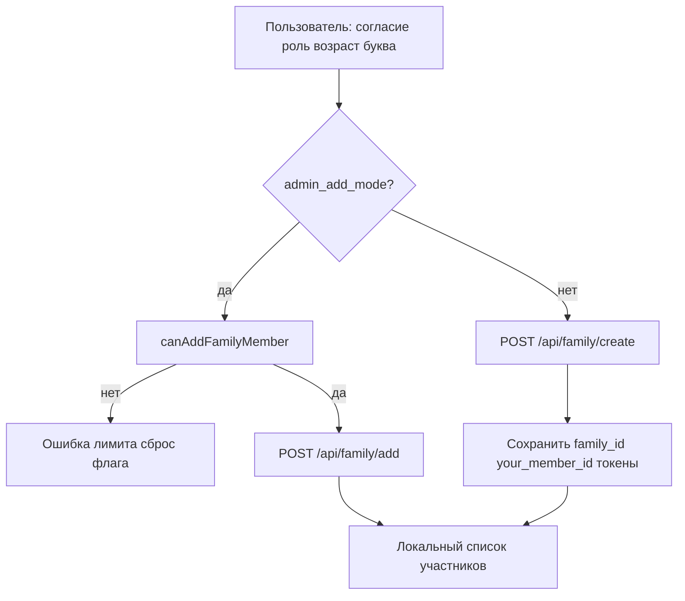

# Регистрация, тарифы и главный экран: iOS + прод-сервер (единый справочник для ML / разработки)

**Охват:**  
1) **iOS** — фактическая логика в этом репозитории (Swift).  
2) **Прод-сервер** — проверка по хосту **`149.154.65.180`**, API **`http://149.154.65.180:8002`**, код в **`/opt/aladdin-backend`** (снимок **2026-05-05**; после деплоя перепроверять OpenAPI и файлы).

**Назначение:** одна точка входа для другой ML-системы: регистрация семьи, подписка/лимиты, карточка семьи на главной — **что откуда берётся на клиенте и что реально есть на сервере**, включая известные расхождения.

**Связанный документ (только iOS, без прода):** `docs/REGISTRATION_AND_MAIN_TARIFF_CARD.md` — сжатое описание стабилизации регистрации и карточки тарифа для handoff; **этот файл** (`…_ML_REFERENCE.md`) — **расширенный канон**: iOS + прод + матрицы + чеклисты ниже.

**Операционные артефакты:** смоук-чеклист семьи — `docs/FAMILY_API_SMOKE_REGIMEN.md`; ТЗ для бэкенда (**POST join**, gate на **add**) — `docs/server/BACKEND_FAMILY_JOIN_AND_ADD_GATE.md`.

**Единый канон выравнивания «тариф в UI ↔ лимит ростера на сервере» (май 2026, задеплоено на прод :8002):**

| Слой | Что сделано |
|------|-------------|
| **Прод `GET /api/family/stats`** | В ответ добавлены **`familyRosterUsed`**, **`familyRosterMax`**, **`ownerSubscriptionTier`**: те же правила, что gate на **`POST /api/family/add`** (`_owner_subscription_level_for_family` + `max_family_slots_for_subscription_level`). Если семьи ещё нет — кап по **`users.subscription_level` самого JWT-актора**, `familyRosterUsed=0`. |
| **Прод подписка / БД** | В **`backend/app/services/subscription_service.py`**: после изменений строки подписки вызывается синхронизация **`users.subscription_level`** (`UPDATE users …`), в т.ч. для **`register_device`**, **`register_device_with_trial`** (все ветки), **`upgrade_subscription`**, и реализован **`cancel_subscription`** (даунгрейд в free; для **trial** поле **`trial_end_date`** в БД **не** затирается — анти-abuse). Раньше JWT/клиент могли показывать trial и «3 из 3», а в **`users.subscription_level`** у владельца оставался **free** → **`409 family_roster_full`** на **add** при уже заполненном ростере. |
| **iOS** | Модель **`FamilyStatsResponse`**: опциональные поля квоты; **`SubscriptionManager.applyFamilyRosterQuotaFromFamilyStats`** обновляет **`family_limit`**, **`family_remaining`**, **`family_roster_used_last`** после успешного **`getFamilyStats`** (**`MainViewModel`**, **`FamilyViewModel`**). **`APIService.performAddFamilyMember`**: обработка **`409`** через **`NetworkError.conflict(detail)`** (раньше ветка почти не срабатывала), отдельные тексты для **`family_roster`**. Удаление: лог **`HTTP DELETE`** + путь **`/api/family/remove`**. |
| **Артефакты репозитория** | **`docs/release/current/openapi.json`** переснят с **`http://149.154.65.180:8002/openapi.json`** после выката; в схеме **`FamilyStatsResponse`** перечислены новые поля. |

Пути выката на хосте: **`/opt/aladdin-backend/app/routers/family.py`**, **`/opt/aladdin-backend/backend/app/services/subscription_service.py`** (короткий файл **`app/services/subscription_service.py`** на проде — не основной модуль роутера подписки).

---

## 1. Ограничение по «окну чата»

Текст переписки из другого сеанса Cursor сюда не подгружается. Всё ниже — **реконструкция по файлам** (`FamilyRegistrationViewModel`, `MainScreen`, `SubscriptionManager`, `APIService`, `AppConfig`, `ALADDINApp`, `MainViewModel`). Незакоммиченные изменения в `ALADDINApp.swift` учтены в разделе про стабилизацию корня приложения.

---

## 2. Стабилизация регистрации (корень приложения)

### 2.1 Проблема, которую закрывают правки

Экран **`mainWithRegistration`** (`MainScreenWithRegistration`) исторически мог оказаться **вне** того же дерева модификаторов, что и основной стек с `NavigationView`: без общих `environmentObject` (в т.ч. `SubscriptionManager`, `MainViewModel`) и без единой обработки жизненного цикла сцены и `SessionExpired` поведение после регистрации и синка подписки становилось нестабильным.

### 2.2 Что сделано в коде (diff `ALADDINApp.swift`)

- Введён общий билдер **`applyRootChrome`** — навешивает на корневой контент:
  - `environmentObject`: `NavigationManager`, `LocalizationManager`, `FeedbackSystem`, **`SubscriptionManager.shared`**, **`MainViewModel`**
  - локаль через `localizationManager.locale`
  - `.id` по текущему экрану навигации
  - `onChange(of: scenePhase)` — триал/expiry check, фоновые синки
  - `SessionExpired` с защитой от реентрантности (`isHandlingSessionExpiredGlobal`) и проверкой `TokenValidator` (не сносить сессию, если токен ещё валиден)
  - тема, оверлеи Visual Logger и `FeedbackParticleOverlay`
- Ветка **`navigationManager.currentScreen == .mainWithRegistration`** возвращает:
  - `applyRootChrome(MainScreenWithRegistration(registrationVM: FamilyRegistrationViewModel()) …)`
- Таким образом регистрация получает **те же зависимости и политики сессии**, что и основное приложение.

### 2.3 Разделение `NavigationView` и первый вход

- **`mainWithRegistration`** рендерится **вне** `NavigationView` (отдельная ветка `mainAppContent()` в `ALADDINApp.swift`), но с тем же **`applyRootChrome`**, чтобы не терять `SubscriptionManager`, `MainViewModel`, сцену и `SessionExpired`.
- **Основное приложение** после онбординга живёт **внутри** `NavigationView` с **`.navigationBarHidden(true)`** и **`StackNavigationViewStyle()`** на контейнере экранов — меньше конфликтов с системной нав-панелью и Auto Layout на первом входе, чем если бы регистрация была в том же стеке без продуманного корня.

Файлы: `ALADDINApp.swift`, `Screens/MainScreenWithRegistration.swift`.

---

## 3. Регистрация нового пользователя / семьи (мобильный клиент)

### 3.1 Два крупных сценария

| Сценарий | Кратко |
|----------|--------|
| **Создатель семьи** | Согласие → роль → возраст → буква → `POST /api/family/create` |
| **Присоединение по коду** | Код → те же шаги (где применимо) → **`POST /api/family/join`** (в bundled OpenAPI только **GET** compat; нужен выкат **POST** на API — раздел 10.3) |
| **Админ: добавить участника** | С главной / семьи: флаг `admin_add_mode` → тот же UX выбора, но API → `POST /api/family/add` |

### 3.2 Прогрессивная регистрация (UI)

`MainScreenWithRegistration` показывает `MainScreen` и поверх — модалы из `FamilyRegistrationViewModel` (согласие, роль, возраст, буква, успех, код приглашения и т.д.).

**Запуск цепочки:** в **`MainScreenWithRegistration.swift`** на корне вешается **`.task`**: пауза **~0.5 с** (`Task.sleep(500_000_000)`), затем **`registrationVM.startRegistration()`** → первое модальное окно (согласие).

`completeRegistration(isSuccess:)`:

- При **`isSuccess == true`** выставляет **`hasCompletedOnboarding`** в `UserDefaults` (ключ из `AppConfig.UserDefaultsKeys`) — онбординг считается завершённым только после **реальной** успешной регистрации.
- При **отмене** (`isSuccess == false`, кнопка «Отмена» в углу): **`hasCompletedOnboarding` не выставляется** (пользователь не должен попадать в сценарий «первый вход завершён» без факта регистрации); переход на экран семьи всё равно выполняется через **`switchToFamilyScreen()`** с задержкой **0.3 с** (как и при успехе), чтобы закрыть модальный поток UI.
- В **DEBUG** опционально доступен блок Apple / magic link (`isAlternativeRegistrationAuthVisible` в файле регистрации).

### 3.3 `FamilyRegistrationViewModel.createFamily()` — развилка

1. **Нормализация `admin_add_mode`:** если режим «добавить», но на устройстве ещё нет `family_id`, флаг сбрасывается (защита от 404 на add до создания семьи).

2. **`admin_add_mode == true` (добавление в существующую семью):**
   - Подсчёт текущего числа участников из `UserDefaults` (`family_members_list` → `[FamilyMemberData]`).
   - Проверка лимита: **`SubscriptionManager.shared.canAddFamilyMember(currentCount:)`** — единая точка правды (см. раздел 5).
   - Успех: `apiService.addFamilyMember(name:role:)` → `POST /api/family/add` с заголовком идемпотентности (см. `APIService`).
   - Ошибка «семья не найдена» / 404: **авто-fallback** — сброс `admin_add_mode`, повторный вызов `createFamily()` уже по ветке создания семьи.

3. **Обычное создание семьи:**
   - Тело: `CreateFamilyRequest(role:, age_group:, personal_letter:, device_type:)`  
   - **`role` для API:** `FamilyRole.serverValue` — подросток (`teenager`) уходит как **`child`**, пожилой — `elderly`.
   - **`age_group` для API:** `AgeGroup.serverValue` — диапазоны вроде `7-12`, `13-17`, `24-55`, `55+` (маппинг от UX-меток).
   - Вызов: `apiService.createFamily` → **`POST /api/family/create`** (`requiresAuth: true`).

4. **Ответ `CreateFamilyResponse` (успех):**
   - `family_id`, `recovery_code`, `your_member_id`, при наличии — JWT access/refresh.
   - `FamilyLocalStore.resetPersistedCachesIfFamilyChanged`, сохранение `family_id`, `creator_member_id` через `FamilyLocalStore.persistFamilyCreatorMemberId`.
   - **`your_member_id`** в `UserDefaults` ключ **`your_member_id`** (для отображения на главной и копирования), **кроме** потока `admin_add_mode` (сессия родителя не перезаписывается).
   - Токены: если валидны — `saveTokens` в Keychain + `AppConfig.authToken`; иначе цепочка **`loginByRecoveryCode`**; при несовместимом JWT — bootstrap через **`registerDeviceAnonymously`**.
   - Локально создатель добавляется в список участников (`saveCreatorAsFamilyMember`).

### 3.4 Присоединение (`joinFamily`)

- Код санитизируется (`sanitizedAsFamilyId()`).
- Запрос: `JoinFamilyRequest(family_id:, role:, age_group:, personal_letter:, device_type:)` → **`POST /api/family/join`**.
- Успех: сохранение `family_id`, `your_member_id` (с теми же правилами `admin_add_mode`), маппинг `members`, `saveJoinedMemberAsFamilyMember`, детям/подросткам — стартовый баланс единорога в `UserDefaults`.

**Прод-сервер:** в актуальном **`docs/release/current/openapi.json`** (снимок после выката) у **`/api/family/join`** есть и **`GET`** (compat), и **`POST`** (боевой контракт iOS). Если другой стенд отстаёт — сверять **`/openapi.json`** на том же хосте.

### 3.5 Что ожидается от сервера (контракт уровня путей)

Клиент использует (см. `AppConfig.Endpoint`):

- `/api/family/create`, `/api/family/join`, `/api/family/add`, `/api/family/stats`, `/api/family/members`, …
- Авторизация устройства: `/api/auth/register-device`, `/api/auth/register-device-trial`
- Подписка: `/api/subscription/status`, sync/update и др.

Точная валидация полей ответа — в моделях и `APIService` / декодерах.

### 3.6 Сетевой слой: `createFamily` / `joinFamily` (`APIService`)

Файл: **`Core/Network/APIService.swift`**.

- Публичный **`createFamily`** делегирует в **`performCreateFamily(..., hasRetriedAfterTokenBootstrap: false)`**.
- Первая попытка: **`POST`** на **`AppConfig.Endpoint.createFamily`** → **`/api/family/create`**, **`requiresAuth: true`**.
- Если ошибка классифицируется как **`.notFound`** (`NetworkError.from`) — **один** fallback на legacy путь **`POST /family/create`** (шлюзы без префикса `/api`).
- Если **401 / истёкший токен / reauth** или ошибка вида **invalid user_id in token** — при **первом** проходе вызывается **`bootstrapDeviceTokenIfNeeded(forceRefresh: true)`** (анонимная регистрация устройства → JWT в `AppConfig` / Keychain), затем **`performCreateFamily`** повторяется **ровно один раз** с флагом `hasRetriedAfterTokenBootstrap: true`. Это стабилизирует первый запуск, когда JWT ещё не успел появиться до вызова создания семьи.
- Симметричная схема для **`joinFamily`** → **`performJoinFamily`**: основной **`POST /api/family/join`**, fallback **`POST /family/join`**, тот же bootstrap и **один** повтор. **На проде :8002** см. раздел **10.3** (POST join может отсутствовать в OpenAPI — тогда клиент получит 404 даже до fallback, если legacy путь не смонтирован).

Изменения контрактов на сервере должны сопровождаться обновлением моделей декодирования и при необходимости **`Core/Validation/APIResponseValidator.swift`**, если ответы валидируются централизованно.

---

## 4. Подписка, JWT и «кто такой текущий тариф»

### 4.1 Старт приложения

`SubscriptionManager.initializeOnAppStart()`:

- Если нет валидного токена — **`performDeviceRegistration()`** (анонимная / trial регистрация устройства).
- Синхронизация `AppConfig.authToken` с Keychain.
- Далее синки статуса подписки (в т.ч. `forceSync`), разбор JWT (`JWTPayload`).

### 4.2 Уровни (`SubscriptionLevel`)

Перечисление в `Core/Models/SubscriptionModels.swift`: `trial`, `free`, `personal`, `family`, `premium`.  
Строки API нормализуются через `SubscriptionLevel.fromAPIPlanString` (синонимы `basic`, `individual`, `standard` → `personal`).

### 4.3 Эффективный уровень для UI: `getCurrentLevel()`

В `SubscriptionManager`:

- Если **`trialStatus?.isActive`** — уровень для UI считается **`.trial`**.
- Если подписка уже **`free`** и триал не активен — **`.free`** (защита от рассинхрона JWT ещё с `trial` после отмены).
- Иначе согласование `currentSubscription?.level` и `currentToken?.subscriptionLevel` при расхождении (апгрейд/даунгрейд).

### 4.4 Лимит членов семьи по тарифу

Метод **`familyMemberLimit(for:)`** (единая таблица в клиенте):

| Уровень   | Макс. участников |
|-----------|------------------|
| `free`    | 1                |
| `trial`             | 3        |
| `personal`          | 2        |
| `family`  | 6                |
| `premium` | 10               |

**Важно:** для расчёта **потолка семьи** используется не только `subscription.level`, но и активный триал — см. `subscriptionLevelForFamilyMemberCap` внутри `updateSubscriptionStatus`: если триал активен, кап может быть **`trial` (3)**, даже если `plan_level` в снимке ещё `free`.

Публикация в UI:

- `@Published currentFamilyLimit`, `currentFamilyRemaining`
- Дублирение в `UserDefaults` ключи **`family_limit`**, **`family_remaining`** для старого кода.
- После успешного **`GET /api/family/stats`**, если в ответе есть **`familyRosterMax`**, вызывается **`SubscriptionManager.applyFamilyRosterQuotaFromFamilyStats`**: лимит слотов подтягивается с сервера (кап владельца в БД), чтобы строка «X / Y» на главной не расходилась с **`409 family_roster_full`** на **`POST /api/family/add`**.

Обновление лимита вызывается из **`updateSubscriptionStatus`** и после **`updateTrialStatus`** (комментарий в коде: раньше порядок обновлений давал кап `free` и «золотой» градиент при активном триале — исправлено).

### 4.5 Охрана «добавить участника»

**`canAddFamilyMember(currentCount:)`** — используется:

- `FamilyRegistrationViewModel` (admin add),
- `FamilyScreen`,
- `AddMemberOptionsScreen`.

Условия блокировки: `currentCount >= currentFamilyLimit` или `currentFamilyRemaining <= 0` (с осмысленными сообщениями для UI).

### 4.6 Кап лимита vs план в JWT (`subscriptionLevelForFamilyMemberCap`)

Уже задействовано в **`updateSubscriptionStatus`**: для **лимита ростера** учитывается не только `SubscriptionStatus.level`, но и **активный триал** в статусе и/или **`trialStatus?.isActive`** — иначе при `plan_level == free` и активном триале кап оставался бы **1** (free), а UI ошибочно оставался бы на «золотом» градиенте.

### 4.7 Порядок обновления триала (`updateTrialStatus`)

После присвоения **`trialStatus`** при наличии **`currentSubscription`** вызывается повторный **`updateSubscriptionStatus(sub)`**, чтобы **`currentFamilyLimit`**, **`subscriptionDisplayEpoch`** и градиент главной не застревали на free до следующего тика.

### 4.8 Downgrade на free (`downgradeToFree`)

`SubscriptionManager.downgradeToFree()`: запрос отмены на сервер (в т.ч. **`userId`** вида **`current`** + Bearer, см. код), при успехе — новый JWT при наличии, снятие триала из Keychain, **`NotificationManager.cancelTrialNotifications`**, локальный снимок **free**, **`forceSync`**, **`SubscriptionUpdated`**.

### 4.9 Повторный тап «Пробный» (`activateTrialIfNeeded`)

Если триал **уже активен** локально, повторный вызов **не игнорируется полностью**: выполняется **`updateSubscriptionStatus(currentSubscription)`** и **`bumpSubscriptionDisplayEpoch()`**, чтобы главная перерисовала лимиты и цвет без повторной активации на сервере.

### 4.10 Синк после экрана тарифов

**`SubscriptionManager.syncSubscriptionAfterTariffsDismiss()`** — **`forceSync()`** и **`bumpSubscriptionDisplayEpoch()`** **без** троттлинга `syncSubscriptionOnMainScreenAppear` (интервал ~1.2 s), чтобы после закрытия **`Screens/10_TariffsScreen.swift`** главная сразу подтянула **`/api/subscription/status`**.

---

## 5. Главный экран: прямоугольник / карточка семьи, цвет и слоты

Файл: `Screens/01_MainScreen.swift`.

### 5.1 Откуда цифры «члены семьи»

- **`mainViewModel.familyMembers`** — приходит из **`GET /api/family/stats`** (`totalMembers`) в `MainViewModel.loadDashboardDataWithRetry`; это **источник правды для счётчика на главной** (комментарий в коде про рассинхрон с локальным списком).
- После того же ответа **`stats`** клиент при необходимости обновляет **`subscriptionManager.currentFamilyLimit`** из полей **`familyRosterMax` / `familyRosterUsed`** (см. блок «единый канон» после оглавления).
- В шапке карточки дополнительно показывается строка вида **«текущее / лимит по тарифу»** через локализацию **`main_family_header_member_slots`** с аргументами:
  - `min(mainViewModel.familyMembers, max(0, subscriptionManager.currentFamilyLimit))`
  - `max(0, subscriptionManager.currentFamilyLimit)`  
  То есть отображается **фактическое число из API**, ограниченное сверху лимитом тарифа, и сам лимит (**лимит после stats совпадает с серверным gate, если сервер прислал квоту**).

### 5.2 Цвет градиента карточки (в т.ч. «жёлтый / бирюзовый»)

Вычисляемое свойство **`currentTariffColor`**:

| `getCurrentLevel()` | Цвет |
|---------------------|------|
| `free`              | `Color.secondaryGold` (золотой / «жёлтый» акцент бренда) |
| `trial`             | Явный RGB: **бирюзовый** `Color(red: 0.22, green: 0.78, blue: 0.72)` (в коде задуман как отличие от бесплатного) |
| `personal`          | Синий |
| `family`            | Фиолетовый |
| `premium`           | Оранжевый |

Карточка рисуется как **`LinearGradient`** от `currentTariffColor` к чуть более прозрачному, обводка и тень тоже от этого цвета.

### 5.3 Почему на устройстве иногда «не менялся» градиент

SwiftUI на реальном устройстве мог не пересобрать градиент при смене только цвета. Исправление:

- У **`SubscriptionManager`** поле **`subscriptionDisplayEpoch`** — монотонно увеличивается при значимых обновлениях подписки / триала (`bumpSubscriptionDisplayEpoch` из `updateSubscriptionStatus`, `updateTrialStatus`, синков).
- На главной у строки тарифа, у карточки семьи и у сегментов чата вешается **`.id(...\(subscriptionDisplayEpoch)...)`** вместе с **`tariffRowViewIdentity`** (`уровень|trial:bool|язык`), чтобы принудительно обновить вид.

### 5.4 Прочие реакции главной на семью и тариф

`onReceive` / `onChange`:

- `MainFamilyStatsForceRefresh`, `FamilyMembersUpdated`, `FamilyDevicesDidChange` — обновление дашборда и при необходимости `subscriptionManager.forceSync()`.
- `SubscriptionUpdated`, `tariffPurchased`, `onChange(subscriptionManager.currentSubscription)` — синк и debounced refresh.

### 5.5 Строка названия тарифа и иконка

- Текст: локализация ключей `tariffs_trial` / `tariffs_free` / … по `getCurrentLevel()`, fallback — `level.displayName`.
- Иконка SF Symbol: `tariffIconForCurrentLevel()` (щит для free/trial, person для personal, и т.д.).
- Дата окончания: кеш **`cachedExpirationText`** из ISO `@AppStorage("subscription_expires_at_iso")` через **`DateFormatterService`** с защитой от рекурсии (глобальный lock в `MainScreen`).

### 5.6 Главная страница: полная карта «что на экране — откуда данные»

Файл UI: **`Screens/01_MainScreen.swift`**. Ниже — привязка **элемента → источник на iOS → типичный источник на сервере** (если есть).

| Элемент главной (карточка семьи и рядом) | iOS (свойство / менеджер) | Откуда значение | Сервер (прод, если применимо) |
|------------------------------------------|---------------------------|------------------|-------------------------------|
| Число «членов семьи» в тексте инфо (`main_family_info`, устройства и т.д.) | `MainViewModel.familyMembers` | **`GET /api/family/stats`** → поле вроде `totalMembers` после декодирования в `MainViewModel.loadDashboardDataWithRetry` | **`GET /api/family/stats`** в `app/routers/family.py`: агрегат `COUNT(*)` по `family_members` для той же семьи, что и `GET /members` (в коде явно согласовано) |
| Строка слотов «X / Y» в шапке карточки (`main_family_header_member_slots`) | `mainViewModel.familyMembers` + **`SubscriptionManager.currentFamilyLimit`** | **X** = `min(члены_из_API, лимит)`; **Y** = `currentFamilyLimit` (после **`/api/subscription/status`** и **`/api/family/stats`**, если в stats есть **`familyRosterMax`**) | **Y** на сервере для gate **add** и в **stats** — из **`users.subscription_level`** владельца семьи + **`max_family_slots_for_subscription_level`** (тот же модуль, что **`family_roster_reconcile`**); заголовки **`X-Family-Limit`** у **members** по-прежнему опциональны |
| Цвет градиента / обводки / тени карточки | `currentTariffColor` ← **`SubscriptionManager.getCurrentLevel()`** | JWT + `SubscriptionStatus` + активный триал (`trialStatus`) после синков | Уровень в БД / JWT выдаётся цепочкой подписки (**`GET /api/subscription/status`**, выпуск/обновление токена при **`/api/auth/register-device`*** и т.д.) — детали в `backend/app/routers/subscription.py` на сервере |
| Название тарифа в тексте | `currentTariffDisplayName` | Локализация по уровню из `getCurrentLevel()` | Строковый уровень плана в ответах подписки / JWT должен маппиться на те же уровни (`SubscriptionLevel.fromAPIPlanString` на iOS) |
| Иконка у строки тарифа | `tariffIconForCurrentLevel()` | Только клиент (SF Symbol по уровню) | — |
| «Действителен до …» | `cachedExpirationText` | `@AppStorage("subscription_expires_at_iso")` + форматирование | Поля срока из API подписки / синка (клиент кладёт ISO в AppStorage после обновлений) |
| ID для копирования (`your_member_id`) | `UserDefaults` **`your_member_id`** | После **`POST /create`**, **`POST /join`**, добавления — из ответа API; в **`admin_add_mode`** не перезаписывается | В **`POST /add`** создаётся `MEM_…`; `GET /members` отдаёт **`X-Current-Member-Id`** для JWT-строки членства |
| Бейдж статуса защиты семьи | `MainViewModel.familyProtectionStatus` | Маппинг из **`stats.familyStatus`** (+ TTL/фолбэки при ошибках в `MainViewModel`) | **`GET /api/family/stats`** — поля статуса/сообщения из БД |
| Устройства под защитой (число в карточке) | `MainViewModel.devicesProtected` | После stats: **`GET /api/devices`**, с дедупликацией; фолбэк — число из stats | Список устройств и/или fallback в stats (см. `family.py`) |
| Заблокированные угрозы | `MainViewModel.threatsBlocked` | Из **`GET /api/family/stats`** | Тот же эндпоинт stats |
| Кнопки «Управлять» / «Добавить» | `NavigationManager` | Локальная навигация; «Добавить» выставляет **`admin_add_mode`** при непустом `family_id` | — |
| Сегменты Family / AI чата (цвет выбранного) | `homeChatDestinationRaw` + `currentTariffColor` | Клиент; форс-refresh через **`subscriptionDisplayEpoch`** | — |

\*Точные пути auth на клиенте: **`AppConfig.Endpoint.registerDevice`**, **`registerDeviceTrial`** → **`/api/auth/register-device`**, **`/api/auth/register-device-trial`**.

### 5.7 Уведомления, которые дергают обновление главной

| Notification (имя) | Зачем |
|---------------------|--------|
| `MainFamilyStatsForceRefresh` | Форс: счётчик семьи из стораджа + debounced dashboard + **`subscriptionManager.forceSync()`** |
| `FamilyMembersUpdated` | После сохранения ростера на экране «Семья» — **`requestRefreshDebounced`** (снова stats) |
| `FamilyDevicesDidChange` | Debounced dashboard (в т.ч. устройства) |
| `SubscriptionUpdated` | Debounced refresh после смены плана |
| `tariffPurchased` | **`forceSync()`** + debounced refresh |

### 5.8 Локальные кэши, не путать с API главной

- **`family_members_list`** в `UserDefaults` — используется для **подсчёта при admin-add** и экрана «Семья»; **главная цифра членов** для отображения в блоке инфо берётся из **`MainViewModel.familyMembers` (stats)**, чтобы не залипать «0» при уже обновлённом списке на другом экране.

### 5.9 Сопутствующие стабилизации (тот же контур билда, не рисуют прямоугольник сами)

В одном пласте работ с **версией / билдом 180** и сопутствующими правками фигурировали также (кратко — чтобы ML не потеряла контекст «что ещё трогали»):

| Область | Файлы / суть |
|---------|----------------|
| Локальное состояние семьи | **`Core/Managers/FamilyLocalStore.swift`** — сброс кэшей при смене `family_id`, `creator_member_id`, согласование с заголовком **`X-Resolved-Family-Id`** где применимо |
| Политика доступа до полной регистрации | **`Core/Profile/FamilyAccessPolicy.swift`** — безопасные дефолты, пока `family_id` / `your_member_id` пусты или в процессе reconcile |
| Экран «Семья» | **`Screens/02_FamilyScreen.swift`** — валидация локального кэша ростера, диалог очистки кэша при рассинхроне |
| Ростер и чат | При записи **`family_members_list`** сохраняется снимок **`family_id`** для согласованности с сервером (см. потоки в VM / семейном чате в том же релизе) |
| Валидация ответов API | **`Core/Validation/APIResponseValidator.swift`** — расширения под контракты success / subscription |
| Тарифы после выхода с экрана | **`Screens/10_TariffsScreen.swift`** → **`syncSubscriptionAfterTariffsDismiss()`** (см. §4.10) |
| Метрики / FPS | **`Core/Monitoring/PerformanceMonitor.swift`** — снижение лишней нагрузки при логировании (в перечне стабилизации билда) |

### 5.10 Ручной смоук и автотесты (рекомендации)

**На физическом устройстве:** trial ↔ free — **бирюзовая** vs **золотая** карточка; лимит **3** vs **1**; после отмены триала — не показывать trial по «устаревшему» JWT (см. **`getCurrentLevel`**).

**Контракт отмены подписки:** smoke **`POST /api/subscription/cancel`** с **`userId: current`** и **Bearer** (как в **`downgradeToFree`** / `APIService`).

**Unit:** при наличии — прогон тестов вроде **`Tests/UnitTests/SubscriptionFamilyLimitsTests.swift`**; при расширении покрытия — сценарий **`downgradeToFree`** (мок сети / Keychain по принятому в проекте паттерну).

---

## 6. Связка «после регистрации» и тариф

- Первый запуск / отсутствие подписки: в `ALADDINApp` при необходимости вызывается **`storeManager.activateFreeTariff()`** (см. логика Store / бесплатный план).
- Семейные лимиты для добавления участников всегда проходят через **`SubscriptionManager`**, а не через дублирующие константы в экранах.

---

## 6.1 Упрощение без PIN: что изменили, зачем, как теперь работает

### 6.1.1 Что изменили

- В runtime-потоках семейных действий убран in-app PIN/биометрический challenge (`ParentSessionGate.confirmSensitiveAction`): add/remove и смежные родительские действия больше не зависят от PIN-сессии.
- Удалён `profile_pin` из пользовательского UI и сохранения (убрана «маскированная» строка PIN в профиле и редактировании профиля).
- Добавлена однократная миграция очистки legacy-ключа `profile_pin` из `UserDefaults` при запуске приложения.
- Актуализированы smoke/контрактные проверки и документация под модель «без PIN-gate в runtime».

### 6.1.2 Зачем это сделано

- Устранить ложные блокировки действий («не прошёл PIN/биометрию» при корректной роли и валидной сессии).
- Упростить UX и поддержку: меньше скрытых состояний, меньше непредсказуемых отказов.
- Убрать путаницу между «profile PIN» и «parental PIN».

### 6.1.3 Как теперь устроено add/remove

PIN больше не является обязательным условием.  
Операции по составу семьи по-прежнему строго завязаны на:

1. **JWT авторизацию** (валидный токен),
2. **Контекст семьи** (`family_id`, `X-Family-Id`, согласованный `your_member_id`),
3. **Роль актора** (через `FamilyAccessPolicy` / `canManageFamilyRoster`),
4. **Серверные бизнес-правила** (лимит тарифа, запрет self-remove, запрет удаления последнего parent и т.д.).

Итог по смыслу:
- **без PIN-привязки** — да,
- **без auth/family binding** — нет (и это корректно с точки зрения безопасности и целостности данных).

### 6.1.4 Что стало лучше (`+`)

- Главный источник фрустрации устранён: операции не срываются из-за PIN-gate.
- Поведение проще и предсказуемее: UI confirm -> API вызов -> sync.
- Меньше точек отказа (нет зависимости от `biometricAvailable`, состояния PIN-сессии, TTL PIN).
- Нет «фантомного» PIN в профиле (`profile_pin` удалён из UI и хранения).

### 6.1.5 Что осталось ограничением (нормально)

- Add/remove доступны не всем ролям; действует роль и политика доступа.
- Нужен валидный auth/family-контекст, иначе запрос не выполняется или отклоняется.
- Лимиты тарифа (`family_roster_full`) продолжают блокировать add на сервере.
- Критичные guard-правила на сервере сохранены (self-remove, last-parent, контекстные 403/409/404).

### 6.1.6 Риски/компромиссы (`-`)

- Убран дополнительный локальный барьер чувствительных действий; основной контур защиты теперь роль + серверная авторизация.
- В add/remove остаются оптимистичные шаги в UI (кратковременное локальное состояние до подтверждения сервером), затем выполняется синхронизация.
- В исторических/архивных docs могут встречаться старые упоминания `ParentSessionGate`; для runtime-кода это уже неактуально.

### 6.1.7 Вывод для текущей стадии продукта

Для продуктовой стадии решение «без PIN-gate в runtime» повышает стабильность и снижает пользовательскую путаницу.  
Формулировка «можно свободно добавлять/удалять» теперь означает: **без PIN**, но **с обязательными ограничениями роли, тарифа и серверной авторизации**.

---

## 7. Диаграмма потока (создание семьи, упрощённо)

---

## 8. Файлы «первого чтения»

### 8.1 iOS (репозиторий `ALADDIN_iOS`)

| Тема | Файлы |
|------|--------|
| Регистрация / семья | `ViewModels/FamilyRegistrationViewModel.swift`, `Screens/MainScreenWithRegistration.swift`, `Core/Network/APIService.swift` (**add**: 409 / `conflict`), `Core/Config/AppConfig.swift` |
| Лимиты, тариф, квота ростера из stats | `Core/Managers/SubscriptionManager.swift` (**`applyFamilyRosterQuotaFromFamilyStats`**), `Core/Models/SubscriptionModels.swift`, `Core/Models/APIModels.swift` (**`FamilyStatsResponse`**), `Tests/UnitTests/SubscriptionFamilyLimitsTests.swift` |
| Главная карточка | `Screens/01_MainScreen.swift` |
| Счётчики дашборда + stats | `ViewModels/MainViewModel.swift`; экран семьи: `ViewModels/FamilyViewModel.swift` (тот же вызов после **`getFamilyStats`**) |
| Корень / стабилизация | `ALADDINApp.swift` (ветка `mainWithRegistration`, `applyRootChrome`) |
| Сопутствующие семья / кэш / политика | `FamilyLocalStore.swift`, `FamilyAccessPolicy.swift`, `02_FamilyScreen.swift` |
| Валидация ответов | `APIResponseValidator.swift` |
| Тарифы → главная | `10_TariffsScreen.swift` |
| Метрики | `Core/Monitoring/PerformanceMonitor.swift` (при необходимости) |

### 8.2 Прод-сервер (путь на хосте)

| Тема | Путь на сервере |
|------|-----------------|
| Роутер семьи (stats, create, add, members, chat, …) | `/opt/aladdin-backend/app/routers/family.py` |
| Лимиты тарифа (функция `getMaxFamilyMembersFor`) | `/opt/aladdin-backend/app/config/subscription_limits.py` |
| Reconcile ростера (дублирующая таблица лимитов) | `/opt/aladdin-backend/app/services/family_roster_reconcile.py` |
| Логика create/join в security-слое (импортируется create) | `/opt/aladdin-backend/app/security/family/family_registration.py` (и дубликат дерева `security/family/…` при наличии) |
| Подписка (часть маршрутов) | `/opt/aladdin-backend/backend/app/routers/subscription.py` (реэкспорт через `app/routers/subscription.py`) |
| Сервис подписки (синк `users.subscription_level`, trial/cancel/upgrade) | **`/opt/aladdin-backend/backend/app/services/subscription_service.py`** |
| Точка подключения роутера | `/opt/aladdin-backend/main.py` (`include_router(family.router, …)`) |

---

## 9. Прод-сервер: методология проверки

По **`ALADDIN_SERVER_CONNECTION_GUIDE_FOR_ML_SYSTEMS.md`**:  
1) `curl -s -S -m 8 http://149.154.65.180:8002/api/health` → `{"status":"ok"}`  
2) SSH (пример: ключ `~/.ssh/aladdin_server`, пользователь `root`)  
3) Чтение `/opt/aladdin-backend/...` и выборка путей из **`http://149.154.65.180:8002/openapi.json`**

Снимок ниже — **2026-05-05**; после выкладок бэкенда повторить OpenAPI и diff файлов.

---

## 10. Прод-сервер: детали по регистрации, семье и тарифам

### 10.1 Лимиты членов семьи (константы на сервере)

**Файл** `app/config/subscription_limits.py` — словарь `_DEFAULT_MAP` и функция **`getMaxFamilyMembersFor(level)`**.  
**Файл** `app/services/family_roster_reconcile.py` — **`_DEFAULT_LEVEL_MAX`** и **`max_family_slots_for_subscription_level`** (читает `users.subscription_level` для reconcile «один child → parent»).

| Уровень (строка) | Макс. слотов на проде (оба файла на дату проверки) |
|------------------|-----------------------------------------------------|
| `trial`          | 3 |
| `free`           | 1 |
| **`personal`** | **2** |
| `family`         | 6 |
| `premium`        | 10 |

**Согласование с iOS (2026-05-05+):** `SubscriptionManager.familyMemberLimit(for: .personal)` выровнен на **2** — как в `subscription_limits.py` / reconcile на проде. Маркетинговые строки про «3 устройства» в тарифах относятся к **другому** лимиту (устройства), не к слотам ростера семьи.

**Рекомендация по-прежнему:** сервер остаётся источником правды; при смене политики — одна таблица на бэкенде + синхронное обновление iOS и OpenAPI.

### 10.2 Регистрация семьи на сервере: `POST /api/family/create`

- Роут: **`app/routers/family.py`** — **`@router.post("/create")`** (префикс роутера **`/api/family`**).
- Вызывается **`create_family`** из **`security.family.family_registration`** (импорт в шапке `family.py`): создание записей в БД, ответ **`CreateFamilyResponse`** (поля в духе `family_id`, recovery, `your_member_id`, токены — как ожидает iOS).
- Без авторизации шлюз отвечает **403** на пробный `POST` с пустым телом — маршрут **существует** (в отличие от POST join).

### 10.3 Присоединение по коду: **`POST /api/family/join`**

| Клиент iOS | Прод (актуальный снимок OpenAPI в репо) |
|------------|------------------------------------------|
| **`POST /api/family/join`** с телом `JoinFamilyRequest` | В **`docs/release/current/openapi.json`** для **`/api/family/join`** указаны **`GET`** (compat) и **`POST`** (боевой путь). На стороннем стенде при **404** на POST — проверить выкат **`family.py`** и маршрутизацию шлюза. Смоук: **`docs/FAMILY_API_SMOKE_REGIMEN.md`**, ТЗ: **`docs/server/BACKEND_FAMILY_JOIN_AND_ADD_GATE.md`**. |

### 10.4 `POST /api/family/add`

- Проверки: имя/роль, роль из whitelist (`parent`, `child`, `teenager`, `elderly`, `other`), контекст семьи (payload `familyId` vs членство актора) → **409** при mismatch, **403** если нет прав админа/родителя на ростер, **404** если семья не найдена для актора.
- Вставка строки в **`family_members`** (`user_id` у добавленной строки может быть **`NULL`** до «присвоения» профиля — см. комментарии в коде).
- **Жёсткий лимит по ростеру на сервере:** перед добавлением считается **`COUNT(*)`** по **`family_members`** для семьи и сравнивается с **`max_family_slots_for_subscription_level(_owner_subscription_level_for_family(...))`**, где **`_owner_subscription_level_for_family`** читает **`users.subscription_level`** владельца (`families.owner_user_id`). При переполнении — **`409`** с **`detail`** вроде **`family_roster_full`**. Клиентский пречек — **`canAddFamilyMember`**; после выката **stats** лимит в UI дополнительно выравнивается полями **`familyRosterMax`** / **`familyRosterUsed`**.

### 10.5 `DELETE /api/family/remove` (и GET compat)

По **`docs/release/current/openapi.json`** (снимок в репозитории):

| Метод | Назначение | Тело | Ответ 200 |
|-------|------------|------|-----------|
| **DELETE** | Боевое удаление участника | JSON **`RemoveFamilyMemberRequest`**: обязательно **`memberId`**; опционально `source`, `reason`, `familyId` | **`FamilyMemberResponse`** |
| **GET** | Compat «Remove Family Member» | нет (compat) | **`FamilyCompatBoolResponse`** |

**iOS:** `APIService.removeFamilyMember` → **`NetworkManager.delete`** на **`/api/family/remove`** с тем же JSON-телом (см. код). В логах семьи явно фиксируется **`HTTP DELETE`** и путь эндпоинта. GET compat **не** используется.

### 10.6 `GET /api/family/members`

- Матрица ответов в docstring роутера: primary семья / пустой список + **`X-Family-Context: none`** / **404** при неверном query без primary / **409** при несовпадении query с primary.
- Заголовки ответа: **`X-Resolved-Family-Id`**, **`X-Current-Member-Id`** (id строки `family_members` для JWT-актора в этой семье).
- **`X-Family-Limit` / `X-Family-Remaining`**: по **`grep`** по **`/opt/aladdin-backend/app`** на дату проверки **не реализованы** (в гайде — как план). Клиенту не стоит зависеть от них, пока не выкатят.

### 10.7 `GET /api/family/stats`

- Есть; учитывает **`X-Family-Id`** (канонический id с клиента) и тот же выбор семьи, что и members.
- **`totalMembers`** согласован с **`COUNT(*)`** по `family_members` для того же `family_id`, что и в **`GET /members`** — совпадает с использованием в **`MainViewModel`**.
- Дополнительно в JSON (для клиента и для ML-диагностики рассинхрона): **`familyRosterUsed`** (= число строк ростера для выбранной семьи), **`familyRosterMax`**, **`ownerSubscriptionTier`** — см. блок «единый канон» в начале документа и схему **`FamilyStatsResponse`** в **`docs/release/current/openapi.json`**.

### 10.8 Подписка и устройство

- **`app/routers/subscription.py`** в дереве приложения — тонкий реэкспорт; фактическая логика — **`/opt/aladdin-backend/backend/app/routers/subscription.py`**.
- На шлюзе **`:8002`** в OpenAPI (снимок 2026-05-05) есть, в частности: **`/api/subscription/status`**, **`/api/subscription/sync`**, **`/api/subscription/update`**, **`/api/subscription/tariffs`**, **`/api/subscription/cancel`**, **`/api/subscription/validate-receipt`**, **`/api/subscription/events/batch`** и др. — полный список смотреть в актуальном **`/openapi.json`**.
- Регистрация устройства: **`app/routers/auth_router.py`** — **`POST /api/auth/register-device`** (и trial-эндпоинт, если смонтирован; на iOS: **`/api/auth/register-device-trial`** в `AppConfig`).
- **Важно для семьи:** после **`register-device-trial`**, **`validate-receipt`** (апгрейд), **`/api/subscription/cancel`** строка **`users.subscription_level`** должна соответствовать уровню в таблице подписок — иначе gate на **add** и поля **stats** будут опираться на «старое» значение в **`users`**. Реализация: **`backend/app/services/subscription_service.py`** на сервере.

### 10.9 Список путей `/api/family/*` в OpenAPI (прод :8002, 2026-05-05)

Снято с `openapi.json`:  
`/api/family/add`, `/api/family/chat/...`, `/api/family/create`, **`/api/family/join` (GET compat + POST iOS)**, `/api/family/member`, `/api/family/members`, `/api/family/reconcile`, `/api/family/recover`, `/api/family/remove`, `/api/family/stats`.

---

## 11. Сводная матрица: iOS ↔ сервер (регистрация, тариф, главная)

| Тема | iOS | Сервер (прод) | Статус согласованности |
|------|-----|---------------|-------------------------|
| Создать семью | `POST /api/family/create` | Есть `POST /create` | Согласовано по пути |
| Присоединиться по коду | `POST /api/family/join` | В **`openapi.json`** в репо: **GET + POST** на `/join` | Согласовано с актуальным снимком прода; иные стенды — проверять вручную |
| Добавить участника | `POST /api/family/add` + `Idempotency-Key` | Есть `POST /add` + gate по **`users.subscription_level`** владельца | Путь согласован; **409 `family_roster_full`** при переполнении |
| Число членов на главной | `GET /api/family/stats` → `familyMembers` | `GET /stats` | Согласовано |
| Лимит слотов в UI («Y») / gate **add** | **`SubscriptionManager.currentFamilyLimit`**: подписка + после **`stats`** поля **`familyRosterMax`** / **`familyRosterUsed`** | **`max_family_slots_for_subscription_level`** + **`users.subscription_level`** владельца (и синк из **`subscription_service`**) | **Выровнено** (май 2026): **`personal`=2**; см. вводной блок |
| Удалить участника | **`DELETE /api/family/remove`** + JSON `RemoveFamilyMemberRequest` | OpenAPI: **DELETE** + body; **GET** compat отдельно | **Согласовано** с текущим клиентом и `openapi.json` в репо |
| Цвет карточки по тарифу | `getCurrentLevel()` локально | Уровень из подписки/JWT/БД | Согласовано концептуально; следить за рассинхроном JWT/plan |
| Заголовки лимита у members | iOS может читать legacy из UserDefaults | `X-Family-Limit` не найден на проде | **Опциональные заголовки не выкатаны** |

---

## 12. Копия таблицы лимитов рядом (для диффа)

| Уровень | iOS `familyMemberLimit` | Прод `subscription_limits` + `family_roster_reconcile` |
|---------|-------------------------|----------------------------------------------------------|
| free    | 1 | 1 |
| trial   | 3 | 3 |
| personal| **2** | **2** |
| family  | 6 | 6 |
| premium | 10 | 10 |

---

## 13. Май 2026: стабилизация sync/logging/metrics (без PIN-гейтов)

Ниже зафиксирована финальная модель после оптимизаций производительности и снижения шумовых логов.

### 13.1 Единая модель триггеров синка (Main + Subscription)

- В `MainScreen` оставлены только ключевые триггеры синка (primary + foreground fallback), без избыточных параллельных `forceSync()`.
- В `SubscriptionManager.syncWithServer()` добавлен one-flight guard: повторный вход в синк при активном запросе блокируется.
- Для события `sync_completed` введена защита от лавины: событие не отправляется без изменения fingerprint состояния и ограничено минимальным интервалом.

### 13.2 JWT observability: compact в production, verbose в debug

- Для health-check JWT оставлен compact heartbeat в production; многословные дубли оставлены только для debug-диагностики.
- `TokenHealthMonitor` не перезапускает таймер без необходимости (нет лишних stop/start при активном мониторинге).
- Эффект: заметно меньше `DEFENSIVE JWT` шума в логах и меньше фоновой нагрузки.

### 13.3 Метрики/FPS: анти-burst модель

- `MetricsService` использует shared-инстанс (`MetricsService.shared`) в ключевых потребителях (`PerformanceMonitor`, `RemoteAnalyticsService`), чтобы не создавать несколько periodic upload timers одновременно.
- Тяжёлые user-action метрики (`fps_measurement`, `memory_usage_check`) дополнительно троттлятся по глобальному интервалу.
- Эффект: устранены burst-отправки метрик и снижена конкуренция на UI/CPU при длительной сессии.

### 13.4 UI warning (Consent/NavBar)

- В consent-потоке убран конфликт системного `NavigationBar` с overlay-контейнером (custom close action + скрытый системный bar).
- Цель: исключить предупреждения AutoLayout вида `UINavigationBar.width == 0` без изменения UX регистрации.

### 13.5 Smoke-валидация без регрессий (статус)

Проверки после стабилизации:

- `scripts/phase8_performance_smoke.py` — PASS
- `scripts/phase8_compliance_smoke.py` — PASS
- `scripts/phase8_security_smoke.py` — PASS
- `scripts/trackb_mandatory_parental_control_smoke.py` — PASS

Итог: модель «без PIN-гейта» сохранена, add/remove/registration/main dashboard проходят смоки, а нагрузка от sync/logging/metrics снижена.

---

*Документ объединяет iOS-репозиторий и снимок прода на дату в разделе 9. После изменений на сервере или в клиенте обновляйте разделы 5.6, 10–12 и переснимайте **`docs/release/current/openapi.json`** с **`http://149.154.65.180:8002/openapi.json`** (или канонического шлюза приложения).*
