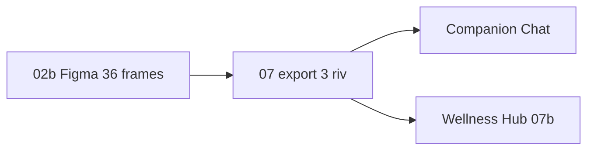

# Rive — чат и Wellness Hub (один art, два экрана)

**Канон:** [RIVE_MASTER_PLAN.md](./RIVE_MASTER_PLAN.md) · art: [COMPANION_HERO_ART_CANON.md](./COMPANION_HERO_ART_CANON.md)

> **PO 2026-06-04:** рисуем **только 3×** `.riv`. Wellness **не** заказывает отдельный art.

---

## Два экрана — один бандл

| Экран | Задача | Файлы | Размер на UI |
|-------|--------|-------|--------------|
| **Companion чат** | HERO-3-07 | `unicorn` · `aladdin` · `genie` | 360×480, 56% высоты, 13 emotion + `mouth_open` |
| **Wellness Hub** | HERO-3-07b / r100-7-07 | **те же 3** | 48pt chip, 1 emotion по pillar |

---

## Wellness r100-7-07 (не отдельный трек art)

| | |
|---|---|
| **План** | [WELLNESS_PILLAR_RIVE_PLAN.md](./WELLNESS_PILLAR_RIVE_PLAN.md) |
| **iOS** | `WellnessPillarEmotionView` + `WellnessHubScreen` ✅ |
| **Блокер** | Production `.riv` из шага **07** |
| **Не делать** | 4× `wellness_*.riv`, 160×160, `WellnessPillarRiveHost` |

### Pillar → emotion (канон)

| pillar | Эмоция |
|--------|--------|
| cognitive | `thinking` |
| behavioral | `happy` |
| humanistic | `comfort` |
| jung | `curious` |

---

## Companion HERO-3 (art)

| Документ | Содержание |
|----------|------------|
| [COMPANION_HEROES_3_FIGMA_RIVE_PLAN.md](./COMPANION_HEROES_3_FIGMA_RIVE_PLAN.md) | Полный план 6 шляп |
| [COMPANION_RIVE_EXPORT_CHECKLIST.md](./COMPANION_RIVE_EXPORT_CHECKLIST.md) | Export |
| [COMPANION_IMPLEMENTATION_TODOS.md](./COMPANION_IMPLEMENTATION_TODOS.md) | HERO-3-07, 07b |

---

## QA после 07

1. iPhone — **Мир героев / чат**: Rive, эмоции, TTS рот.  
2. iPhone — **Wellness Hub**: на каждой карточке **тот же** выбранный герой; разные **подписи и цвет**; child — 2 карточки, **не** «другой персонаж на дорожку».

---

*См. [RIVE_MASTER_PLAN.md](./RIVE_MASTER_PLAN.md) для чеклиста «что делать дальше».*
