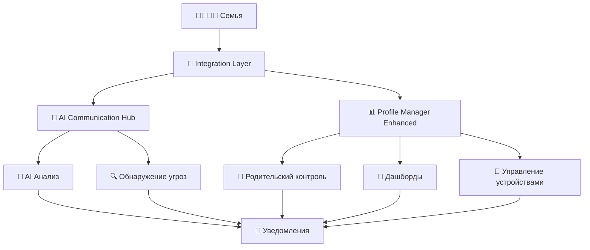

# 🛡️ АРХИТЕКТУРА СЕМЕЙНОЙ БЕЗОПАСНОСТИ ALADDIN

## 📋 ОСНОВНЫЕ КОМПОНЕНТЫ

### 1. AI АГЕНТ КОММУНИКАЦИИ
**Файл:** `security/ai_agents/family_communication_hub_a_plus.py`
**Роль:** Мозг системы безопасности
- 🧠 AI анализ всех семейных сообщений
- 🔍 Обнаружение угроз и подозрительной активности
- 📊 Кластеризация и приоритизация сообщений
- 😊 Анализ тональности и эмоционального состояния
- 🚨 Автоматические уведомления о рисках

### 2. ОСНОВНОЙ МЕНЕДЖЕР ПРОФИЛЕЙ
**Файл:** `security/family/family_profile_manager_enhanced.py`
**Роль:** Центр управления семьей
- 👨‍👩‍👧‍👦 Управление профилями всех членов семьи
- 📱 Персональные дашборды для каждого
- 👶 Родительский контроль и профили детей
- 📱 Управление устройствами и безопасными зонами
- 📈 Статистика и аналитика безопасности

### 3. СЛОЙ ИНТЕГРАЦИИ
**Файл:** `security/family/family_integration_layer.py`
**Роль:** Координатор системы
- 🔗 Связывает AI агента с менеджером профилей
- ⚡ Обрабатывает все запросы и команды
- 🛡️ Обеспечивает безопасность данных
- 📝 Логирует все действия системы
- 🔔 Управляет уведомлениями и алертами

## 🏗️ ДИАГРАММА АРХИТЕКТУРЫ



## 📊 СТАТИСТИКА ИНТЕГРАЦИИ

| Компонент | Строк кода | Функций | Статус |
|-----------|------------|---------|--------|
| AI Communication Hub | ~500 | 20+ | ✅ Активен |
| Profile Manager Enhanced | 1318 | 89+ | ✅ Активен |
| Integration Layer | ~200 | 10+ | ✅ Активен |
| **ИТОГО** | **2018** | **119+** | **✅ Готово** |

## 🚀 КЛЮЧЕВЫЕ ВОЗМОЖНОСТИ

### 🛡️ БЕЗОПАСНОСТЬ
- ✅ AI мониторинг всех семейных коммуникаций
- ✅ Автоматическое обнаружение подозрительной активности
- ✅ Родительский контроль с гибкими настройками
- ✅ Безопасные зоны с GPS мониторингом
- ✅ Ограничения времени использования устройств

### 📊 УПРАВЛЕНИЕ
- ✅ Единый интерфейс для всей семьи
- ✅ Персональные дашборды для каждой роли
- ✅ Централизованное управление профилями
- ✅ Автоматические уведомления о важных событиях
- ✅ Детальная статистика и аналитика

### 🧠 ИНТЕЛЛЕКТ
- ✅ Машинное обучение для анализа поведения
- ✅ Кластеризация сообщений по важности
- ✅ Анализ тональности и эмоций
- ✅ Предсказание рисков на основе паттернов
- ✅ Адаптивные алгоритмы безопасности

## 📁 РАСПОЛОЖЕНИЕ ФАЙЛОВ

```
ALADDIN_NEW/
├── security/
│   ├── ai_agents/
│   │   └── family_communication_hub_a_plus.py  # AI агент
│   └── family/
│       ├── family_profile_manager_enhanced.py  # Основной менеджер
│       └── family_integration_layer.py        # Слой интеграции
└── docs/
    └── architecture/
        └── family_security_architecture.md    # Эта диаграмма
```

## 🎯 ЗАКЛЮЧЕНИЕ

Эти 3 файла составляют **ядро всей семейной безопасности ALADDIN**:
- **AI агент** - думает и анализирует
- **Менеджер профилей** - управляет и контролирует  
- **Слой интеграции** - координирует и связывает

**Вместе они создают мощную, интеллектуальную систему защиты семьи!** 🚀🛡️