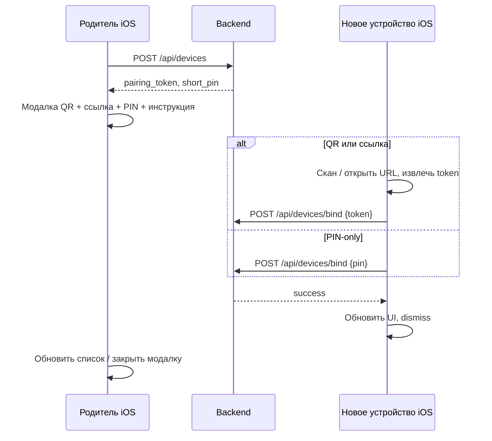

# План: привязка устройства (гибрид QR + ссылка + PIN) и TODO

**Версия плана:** 1.0  
**Статус:** основной клиентский поток и гибрид A+B на бэкенде в репозитории реализованы; деплой прода и Universal Links — отдельно.  
**Связанные файлы (текущее состояние):** `Shared/Components/Modals/DevicePairingModal.swift`, `Screens/28_JoinDeviceScreen.swift`, `Core/Network/APIService.swift` (`bindDevice`), бэкенд `app/routers/misc_other_compat.py` (`POST /api/devices`, `POST /api/devices/bind`).

---

## 1. Решение по модели: гибрид (рекомендуется)

| Путь | Ввод на новом устройстве | Тело `POST /api/devices/bind` | Заметки |
|------|---------------------------|--------------------------------|---------|
| **A. QR / ссылка** | Скан или открытие ссылки | `token` = `pairing_token` (обязательно), `pin` опционально | Основной путь, минимум ошибок. |
| **B. PIN-only** | Только 6 цифр | `token` пустой или опущен, `pin` = 6 цифр | Нужна доработка бэкенда: однозначный поиск pending-записи по `short_pin` + TTL + лимит попыток. |
| **C. Усиление (опционально)** | Токен + PIN | оба поля | Если захотите «как банк»: сначала токен из QR, PIN как второй фактор для bind. |

**Итог:** в продукте держим **гибрид A + B**: QR/ссылка как default; PIN-only как понятный запасной сценарий «камера не работает / диктуем голосом». Вариант C включаем только при явном требовании безопасности.

---

## 2. Логика «на 100%» (целостная цепочка)

### Родительское устройство

1. Экран «Устройства» → **Добавить устройство** → заполнение формы → **`POST /api/devices`**.
2. Успех → модалка с:
   - **QR** (полезная нагрузка: токен привязки, см. п. B iOS),
   - **Поделиться ссылкой** (тот же токен в Universal Link / custom URL),
   - **PIN** в формате **XXX-XXX** + одна строка: **куда нажать на втором телефоне** (путь 1:1 по пунктам меню),
   - Кнопка **Готово** (после фактической привязки на втором устройстве или «пропустить позже» — политика продукта).

### Новое устройство

3. Пользователь открывает приложение → пункт **«Присоединить устройство к семье»** (или эквивалент в онбординге / Настройках / Семье — **единый путь везде**).
4. Дальше один из вариантов:
   - **Скан QR** встроенным сканером → извлечь `token` → **`POST /api/devices/bind`**;
   - **Ввод 6 цифр** (без пробела или с маской) → **`POST /api/devices/bind`** (режим PIN-only после доработки API);
   - **Открыть ссылку** из SMS / iMessage / буфера → обработка **Universal Link** или `aladdin://` → bind с `token`.

### Завершение

5. Успешный bind → сервер помечает сессию привязки (у вас уже зачистка `pairing_token` в `UPDATE`).
6. Клиенты: **обновить список устройств / семью**, закрыть модалку на родителе, закрыть экран привязки на новом устройстве, при необходимости показать короткий success.

---

## 3. Подсказки UX (принципы «максимально просто»)

- **Один канонический путь в меню** на новом устройстве; тот же текст в модалке родителя и в заголовке экрана привязки.
- PIN на родителе: отображение **`334-329`**, подпись: «Введите **шесть цифр подряд** на втором телефоне: **334329**» (или маска ввода, принимающая пробел).
- После bind: одно предложение «Устройство в семье» + что делать дальше (войти в профиль ребёнка и т.д., по продукту).
- Локализация: **все** строки модалки и `JoinDeviceScreen` через `LocalizationManager` (RU/EN).

---

## 4. Фазы реализации и TODO (чеклист)

Отмечайте `- [ ]` → `- [x]` по мере выполнения.

### Фаза A — Контракт API и бэкенд (обязательно)

- [x] **A1.** Зафиксировать в OpenAPI/README тело `POST /api/devices/bind`: варианты `{ "token": "..." }`, `{ "pin": "123456" }`, опционально `{ "token", "pin" }`. (См. `docs/api/DEVICE_BIND.md`.)
- [x] **A2.** Реализовать **PIN-only bind**: поиск строки в `aladdin_family_devices` по `short_pin`, условия `pairing_token IS NOT NULL`, `created_at` в пределах **TTL** (например 15 мин, согласовать).
- [x] **A3.** **Идемпотентность:** повторный bind по уже очищенному токену → **409** (`Pairing token already used`); неизвестный токен/PIN → **404**.
- [x] **A4.** **Лимит попыток** по IP / по PIN (например 5 неудачных / 15 мин) — защита от перебора 6-значного кода.
- [x] **A5.** Логи: `device_bind_ok`, `device_bind_miss` (неудачный bind), `device_bind_rate_limited` (429); отдельные `device_bind_pin_miss` / `device_bind_expired` — по желанию для метрик.
- [x] **A6.** Деплой на прод по гайду сервера, смоук `curl` с тестовым JWT (при наличии).

### Фаза B — Новое устройство (iOS)

- [x] **B1.** Добавить **пункт навигации** «Присоединить устройство к семье» (Настройки и/или Семья и/или первый запуск — согласовать одно место + дубли только deeplink).
- [x] **B2.** Подключить **`JoinDeviceScreen`** к этому пункту (сейчас экран изолирован).
- [x] **B3.** Заменить заглушку сканера на **реальный QR** (AVFoundation / CodeScanner): распознавание `aladdin://bind?token=…` и **https://** варианта Universal Link.
- [x] **B4.** Регистрация **обработки URL**: `onOpenURL` + `CFBundleURLTypes` (`aladdin://`). **Associated Domains** + AASA для **https** Universal Links — отдельная задача (сайт + Xcode).
- [x] **B5.** Вызов **`bindDevice`**: при скане передавать **реальный `token`**; при PIN-only — **`pin`** (после A2); не отправлять `token: ""`.
- [x] **B6.** После успеха: **обновить** список устройств / семью (существующие нотификации/рефреш главной), dismiss, алерт успеха.

### Фаза C — Родительская модалка и тексты

- [x] **C1.** В **`DevicePairingModal`**: блок «Куда нажать на втором телефоне» с **точным путём** (после B1).
- [x] **C2.** Форматирование PIN **XXX-XXX** + подсказка про ввод без пробела / маска.
- [x] **C3.** Вынести все строки в **локализацию** (ключи RU/EN).
- [x] **C4.** Копирование PIN в буфер (кнопка «Скопировать код») + haptic.

### Фаза D — Безопасность и наблюдаемость

- [ ] **D1.** Убедиться, что bind доступен только **аутентифицированному** пользователю (как сейчас) и при необходимости ограничить «чужую» семью (политика: только член семьи или любой залогиненный — согласовать).
- [ ] **D2.** Метрики / аналитика: `device_pairing_started`, `device_pairing_completed`, `device_pairing_failed_reason`.
- [ ] **D3.** Регрессионные тесты: успешный bind по token; успешный по PIN; истёкший PIN; неверный PIN.

### Фаза E — Опционально

- [ ] **E1.** Ручной ввод длинного токена (поле «Для опытных пользователей»).
- [ ] **E2.** NFC / Nearby Interaction (оценка стоимости разработки).

---

## 5. Критерии готовности («готово к релизу»)

1. Родитель видит модалку с **тремя** способами и **понятной инструкцией** для второго телефона.  
2. На новом устройстве есть **один** очевидный вход в сценарий привязки.  
3. Работают **QR/ссылка (token)** и **PIN-only** согласно контракту A.  
4. Нет «тихих» ошибок: пустой `token` при ручном режиме не уходит на сервер без осмысленного тела PIN-only.  
5. После успеха оба клиента в актуальном состоянии списков/семьи.

---

## 6. Порядок работ (рекомендуемая очередь)

`A2–A5` → `B2, B5` → `B3, B4` → `C1–C4` → `D*` → `E*`.

При согласовании можно сузить scope (например, сначала только token-path + навигация, PIN-only в следующем спринте).
