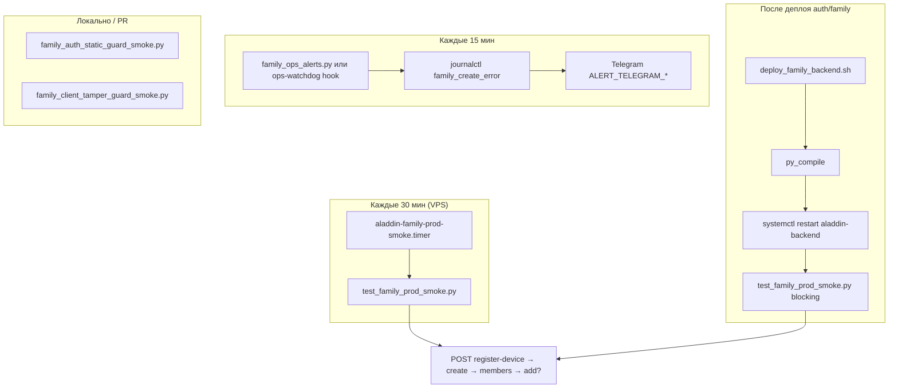

# Family Prod Smoke — план реализации (P0–P4)

**Версия:** 1.0 · **Дата:** 2026-06-16  
**Корень:** `ALADDIN_iOS` · **Prod:** `127.0.0.1:8002` / `aladdin-ai.ru`  
**Контекст:** инцидент `family_create_error` / `integer out of range` (pseudo JWT `user_id` > PG `INTEGER`).

**Связанные документы:**

| Документ | Роль |
|----------|------|
| `docs/FAMILY_API_SMOKE_REGIMEN.md` | Ручной регламент (остаётся для QA) |
| `docs/server/test_antifake_prod_smoke.py` | Эталон формата smoke |
| `docs/server/test_security_prod_smoke.py` | Оркестратор domain-smokes |
| `ALADDIN_SERVER_CONNECTION_GUIDE_FOR_ML_SYSTEMS.md` | SSH / деплой §10, §12 |
| `docs/server/BACKEND_FAMILY_JOIN_AND_ADD_GATE.md` | Контракт join/add |

---

## 0. Цели и Definition of Done

### Цели

1. **Поймать регрессию до пользователя** — цепочка `register-device` → `family/create` → `members` (+ опционально `add`).
2. **Блокировать плохой деплой** `auth_router.py` / `family.py`.
3. **Алертить** на `family_create_error` в journal.
4. **Закрепить инварианты в статике** до выката.
5. **Долгосрочно** — схема БД или жёсткий инвариант JWT.

### DoD (весь пакет)

| # | Критерий |
|---|----------|
| 1 | `test_family_prod_smoke.py` → `{"pass": true}`, exit 0 на prod |
| 2 | systemd timer активен, последний run в journal без FAIL |
| 3 | `scripts/deploy_family_backend.sh` (или расширение server deploy) — smoke **blocking** после restart |
| 4 | Алерт при `family_create_error` за окно N минут (Telegram ops-канал) |
| 5 | `family_auth_static_guard_smoke.py` в локальном gate / pre-scp |
| 6 | Документ обновлён: `FAMILY_API_SMOKE_REGIMEN.md` § «автоматический smoke» |

---

## 1. Архитектура (целевая)



**Рекомендация по интеграции timer:**

| Вариант | Плюсы | Минусы |
|---------|-------|--------|
| **A. Отдельный timer** `aladdin-family-prod-smoke` (рекомендуется) | Изоляция; family FAIL не маскируется; свой интервал 30 мин; create пишет в БД | Ещё один unit |
| B. Домен `family` в `test_security_prod_smoke.py` | Один timer | 11 доменов уже тяжёлые; family create = side effect в PG |
| C. Оба: timer + строка в security report | Максимальная видимость | Дублирование нагрузки |

**Выбор:** **A** для periodic + **обязательный blocking smoke в deploy** (P1). Опционально позже добавить read-only ping в security orchestrator (health family без create).

---

## 2. P0 — `test_family_prod_smoke.py`

### 2.1 Файл

`docs/server/test_family_prod_smoke.py`

### 2.2 Контракт (как antifake)

- Env: `FAMILY_SMOKE_BASE` (default `http://127.0.0.1:8002`)
- Env: `FAMILY_SMOKE_DEVICE_ID` (optional override)
- Env: `FAMILY_SMOKE_SKIP_ADD=1` — пропустить шаг add (быстрый режим)
- Env: `FAMILY_SMOKE_SKIP_CLEANUP=1` — не удалять тестовую семью (debug)
- Выход stdout: `{"pass": bool, "failures": [...], "steps": {...}}`
- Exit: `0` if pass else `1`

### 2.3 Канонический device_id (overflow-prone)

```python
import hashlib
PG_INT_MAX = 2_147_483_647
DEFAULT_SMOKE_DEVICE_ID = "ALADDIN-FAMILY-SMOKE-OVERFLOW-v1"

def _legacy_pseudo_would_overflow(device_id: str) -> bool:
    pseudo = int(hashlib.sha256(device_id.encode()).hexdigest()[:8], 16)
    return pseudo > PG_INT_MAX
```

Перед прогоном: **assert** `_legacy_pseudo_would_overflow(device_id)` — иначе smoke бессмысленен.

### 2.4 Шаги smoke (порядок обязателен)

| Step | HTTP | Проверки |
|------|------|----------|
| **S0** | `GET /api/health` | 200 |
| **S1** | `POST /api/auth/register-device` | 200; `access_token`; decode JWT payload (без verify) — `user_id`/`sub` **≤ PG_INT_MAX** |
| **S2** | `POST /api/family/create` | 200; `family_id` matches `FAM_`; `creator_member_id` matches `MEM_` |
| **S3** | `GET /api/family/members` + header `X-Family-Id` | 200; `len(members) >= 1`; header `X-Resolved-Family-Id` если есть |
| **S4** (opt) | `POST /api/family/add` | 200 **или** 409 `family_roster_full`; не 500 |
| **S5** (opt) | `GET /api/family/stats` | `totalMembers` согласован с members; `familyRosterUsed <= familyRosterMax` |

Тело create (как iOS):

```json
{
  "role": "parent",
  "age_group": "24-55",
  "personal_letter": "Z",
  "device_type": "smartphone"
}
```

### 2.5 Cleanup (рекомендуется)

После успеха — **не удалять** семью на prod smoke (проще, как antifake device). Использовать **один стабильный** `device_id` → одна smoke-семья на владельца; шаг create идемпотентен через новый `family_id` каждый раз **или** проверять «у device уже есть семья»:

- **Стратегия v1 (простая):** каждый run создаёт **новую** семью (мусор в `families`). Раз в неделю cron cleanup `families` где `id` owner smoke user и `created_at` > 7d.
- **Стратегия v2 (чище):** если у smoke `users.id` уже есть семья — пропустить create, проверить members ≥ 1; раз в месяц пересоздать device_id suffix.

**Рекомендация v1** для P0 + отдельная задача P0-cleanup.

### 2.6 Реализация — чеклист кода

- [ ] Скопировать `_request()` из `test_antifake_prod_smoke.py`
- [ ] `_register_device()` → token
- [ ] `_decode_jwt_payload_unverified()` — только base64 payload, проверка numeric sub
- [ ] `main()` — failures list, json report
- [ ] `if __name__ == "__main__": raise SystemExit(main())`
- [ ] Shebang `#!/usr/bin/env python3`

### 2.7 Локальная проверка

```bash
cd ALADDIN_iOS
python3 docs/server/test_family_prod_smoke.py   # против staging / SSH tunnel

# На сервере:
ssh root@149.154.65.180 'cd /opt/aladdin-backend && \
  FAMILY_SMOKE_BASE=http://127.0.0.1:8002 \
  ./venv/bin/python3 docs/server/test_family_prod_smoke.py'
```

### 2.8 systemd (отдельный timer)

Файлы (по образцу `docs/server/aladdin-security-prod-smoke.*`):

| Файл | Содержание |
|------|------------|
| `docs/server/aladdin-family-prod-smoke.service` | `Type=oneshot`, `ExecStart=.../test_family_prod_smoke.py`, `WorkingDirectory=/opt/aladdin-backend`, `PYTHONPATH=...` |
| `docs/server/aladdin-family-prod-smoke.timer` | `OnBootSec=7min`, `OnUnitActiveSec=30min` |

Установка на VPS:

```bash
scp docs/server/aladdin-family-prod-smoke.* root@149.154.65.180:/etc/systemd/system/
ssh root@149.154.65.180 'systemctl daemon-reload && \
  systemctl enable --now aladdin-family-prod-smoke.timer && \
  systemctl start aladdin-family-prod-smoke.service && \
  journalctl -u aladdin-family-prod-smoke.service -n 30 --no-pager'
```

### 2.9 Метрика успеха (для P2)

Smoke при pass пишет timestamp:

```bash
echo "$(date -u +%Y-%m-%dT%H:%M:%SZ)" > /var/lib/aladdin/family_smoke_last_success.timestamp
```

(создать `/var/lib/aladdin/` на сервере, chmod 755)

---

## 3. P1 — Deploy gate

### 3.1 Новый скрипт

`scripts/deploy_family_backend.sh`

**Триггерные файлы** (scp список):

- `app/routers/auth_router.py`
- `app/routers/family.py`
- `app/security/family/family_registration.py` (если меняется)
- `docs/server/test_family_prod_smoke.py`

### 3.2 Алгоритм (как `deploy_antifake_m1.sh` §post-deploy)

1. `git status` / подтвердить корень `ALADDIN_iOS`
2. `curl` health снаружи (опционально)
3. SSH: backup `.py.bak.TIMESTAMP` в `/opt/aladdin-backend/app/routers/`
4. `scp` изменённые файлы + smoke script
5. `python3 -m py_compile` всех изменённых `.py`
6. `systemctl restart aladdin-backend`
7. `sleep 2` + `systemctl is-active aladdin-backend`
8. **`FAMILY_SMOKE_BASE=http://127.0.0.1:8002 ./venv/bin/python3 docs/server/test_family_prod_smoke.py`**
   - **FAIL → exit 1** (не «WARN» как у antifake — family критичнее для онбординга)
9. Печать backup path для rollback

### 3.3 Rollback runbook (короткий)

`docs/server/RUNBOOK_FAMILY_DEPLOY_ROLLBACK.md`:

1. `cp auth_router.py.bak.* auth_router.py`
2. `cp family.py.bak.* family.py`
3. `py_compile` + `systemctl restart aladdin-backend`
4. Повторить smoke

### 3.4 Обновить гайды

- `ALADDIN_SERVER_CONNECTION_GUIDE_FOR_ML_SYSTEMS.md` — § новый «Family smoke gate»
- `.cursor/rules/aladdin-server-connection.mdc` — одна строка про `deploy_family_backend.sh`

---

## 4. P2 — Алерты по логам

### 4.1 Скрипт

`scripts/family_ops_alerts.py` (по образцу `scripts/antifake_ops_alerts.py`)

**Проверки:**

| Check | Условие FAIL |
|-------|----------------|
| `family_create_error` | `journalctl -u aladdin-backend --since "20 min ago"` содержит строку |
| `integer out of range` | то же |
| `family_smoke_stale` | файл timestamp старше 45 мин (timer 30 + slack) |

**Действие:** POST Telegram `ALERT_TELEGRAM_BOT_TOKEN` + `ALERT_TELEGRAM_CHAT_ID` из `/opt/aladdin-telegram-shop-bot/shared/.env` (как `verify_ops_alerts_routing.sh`).

### 4.2 Установка

```bash
# crontab или systemd timer каждые 15 мин
*/15 * * * * cd /opt/aladdin-backend && ./venv/bin/python3 scripts/family_ops_alerts.py --check-all >> /var/log/aladdin-family-ops.log 2>&1
```

Альтернатива: расширить существующий `ops-watchdog` одним check-блоком — меньше moving parts, если watchdog уже на сервере.

### 4.3 Анти-спам

- Cooldown 60 мин на одинаковый alert key (файл `/var/lib/aladdin/family_alert_cooldown`)
- В сообщении: последние 3 строки journal с `family_create`

---

## 5. P3 — Статика до деплоя

### 5.1 Новый скрипт

`scripts/family_auth_static_guard_smoke.py`

**Проверки в `app/routers/auth_router.py`:**

| Assert | Зачем |
|--------|-------|
| `_ensure_db_user_for_device` существует | Нет регрессии к pseudo-only |
| `register_device` вызывает `_ensure_db_user_for_device` | |
| Нет присвоения `pseudo_user_id = int(hashlib.sha256` без комментария DEPRECATED | |
| `_PG_INT_MAX` или `2_147_483_647` упомянут | |

**Проверки в `app/routers/family.py`:**

| Assert | Зачем |
|--------|-------|
| `_lookup_or_create_user_id_for_device` или `claim_device_id` до numeric parse | |
| `_PG_INT_MAX` guard на numeric sub | |
| `INSERT INTO families` рядом с `owner_user_id` | |

**Расширить** `scripts/family_client_tamper_guard_smoke.py`:

- Вызов `family_auth_static_guard` из одного entrypoint `scripts/verify_family_static_gates.sh`

### 5.2 Локальный gate

```bash
#!/usr/bin/env bash
# scripts/verify_family_static_gates.sh
set -euo pipefail
python3 scripts/family_client_tamper_guard_smoke.py
python3 scripts/family_auth_static_guard_smoke.py
echo "family static gates: OK"
```

Запуск: перед `scp` в `deploy_family_backend.sh` **локально** на Mac.

### 5.3 CI (опционально)

GitHub Actions job `family-static-gates` на PR, если workflow для backend есть.

---

## 6. P4 — Схема БД (долгосрочно)

### 6.1 Варианты

| Вариант | Описание | Когда |
|---------|----------|-------|
| **4A. Инвариант only** (текущий фикс) | JWT только `users.id` из sequence | Уже сделано; smoke S1 ловит регрессию |
| **4B. BIGINT migration** | `ALTER TABLE families ALTER COLUMN owner_user_id TYPE BIGINT` + `family_members.user_id` | Если понадобятся внешние numeric id |

### 6.2 Миграция (если 4B)

Файл: `app/database/migrations/20260616_family_user_id_bigint.sql`

```sql
ALTER TABLE families ALTER COLUMN owner_user_id TYPE BIGINT;
ALTER TABLE family_members ALTER COLUMN user_id TYPE BIGINT;
```

Порядок: backup PG → миграция на staging → smoke → prod в maintenance window.

### 6.3 ADR (2026-06-16): BIGINT vs JWT-only

**Решение:** **4A — invariant only** (JWT всегда `users.id` из sequence; smoke S1 ловит регрессию).

**BIGINT migration (4B)** — отложена до появления требования хранить внешние numeric id в `owner_user_id`.

### 6.4 Опциональная проверка в smoke (4A)

```sql
SELECT MAX(owner_user_id) FROM families WHERE owner_user_id > 2147483647;
-- ожидание: 0 rows
```

---

## 7. Порядок реализации (спринт)

| Фаза | Задачи | Оценка |
|------|--------|--------|
| **Sprint 1** | P0 smoke script + локальный прогон + deploy на VPS + timer | 2–3 ч |
| **Sprint 2** | P1 deploy script + rollback runbook | 1–2 ч |
| **Sprint 3** | P3 static guards + verify_family_static_gates.sh | 1 ч |
| **Sprint 4** | P2 family_ops_alerts + crontab | 1–2 ч |
| **Sprint 5** | P0 cleanup cron + доки + опционально P4 | backlog |

**Не начинать P2 до зелёного P0 на prod** — иначе алерты без working smoke.

---

## 8. Cursor TODO (ID для TodoWrite)

| ID | Задача | Приоритет |
|----|--------|-----------|
| `fam-p0-01` | Написать `docs/server/test_family_prod_smoke.py` | P0 |
| `fam-p0-02` | Прогон smoke на prod (SSH) | P0 |
| `fam-p0-03` | `aladdin-family-prod-smoke.service` + `.timer` | P0 |
| `fam-p0-04` | Установить timer на VPS, проверить journal | P0 |
| `fam-p0-05` | Timestamp file `/var/lib/aladdin/family_smoke_last_success.timestamp` | P0 |
| `fam-p1-01` | `scripts/deploy_family_backend.sh` (blocking smoke) | P1 |
| `fam-p1-02` | `docs/server/RUNBOOK_FAMILY_DEPLOY_ROLLBACK.md` | P1 |
| `fam-p1-03` | Обновить server connection guide §family | P1 |
| `fam-p2-01` | `scripts/family_ops_alerts.py` | P2 |
| `fam-p2-02` | Crontab/timer + verify Telegram routing | P2 |
| `fam-p3-01` | `scripts/family_auth_static_guard_smoke.py` | P3 |
| `fam-p3-02` | `scripts/verify_family_static_gates.sh` | P3 |
| `fam-p3-03` | Вызов static gate в deploy script (локально) | P3 |
| `fam-p4-01` | Решение: BIGINT vs invariant-only (ADR в плане) | P4 |
| `fam-p4-02` | Миграция SQL (если BIGINT) | P4 |
| `fam-doc-01` | Обновить `FAMILY_API_SMOKE_REGIMEN.md` §auto | Doc |

---

## 9. Риски и митигация

| Риск | Митигация |
|------|-----------|
| Smoke создаёт много семей | Стабильный device_id + cleanup cron; или skip create if family exists |
| Timer FAIL после деплоя auth | P1 blocking smoke до enable timer |
| Ложные алерты | Cooldown + проверка smoke timestamp |
| JWT decode в smoke без verify | Только assert на numeric range, не security audit |
| Внешний curl health timeout | Smoke на `127.0.0.1` внутри VPS |

---

## 10. Команды быстрого контроля (оператор)

```bash
# Smoke вручную
ssh -i ~/.ssh/aladdin_server root@149.154.65.180 \
  'cd /opt/aladdin-backend && FAMILY_SMOKE_BASE=http://127.0.0.1:8002 ./venv/bin/python3 docs/server/test_family_prod_smoke.py'

# Статус timer
ssh ... 'systemctl list-timers | grep family'

# Последние ошибки семьи
ssh ... 'journalctl -u aladdin-backend --since "1 hour ago" | grep family_create'

# Static gates локально
cd ALADDIN_iOS && bash scripts/verify_family_static_gates.sh
```

---

*План SSOT для family prod gates. При реализации закрывать пункты в Cursor TODO `fam-p0-*` … `fam-p4-*`.*
