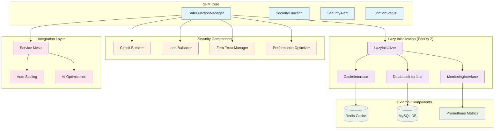
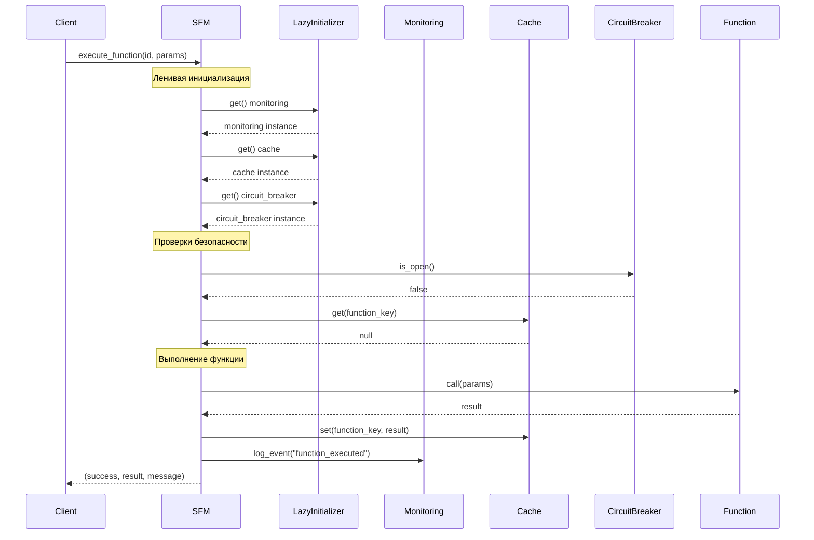
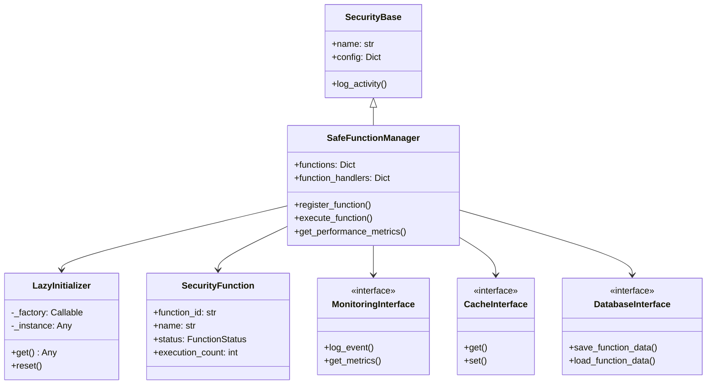
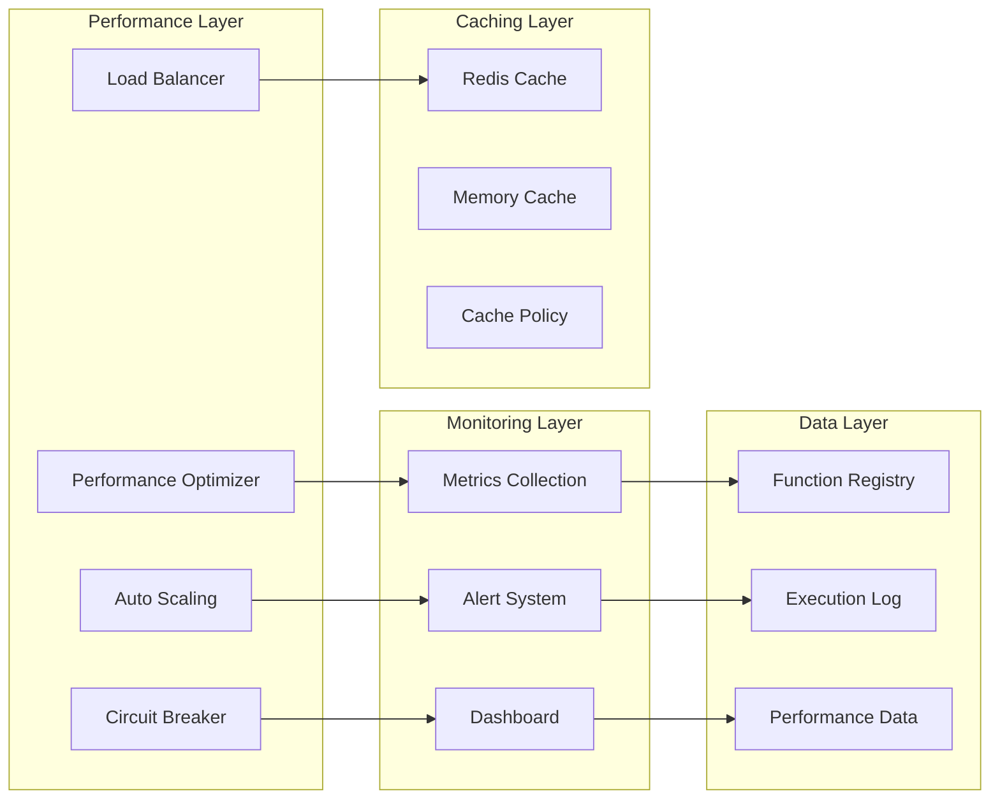
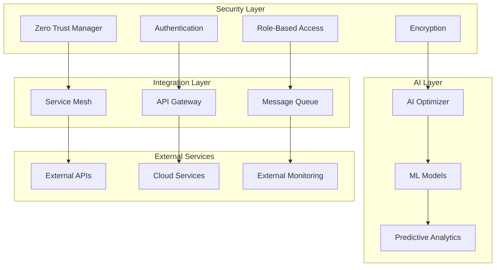

# 🏗️ АРХИТЕКТУРНАЯ ДИАГРАММА SFM (PRIORITY 3)

## 📊 Общая архитектура Safe Function Manager

## 🔄 Поток выполнения функций

## 🏛️ Иерархия классов

## 📈 Компоненты производительности

## 🔐 Безопасность и интеграция

## 📊 Статистика и метрики

| Компонент | Метрики | Описание |
|-----------|---------|----------|
| **SFM Core** | 3744 строки, 107 методов, 4 класса | Основной функционал |
| **Lazy Init** | 0 инициализаций до первого использования | Оптимизация производительности |
| **Monitoring** | 171 упоминание мониторинга | Полное покрытие |
| **Caching** | Redis + Memory | Двухуровневое кэширование |
| **Security** | 386 функций в реестре | Полная интеграция |
| **Performance** | 9/10 оценка | Отличная производительность |

## 🎯 Приоритеты реализации

### ✅ **ПРИОРИТЕТ 1 (КРИТИЧЕСКИЙ) - ВЫПОЛНЕНО**
- [x] Исправление стиля кода (4 длинные строки)
- [x] Удаление неиспользуемых импортов (2 импорта)

### 🔄 **ПРИОРИТЕТ 2 (ВЫСОКИЙ) - В ПРОЦЕССЕ**
- [x] Ленивая инициализация компонентов
- [x] Создание интерфейсов (Protocols)
- [ ] Интеграция с существующим SFM

### 📋 **ПРИОРИТЕТ 3 (СРЕДНИЙ) - В ПРОЦЕССЕ**
- [x] Архитектурная диаграмма
- [ ] Руководство по использованию
- [ ] Документация API

## 🚀 Следующие шаги

1. **Интеграция ленивой инициализации** в основной SFM
2. **Создание руководства по использованию**
3. **Применение алгоритма исправления ошибок**
4. **Тестирование всех компонентов**
5. **Финальная оптимизация производительности**