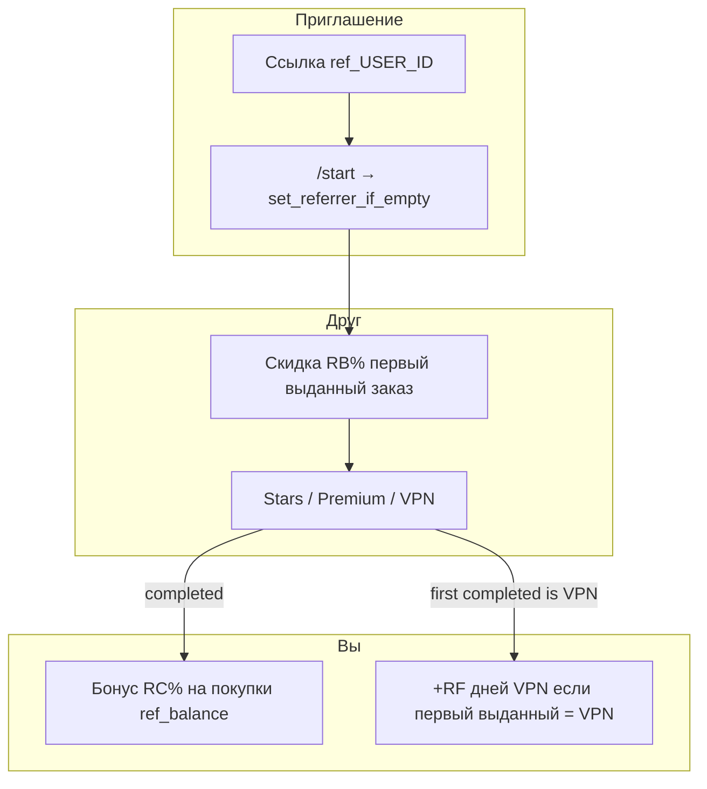

# Единая реферальная программа ALADDIN Shop Bot (UX + внедрение)

Версия: 2026-05-22. Продуктовый принцип: **мы не предлагаем людям «зарабатывать деньги»** рефералкой.  
Техника в БД (`ref_balance_rub`, `commission_rub`) **не меняется** — меняются **формулировки**, **одна ссылка**, **один экран условий**.

Связано: `ML_SYSTEM_HANDOFF_FINAL.md` §17, `EDGE_CASES.md`.

---

## 1. Позиционирование (обязательно)

### 1.1 Что говорим пользователю

| Можно | Нельзя |
|------|--------|
| Пригласить друга в бот | Заработать, заработок, доход |
| Скидка другу на первую выданную покупку | Комиссия, проценты с продаж, MLM |
| Бонус на ваши покупки в магазине (в ₽) | Реферальный доход, выплаты, вывод |
| Бонусные дни VPN | Партнёрская программа за деньги |
| Внутренний счёт магазина для оплаты заказов | Инвестиции, пассивный доход |

### 1.2 Что происходит технически (без изменений)

1. Друг переходит по **`ref_{ваш_telegram_id}`** → фиксируется `users.referrer_id` (один раз).
2. Пока у друга **нет выданного** заказа — скидка **`REF_BUYER_*` %** на любой товар (Stars, Premium, VPN).
3. После **первого выданного** заказа друга — на ваш **`ref_balance_rub`** начисляется **`REF_REFERRER_*` %** (в UI: **«бонус на покупки»**, не «комиссия»).
4. Если первая выданная покупка друга — **VPN** — дополнительно **+дни** другу и вам (`VPN_REFERRAL_*_DAYS`) через VPN API.

П.4 — **дополнительный бонус за тип товара**, не отдельная «VPN-рефералка за деньги».

### 1.3 Единая ссылка (канон)

```
https://t.me/{SHOP_BOT_USERNAME}?start=ref_{user_id}
```

- Stars, Premium, VPN, профиль, кнопки «Скопировать для друга» — **только эта ссылка**.
- Короткий URL **`https://aladdin-ai.ru/r/{code}`** (Partner API `:8090`) — **опционально** для рекламы; редирект на `?start=ref_{owner_id}` (см. день 3, опционально).

---

## 2. Словарь терминов в боте (замена в копирайте)

| Было в UI | Стало в UI | Где менять |
|-----------|------------|------------|
| Реф. баланс | **Бонус на покупки** (или «Бонусы магазина») | `hub.py` профиль |
| начисляется X% на реф. баланс | **бонус X% на покупки в магазине** (можно оплатить Stars / Premium / VPN) | `marketing.py`, `hub.py` |
| комиссия | **бонус за приглашение** | везде user-facing |
| Всего начислено с рефки | **Бонусов за приглашения** (накоплено) | профиль, партнёры (если показываем) |
| Рефералка VPN (отдельный заголовок) | **Бонус за приглашение** + подпункт про VPN | `vpn_tariffs.py` |
| Ссылка r-CODE | убрать из основного UI; только `ref_` | `vpn_user_links.py`, `hub.py` |
| 👥 Скопировать для друга | **👥 Скопировать приглашение** (тот же `ref_` URL) | `vpn_user_links.py` |

**Кнопки оплаты** «С баланса» — оставить; это не «заработок», а способ оплаты заказа.

---

## 3. Как должно выглядеть по экранам

### 3.1 Профиль → «Мой профиль» (`hub.profile_body_html`)

**Один блок** «Пригласить друга» (без второго блока «только VPN»).

```text
Пригласить друга в ALADDIN

Ваша ссылка:
https://t.me/...?start=ref_XXXXX

Как это работает
• Друг открывает бота по ссылке и оформляет заказ в магазине.
• Пока у него не было выданной покупки — скидка {RB}% на первый заказ
  (Stars, Premium или VPN).
• После первой выданной покупки друга вам начисляется бонус {RC}% на покупки
  в магазине — им можно оплатить следующие заказы (кнопка «С баланса»).
• Если друг впервые оформит и получит VPN — дополнительно ему +{FF} дн.,
  вам +{RF} дн. к подписке (один раз на каждого приглашённого).

Статистика
• Перешли по ссылке: N
• С выданной покупкой: M
• Бонусов на покупки (накоплено): X ₽

Счёт в магазине (для оплаты заказов): Y ₽
Заказов выдано: … · Сумма покупок: …
```

**Не показывать** отдельную вторую ссылку `r-…`.  
**Не писать** «заработано», «комиссия», «реферальный доход».

Кнопки профиля (без изменения callback):

- `📖 Как работает приглашения` (бывш. «рефералка») → тот же FAQ с новым текстом.

---

### 3.2 FAQ → «Как работает приглашения» (`marketing.referral_faq_html`)

```text
Как работает приглашение друзей

• Поделитесь ссылкой из профиля — друг должен открыть бота по ней.
• Пока у друга ещё не было выданных покупок, на первый заказ действует скидка {RB}%
  (Stars, Premium, VPN — любой товар в магазине).
• После первой выданной покупки друга на ваш счёт в магазине начисляется бонус {RC}%
  от суммы этого заказа. Бонус можно потратить на новые заказы — «С баланса» при оплате.
• Если первой выданной покупкой друга стала подписка VPN — дополнительно бонусные дни
  ему (+{FF}) и вам (+{RF}) к VPN (см. раздел VPN в боте).
• Самоприглашение не засчитывается. Повторные начисления за того же человека — нет.

Это программа скидок и бонусов внутри сервиса ALADDIN, а не выплата денег «с улицы».
```

---

### 3.3 VPN → экран подключения / тарифы (`vpn_referral_blurb_html`)

Тон как у Stars: коротко, без второй программы.

```text
Приглашение друзей

• Та же ссылка, что в «Мой профиль» (ref_…).
• Друг может купить Stars, Premium или VPN — скидка {RB}% на первую выданную покупку в боте.
• Если он впервые получит VPN — вам +{RF} дн., ему +{FF} дн. (один раз на друга).
• Это ссылка в бот, не конфиг WireGuard. Не перепутайте с «запасной подпиской».
```

Кнопка копирования: **«👥 Скопировать приглашение»** — текст = `ref_{id}`, не `r-{code}`.

---

### 3.4 Чекаут Stars / Premium / VPN (`shop.py`)

Сохранить строку про первую покупку, переформулировать:

```text
Первая покупка в магазине: обычно −{RB}% по вашей пригласительной ссылке
(если друг пришёл по ref_ и ещё не было выданных заказов).
```

Для VPN-чекаут — **та же** логика скидки; отдельно не обещать «деньги рефереру».

---

### 3.5 Онбординг / «Почему мы» (`marketing` wow-блоки)

Блок про приглашения (если есть цифры `ref_*`):

- «Скидка другу до первой выдачи»
- «Бонус на ваши покупки после первой выдачи друга»
- «+дни VPN, если друг выбрал VPN»

**Убрать** формулировки «вам начисляются проценты на реф. баланс» из приветствия (см. `marketing.py` ~172, 336–340).

---

### 3.6 Партнёрам / API (`hub` partners)

Раздел **партнёрам** — про **API и бизнес**, не про «рефералку за деньги» для обычных пользователей.  
Пользовательский invite — только профиль + FAQ.  
В API `profile` поле `ref_balance_rub` в OpenAPI можно описать как `store_bonus_rub` в доке (код не трогать в v1).

---

### 3.7 Админка

Внутренние метрики «commission», «referral» — **можно оставить** для операторов.  
Пользовательские рассылки из админки — не использовать «заработок».

---

## 4. Потоки (одна воронка)



| Шаг | Stars/Premium | VPN |
|-----|---------------|-----|
| Ссылка | `ref_` | **та же** `ref_` |
| Скидка в чекауте | да | да |
| Бонус вам в ₽ | после 1-го completed | после 1-го completed (если первый глобальный) |
| Доп. бонус | — | +дни (если первый **VPN** completed) |

---

## 5. План внедрения (3 дня + опция)

### День 1 — копирайт и одна ссылка (без смены экономики)

| # | Файл | Действие |
|---|------|----------|
| 1.1 | `bot/handlers/hub.py` | Один блок «Пригласить друга»; убрать второй VPN-only блок с `r-`; новые термины |
| 1.2 | `bot/services/vpn_user_links.py` | `resolve_friend_referral_url` → `ref_{user_id}`; подпись кнопки «Скопировать приглашение» |
| 1.3 | `bot/services/vpn_tariffs.py` | `vpn_referral_blurb_html` — текст §3.3 |
| 1.4 | `bot/services/marketing.py` | `referral_faq_html`, wow/поддержка — §3.2, §3.5 |
| 1.5 | `bot/handlers/shop.py` | строка первой покупки §3.4 |
| 1.6 | `bot/handlers/hub.py` | кнопка «Как работает приглашения» (label only) |

**DoD дня 1:** в боте нигде в user-facing нет `r-` как основной ссылки; нет «комиссия/заработок/реф. баланс»; VPN и Stars говорят об одной ссылке.

**Тест:** ручной `/start ref_X`, профиль, VPN экран, FAQ; кнопка копирования содержит `ref_`.

---

### День 2 — `referral/on_completed.py` (рефактор, поведение 1:1)

| # | Файл | Действие |
|---|------|----------|
| 2.1 | `bot/services/referral/on_completed.py` | **новый**: перенос тела `apply_completed_side_effects` |
| 2.2 | `bot/services/referral/__init__.py` | экспорт `apply_order_completed_referral_effects` |
| 2.3 | `bot/services/order_flow.py` | тонкая обёртка → вызов referral-модуля |
| 2.4 | `bot/services/referral/attach.py` | опционально: `parse_start_payload`, `attach_referrer` из `common.py` |

**DoD дня 2:** `pytest tests/test_referral_stats.py` зелёный; админ `completed` → те же начисления.

---

### День 3 — тесты, доки, опция `/r/`

| # | Действие |
|---|----------|
| 3.1 | Тест: копирование invite URL из vpn_user_links = `ref_` |
| 3.2 | Обновить `ML_SYSTEM_HANDOFF_FINAL.md` §17 + ссылка на этот файл |
| 3.3 | **Опция:** `partner_api/routers/vpn_ref_landing.py` — редирект `302` на `?start=ref_{owner_id}` вместо `r-{code}` (код в БД оставить для аналитики `vpn_ref_link_open` → можно логировать как `ref_redirect`) |
| 3.4 | `common.py`: по-прежнему принимать `r-` для обратной совместимости старых ссылок |

**DoD дня 3:** документация актуальна; CI/tests referral green.

---

## 6. Что НЕ делаем в этой итерации

- Миграция БД, переименование `ref_balance_rub` / `commission_rub`.
- Изменение `REF_*` / `VPN_REFERRAL_*` процентов и дней.
- Вывод «бонусов» на карту / USDT (никогда в копирайте не обещать).
- Отдельная «денежная» рефералка для VPN.

---

## 7. Чеклист приёмки (продукт)

- [ ] Один URL приглашения во всех разделах (`ref_`).
- [ ] Нет слов: заработок, комиссия, доход, выплата, MLM (user-facing).
- [ ] Друг понимает: скидка на первый заказ (любой товар).
- [ ] Реферер понимает: бонус на покупки в магазине + опционально дни VPN.
- [ ] VPN-блок не создаёт впечатление второй денежной программы.
- [ ] Старая ссылка `r-` всё ещё привязывает реферера (обратная совместимость).
- [ ] После `completed` начисления как до рефактора (регрессия `test_referral_stats`).

---

## 8. Решение по бонусу днями

**Оставляем дни VPN** (`VPN_REFERRAL_FRIEND_DAYS` / `REFERRER_DAYS`) как **дополнительный** подарок за тип товара, не вместо бонуса в ₽.

**Не переходим** на «только ₽» — для ALADDIN сильнее связка «пригласи → друг получил VPN → вы оба продлили подписку», без акцента на деньги.

Внутренний бонус в ₽ остаётся для тех, кто приводит покупателей Stars/Premium; в тексте это **«бонус на покупки в магазине»**, не выплата.

---

## 9. Кратко для ML/handoff

| Вопрос | Ответ |
|--------|--------|
| Где править тексты? | `hub.py`, `marketing.py`, `vpn_tariffs.py`, `vpn_user_links.py`, `shop.py` |
| Где логика? | Пока `order_flow.py` → после дня 2 `referral/on_completed.py` |
| Где дни VPN? | `vpn_referral_repo` + `vpn_referral_extensions` (не трогать в день 1) |
| Порт | Бот + `8090` Partner API; VPN API `8091` только для дней |
| Секреты | только `ROOT/shared/.env`, не в git |
